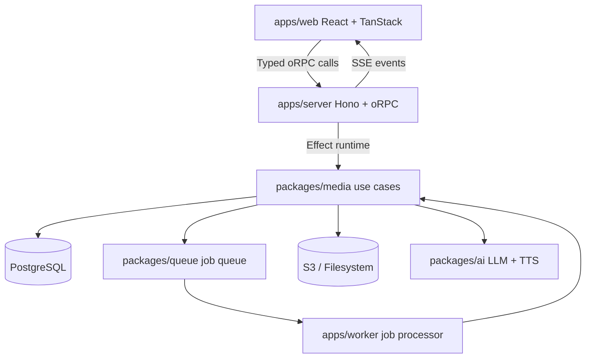

# Content Studio

AI-powered content creation platform for podcasts, voiceovers, documents, and infographics.

## Quick Start

### 1. Configure environment

Run the interactive setup script to generate `.env` files for all apps:

```bash
./scripts/setup-env.sh
```

The script asks for your hostname, ports, database URL, and AI config, then writes `.env` files to `apps/server/`, `apps/web/`, and `apps/worker/`.

It supports two modes:

| | Local | Docker |
|---|---|---|
| **Ports** | server `3035`, web `8085` | server `3036`, web `8086` |
| **Storage** | filesystem (`./uploads`) | MinIO S3 |
| **Database** | `postgres://…/postgres` | `postgres://…/content_studio` |
| **How to run** | `pnpm dev` | `docker compose up --build` |

### 2a. Docker (recommended for deployment)

Everything runs in containers — Postgres, Redis, MinIO, server, worker, and web app.

```bash
# Default (localhost)
docker compose up --build

# Expose on your network
HOST_IP=192.168.1.50 docker compose up --build
```

Services:

| Service | URL |
|---|---|
| Web app | `http://<host>:8086` |
| API server | `http://<host>:3036` |
| MinIO S3 API | `http://<host>:9001` |
| MinIO Console | `http://<host>:9090` |

MinIO credentials: `minioadmin` / `minioadmin`

### 2b. Local development

Requires Node.js 22.10+, pnpm, and Docker (for Postgres + Redis).

```bash
pnpm install
docker compose -f docker-compose.yml up -d   # postgres + redis
pnpm db:push                                  # apply schema
pnpm dev                                      # start all services
```

## Architecture



## Docs-Driven AI Development

This project is 100% written by AI agents and maintained through standards docs.
The `docs/` folder is the source of truth for implementation patterns, architecture
rules, testing requirements, and safety constraints used by coding agents.

For full index and reading order, see `docs/README.md`.

`docs/` structure:

- `docs/architecture/` - boundaries, access control, observability
- `docs/patterns/` - backend implementation contracts (use cases, handlers, repos, runtime)
- `docs/frontend/` - frontend architecture, data-fetching, forms, real-time, UI patterns
- `docs/testing/` - required test strategy by change type
- `docs/setup.md` - local/dev/test environment setup

### How this is enforced

- Agents are expected to read relevant `docs/...` files before making changes
- New features are implemented against these docs, not ad hoc conventions
- Test suites and invariant tests are used to catch regressions against the standards
- Agent skills are used to accelerate feature implementation, refactors, and testing workflows

## Environment Variables

### AI Configuration

| Variable | Default | Description |
|---|---|---|
| `USE_MOCK_AI` | `true` | Use mock AI services (no API key needed). Set to `false` for real Gemini LLM + TTS. |
| `GEMINI_API_KEY` | — | Required when `USE_MOCK_AI=false` |

### Server (`apps/server/.env`)

| Variable | Default | Description |
|---|---|---|
| `SERVER_HOST` | `localhost` | Bind address (`0.0.0.0` for network access) |
| `SERVER_PORT` | `3035` | HTTP port |
| `SERVER_AUTH_SECRET` | — | **Required.** Auth secret (any random string) |
| `SERVER_POSTGRES_URL` | — | **Required.** Postgres connection string |
| `SERVER_REDIS_URL` | `redis://localhost:6379` | Redis for SSE pub/sub |
| `PUBLIC_SERVER_URL` | — | **Required.** Public URL for the API |
| `PUBLIC_WEB_URL` | — | **Required.** Frontend URL (CORS) |
| `CORS_ORIGINS` | — | Extra CORS origins (comma-separated, or `*`) |

### Web (`apps/web/.env`)

| Variable | Default | Description |
|---|---|---|
| `PUBLIC_SERVER_URL` | — | **Required.** Backend API URL |
| `PUBLIC_SERVER_API_PATH` | `/api` | API path prefix |
| `PUBLIC_AUTH_MODE` | `dev-password` | Login UI mode (`dev-password`, `hybrid`, `sso-only`) |
| `PUBLIC_WEB_URL` | `http://localhost:8085` | Dev server host/port |

### Authentication (SSO + Roles)

| Variable | Default | Description |
|---|---|---|
| `AUTH_MODE` | `dev-password` | Server auth mode: `dev-password`, `hybrid`, `sso-only` |
| `AUTH_MICROSOFT_CLIENT_ID` | — | Required for `hybrid` / `sso-only` |
| `AUTH_MICROSOFT_CLIENT_SECRET` | — | Required for `hybrid` / `sso-only` |
| `AUTH_MICROSOFT_TENANT_ID` | — | Required for `hybrid` / `sso-only` |
| `AUTH_ROLE_ADMIN_GROUP_IDS` | — | Comma-separated Graph group IDs that map to role `admin` |
| `AUTH_ROLE_USER_GROUP_IDS` | — | Comma-separated Graph group IDs that map to role `user` |

In SSO modes, role resolution is done by calling Microsoft Graph `transitiveMemberOf` on session creation (not token `groups` claims), which handles users with high group counts.

### Storage

Both server and worker share these variables:

| Variable | Default | Description |
|---|---|---|
| `STORAGE_PROVIDER` | `filesystem` | `filesystem` or `s3` |
| `STORAGE_PATH` | — | Local path (filesystem only) |
| `STORAGE_BASE_URL` | `{server}/storage` | Public URL for files (filesystem only) |
| `S3_BUCKET` | — | S3 bucket name |
| `S3_REGION` | — | S3 region |
| `S3_ACCESS_KEY_ID` | — | S3 access key |
| `S3_SECRET_ACCESS_KEY` | — | S3 secret key |
| `S3_ENDPOINT` | — | Custom S3 endpoint (MinIO, etc.) |
| `S3_PUBLIC_ENDPOINT` | — | Public-facing S3 endpoint for file URLs |

**Docker/MinIO defaults** (used by `docker compose`):

```
S3_BUCKET=content-studio
S3_REGION=us-east-1
S3_ACCESS_KEY_ID=minioadmin
S3_SECRET_ACCESS_KEY=minioadmin
S3_ENDPOINT=http://minio:9001          # internal to docker network
S3_PUBLIC_ENDPOINT=http://<host>:9001   # public access
```

### Telemetry (Backend Only)

Server and worker export OpenTelemetry spans to Datadog-compatible OTLP endpoints.
The web frontend does not send client-side error telemetry.

| Variable | Default | Description |
|---|---|---|
| `TELEMETRY_ENABLED` | `true` in production, else `false` | Enables backend trace export |
| `OTEL_EXPORTER_OTLP_TRACES_ENDPOINT` | `http://localhost:4318/v1/traces` | OTLP traces endpoint (Datadog Agent/Collector) |
| `OTEL_EXPORTER_OTLP_HEADERS` | — | Optional comma-separated headers (`KEY=value,KEY2=value2`) |
| `OTEL_SERVICE_NAME` | app default | Override service name |
| `OTEL_SERVICE_VERSION` | `0.0.0` | Override service version |
| `OTEL_ENV` | `NODE_ENV` | Deployment environment tag |

#### Configure Datadog

Set telemetry vars in both `apps/server/.env` and `apps/worker/.env`.

Use a local Datadog Agent/Collector:

```bash
TELEMETRY_ENABLED=true
OTEL_EXPORTER_OTLP_TRACES_ENDPOINT=http://localhost:4318/v1/traces
OTEL_SERVICE_NAME=content-studio-server
OTEL_ENV=production
```

Use direct Datadog OTLP intake:

```bash
TELEMETRY_ENABLED=true
OTEL_EXPORTER_OTLP_TRACES_ENDPOINT=<your-datadog-otlp-traces-endpoint>
OTEL_EXPORTER_OTLP_HEADERS=DD-API-KEY=<your-datadog-api-key>
OTEL_SERVICE_NAME=content-studio-server
OTEL_ENV=production
```

Repeat with `OTEL_SERVICE_NAME=content-studio-worker` for worker telemetry.

## Project Structure

```
apps/
  server/          # Hono HTTP server
  web/             # React SPA (Vite + TanStack Router)
  worker/          # Background job processor
packages/
  ai/              # LLM + TTS providers (Google, OpenAI)
  api/             # oRPC contracts, router, handlers
  auth/            # better-auth integration
  db/              # Drizzle schema + migrations (PostgreSQL)
  media/           # Domain logic — podcasts, voiceovers, documents, infographics
  queue/           # Postgres-backed job queue
  storage/         # S3-compatible file storage
  testing/         # Shared test utilities
  ui/              # Radix UI + Tailwind component library
```

## Stack

- **Monorepo**: pnpm workspaces + Turborepo
- **Backend**: Effect TS, Hono, oRPC, Drizzle ORM
- **Frontend**: React 19, TanStack Query/Router/Form, Tailwind CSS, Radix UI
- **Testing**: Vitest, Playwright

## Scripts

| Command | Description |
|---|---|
| `pnpm dev` | Start all dev servers (Turborepo watch) |
| `pnpm build` | Build all packages |
| `pnpm test` | Run all tests |
| `pnpm typecheck` | Type check all packages |
| `pnpm lint` | Lint all packages |
| `pnpm db:push` | Push Drizzle schema to database |
| `pnpm db:studio` | Open Drizzle Studio GUI |
| `pnpm test:e2e` | Run Playwright e2e tests |
