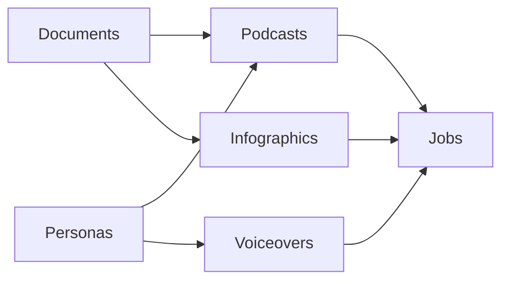
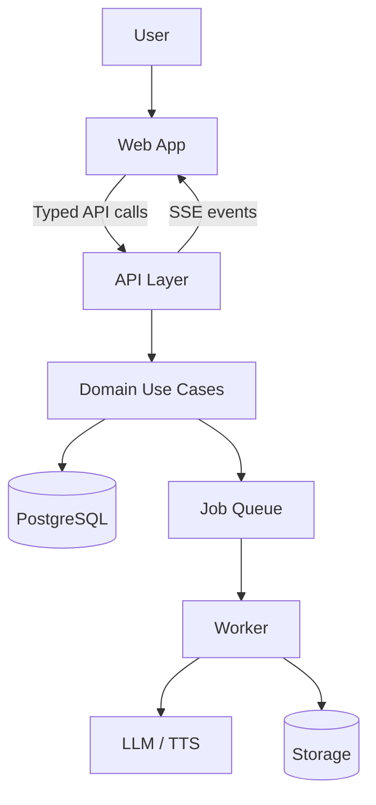

# Content Studio Product Guide

This document explains what the application does, the core domains it manages, and how those domains connect.
For engineering philosophy, read `README.md`.
For setup and local development, read `README.dev.md`.

## What The App Does

Content Studio helps teams create and iterate on AI-assisted media:

1. Documents for knowledge capture and source material
2. Personas for voice, tone, and identity
3. Podcasts for long-form audio production
4. Voiceovers for focused narration workflows
5. Infographics for visual communication assets

## Core Domain Model

| Domain | Purpose | Key Outputs |
|---|---|---|
| Documents | Store source content from text, files, URLs, and research | Parsed content, reusable context |
| Personas | Define voice identity and style | Persona profiles, optional avatars |
| Podcasts | Build and generate podcast content | Scripted and rendered podcast assets |
| Voiceovers | Produce concise spoken output | Generated narration audio |
| Infographics | Create visual summaries from content | Generated image versions |
| Jobs | Track async generation workflows | Status, progress, completion/failure |

## Domain Relationships

## System Interaction Model

## Canonical Behavior Sources

1. Master behavior spec: `docs/master-spec.md`
2. Generated API/domain/data/UI snapshots: `docs/spec/generated/`
3. Architecture constraints: `docs/architecture/overview.md`
4. Access control semantics: `docs/architecture/access-control.md`
5. Error and handler semantics: `docs/patterns/error-handling.md`, `docs/patterns/api-handler.md`

## Primary User Flows

1. Create or import documents, then generate derivative media.
2. Define personas, then apply them to podcasts and voiceovers.
3. Run generation asynchronously and observe progress through job status/events.
4. Iterate on generated output through update, approve, and revoke flows.

## Product Change Policy

If product behavior changes, update `docs/master-spec.md` first.
Code changes that alter behavior are incomplete until spec and generated snapshots are aligned.
