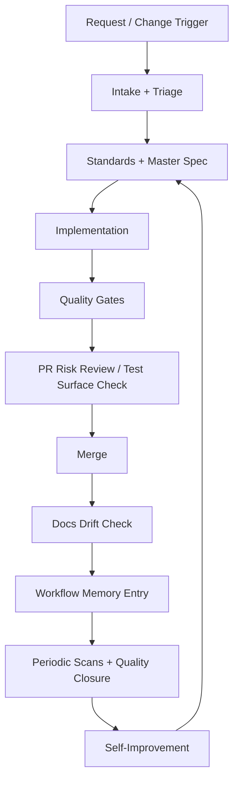

# Repository Operating Framework

This is the navigation layer for how repository governance works in Content Studio.
It explains how standards docs, specs, skills, lint/invariants/tests, workflow memory,
and automation lanes fit into one operating system.

Start with `agentic-harness-framework/README.md`, then use this page for the detailed control map and linked source-of-truth docs.

## Why This Exists

The repo already has strong controls, but they are distributed across:

- `docs/`
- `.agents/skills/`
- `scripts/`
- invariant tests and lint rules
- `agentic-harness-framework/automations/`

This framework reduces orientation time by showing one coherent model.

## System Map

## Control Planes

| Plane | Source Of Truth | Primary Enforcement | Evidence Artifact |
|---|---|---|---|
| Standards | `docs/README.md` and `docs/{architecture,patterns,frontend,testing}` | Type/lint/tests/manual review | Updated standards docs + passing gates |
| Product/system spec | `docs/master-spec.md` + `docs/spec/generated/*` | `pnpm spec:generate`, `pnpm spec:check` | Generated snapshots + spec drift gate |
| Skill workflows | `.agents/skills/*/SKILL.md` | `scripts/sync-skills.sh`, `pnpm skills:check:strict` | Canonical skills + synced mirrors |
| Static/dynamic guardrails | `tools/eslint/*`, invariant tests, package tests | `pnpm lint`, `pnpm test:invariants`, `pnpm test`, `pnpm typecheck`, `pnpm build` | CI/test logs + invariant pass/fail |
| Workflow memory | `docs/workflow-memory/*` | `scripts/workflow-memory/*.mjs`, coverage checks | JSONL events + index + summaries |
| Automation lanes | `agentic-harness-framework/automations/*/*.md` + `agentic-harness-framework/automations/*/*.toml` | Playbook contracts + lane-specific gate checklists | Issues/PRs + run summaries + memory events |

## Execution Model

1. Scope the work with `intake-triage`.
2. Align behavior with `docs/master-spec.md` and standards docs.
3. Implement with the smallest relevant workflow skills.
4. Run gate ladder:
`pnpm typecheck`, `pnpm lint`, `pnpm test`, `pnpm test:invariants`, `pnpm build`
and `pnpm spec:check` when behavior/spec surface changes.
5. Run pre-merge risk/coverage checks (`pr-risk-review`, `test-surface-steward` as needed).
6. Persist workflow memory entries for each workflow used.
7. Periodically run scan loops and self-improvement updates.

## Documentation Strategy (Recommended)

Keep docs layered to avoid duplication:

1. Framework map (this folder): how controls connect.
2. Standards docs (`docs/architecture`, `docs/patterns`, `docs/frontend`, `docs/testing`): what rules are.
3. Workflow/skills docs (`docs/workflow.md`, `.agents/skills/*`): how work is executed.
4. Enforcement artifacts (`scripts/`, lint rules, invariants, CI): what is automatically checked.
5. Memory/automation docs (`docs/workflow-memory`, `agentic-harness-framework/automations/`): how learnings compound and lanes operate.

When updating policy, prefer editing the deepest true source rather than repeating text in multiple places.

## Next Read

1. `agentic-harness-framework/control-surfaces.md`
2. `docs/workflow.md`
3. `docs/workflow-memory/README.md`
4. `agentic-harness-framework/automations/README.md`
