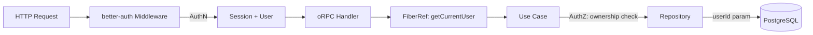

# Access Control



## Golden Principles

1. All mutations and reads require authentication via `protectedProcedure`.
<!-- enforced-by: types -->

2. Use cases access the current user via `getCurrentUser` FiberRef, never from direct parameters.
<!-- enforced-by: architecture -->

3. Repositories are user-agnostic: they accept `userId` as a parameter, never import `getCurrentUser`.
<!-- enforced-by: invariant-test -->

4. Denied access returns 404 (resource concealment), not 403.
<!-- enforced-by: manual-review -->

## Authentication (AuthN)
<!-- enforced-by: types -->

| Layer | Mechanism |
|---|---|
| HTTP | `better-auth` middleware validates session cookie on every request |
| oRPC | `protectedProcedure` middleware extracts `user` from session, rejects with `UNAUTHORIZED` if null |
| Handler | Receives `AuthenticatedORPCContext` with typed `user` field |

The `protectedProcedure` type guarantees that handlers receive a non-null user. Handlers that use `baseProcedure` receive `user: User | null` and must handle the null case explicitly.

## Authorization (AuthZ)
<!-- enforced-by: architecture -->

Authorization is enforced at the **use case** layer, not the handler layer.

| Pattern | Where | How |
|---|---|---|
| Current user | Use case | `yield* getCurrentUser` from FiberRef |
| Resource ownership | Repository query | `WHERE userId = $userId AND id = $resourceId` |
| Job ownership | Safety primitive | `getOwnedJobOrNotFound(jobId)` checks user owns the parent resource |
| Collaborator access | Use case | Query collaborator table, verify `userId` is set (invite claimed) |

### getCurrentUser FiberRef

The handler sets the current user on the Effect FiberRef before running the use case. Use cases access it via:

```typescript
const user = yield* getCurrentUser;
```

This decouples use cases from HTTP context while ensuring every use case has access to the authenticated user.

## Denial Semantics
<!-- enforced-by: manual-review -->

| Scenario | Response | Rationale |
|---|---|---|
| Resource not found | 404 NOT_FOUND | Standard |
| Resource exists but owned by another user | 404 NOT_FOUND | Resource concealment: do not reveal existence |
| Collaborator with pending invite (userId is null) | 404 NOT_FOUND | Invite not yet claimed |
| Unauthenticated request | 401 UNAUTHORIZED | No valid session |
| Admin-only action by non-admin | 403 FORBIDDEN | Role existence is public knowledge |

## Ownership Helpers
<!-- enforced-by: invariant-test -->

| Helper | Purpose | Enforced By |
|---|---|---|
| `getOwnedJobOrNotFound(jobId)` | Verifies user owns the resource associated with the job | Invariant test: all `get-job` use cases must use this |
| `withTransactionalStateAndEnqueue(...)` | Atomic status change + job enqueue in one transaction | Invariant test: state-change + enqueue use cases must use this |

## Repository Rules
<!-- enforced-by: architecture -->

Repositories must:
- Accept `userId` as an explicit parameter on ownership-scoped queries
- Never import or call `getCurrentUser`
- Return `Option.none()` or empty results when resource is not found (use case converts to typed error)

## Multi-User / Collaboration
<!-- enforced-by: manual-review -->

For features with shared access (e.g., podcast collaborators):

1. Owner has full CRUD access
2. Collaborator access requires a row in the collaborator table with `userId` set (not null)
3. Pending invites (`userId: null`) grant no access until claimed
4. Use case queries both ownership and collaboration tables to determine access
