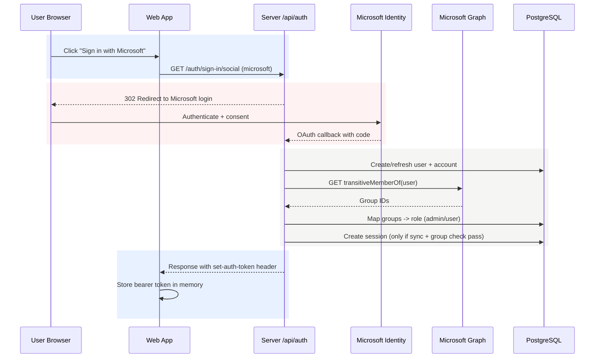
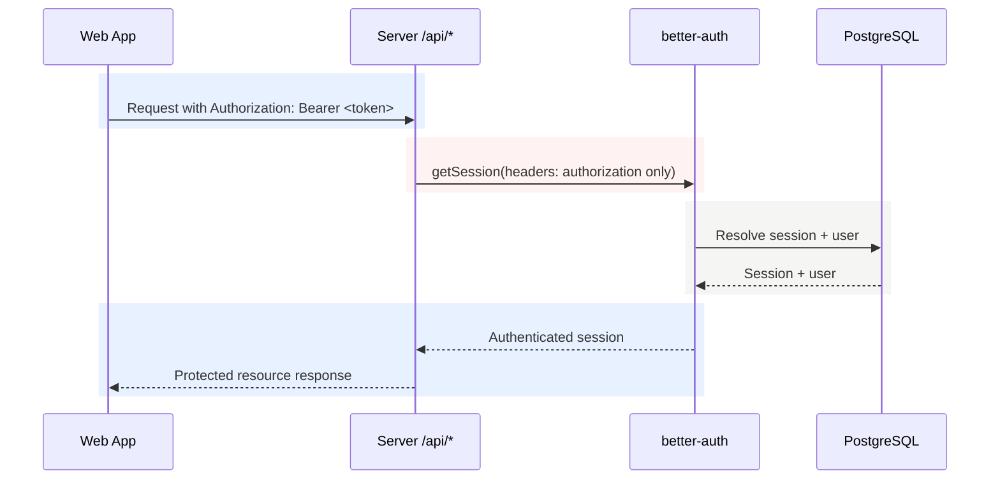

# Access Control


```mermaid
flowchart LR
  classDef entry fill:#e8f1ff,stroke:#1d4ed8,color:#0f172a,stroke-width:1.5px;
  classDef runtime fill:#ecfdf3,stroke:#15803d,color:#0f172a,stroke-width:1.5px;
  classDef async fill:#fff7ed,stroke:#c2410c,color:#0f172a,stroke-width:1.5px;
  classDef store fill:#f5f5f4,stroke:#57534e,color:#0f172a,stroke-width:1.5px;
  classDef control fill:#fef2f2,stroke:#b91c1c,color:#0f172a,stroke-width:1.5px;

  Request[HTTP Request] --> Middleware[better-auth Middleware]
  Middleware -->|AuthN| Session[Session + User]
  Middleware -->|SSO mode role sync| Graph[Microsoft Graph transitiveMemberOf]
  Graph -->|Group IDs -> app role| DB[(PostgreSQL)]
  Session --> Handler[oRPC Handler]
  Handler --> FiberRef[FiberRef: getCurrentUser]
  FiberRef --> UseCase[Use Case]
  UseCase -->|AuthZ: ownership check| Repo[Repository]
  Repo -->|userId param| DB[(PostgreSQL)]

  class Request entry;
  class Session,Handler,FiberRef,UseCase,Repo runtime;
  class Middleware control;
  class Graph,DB store;
```

## Golden Principles

1. All mutations and reads require authentication via `protectedProcedure`.
<!-- enforced-by: types -->

2. Use cases access the current user via `getCurrentUser` FiberRef, never from direct parameters.
<!-- enforced-by: architecture -->

3. Repositories are user-agnostic: they accept `userId` as a parameter, never import `getCurrentUser`.
<!-- enforced-by: invariant-test -->

4. Denied access returns 404 (resource concealment), not 403.
<!-- enforced-by: manual-review -->

## Authentication (AuthN)
<!-- enforced-by: types -->

| Layer | Mechanism |
|---|---|
| HTTP | `better-auth` validates session from bearer token (`Authorization`) via bearer plugin (bearer-only transport; cookie fallback disabled) |
| Login mode | `AUTH_MODE` selects providers: `dev-password`, `sso-only` |
| SSO role sync | On Microsoft callback, `databaseHooks.session.create.before` calls Graph `transitiveMemberOf`; auth fails closed if sync fails or no configured groups match, otherwise role is mapped to `admin`/`user` |
| oRPC | `protectedProcedure` middleware extracts `user` from session, rejects with `UNAUTHORIZED` if null |
| Handler | Receives `AuthenticatedORPCContext` with typed `user` field |

Auth-context failure semantics:
- Expected no-session resolves to `{ session: null, user: null }` and can later produce `UNAUTHORIZED` on protected routes.
- Unexpected auth/session lookup failures during context creation map to `SERVICE_UNAVAILABLE` with request-scoped logging (`requestId` + stable auth-context error tag).

The `protectedProcedure` type guarantees that handlers receive a non-null user. Handlers that use `baseProcedure` receive `user: User | null` and must handle the null case explicitly.

Role mapping intentionally uses Graph API lookup (instead of token `groups` claim) to avoid group-claim overage behavior for users in many groups.

### SSO Sign-In Sequence


```mermaid
sequenceDiagram
  participant U as User Browser
  participant W as Web App
  participant A as Server /api/auth
  participant MS as Microsoft Identity
  participant G as Microsoft Graph
  participant DB as PostgreSQL

  rect rgb(232, 241, 255)
    U->>W: Click "Sign in with Microsoft"
    W->>A: GET /auth/sign-in/social (microsoft)
  end
  rect rgb(254, 242, 242)
    A-->>U: 302 Redirect to Microsoft login
    U->>MS: Authenticate + consent
    MS-->>A: OAuth callback with code
  end
  rect rgb(245, 245, 244)
    A->>DB: Create/refresh user + account
    A->>G: GET transitiveMemberOf(user)
    G-->>A: Group IDs
    A->>DB: Map groups -> role (admin/user)
    A->>DB: Create session (only if sync + group check pass)
  end
  rect rgb(232, 241, 255)
    A-->>W: Response with set-auth-token header
    W->>W: Store bearer token in memory
  end
```

### Bearer API Request Sequence


```mermaid
sequenceDiagram
  participant W as Web App
  participant API as Server /api/*
  participant BA as better-auth
  participant DB as PostgreSQL

  rect rgb(232, 241, 255)
    W->>API: Request with Authorization: Bearer <token>
  end
  rect rgb(254, 242, 242)
    API->>BA: getSession(headers: authorization only)
  end
  rect rgb(245, 245, 244)
    BA->>DB: Resolve session + user
    DB-->>BA: Session + user
  end
  rect rgb(232, 241, 255)
    BA-->>API: Authenticated session
    API-->>W: Protected resource response
  end
```

### Session Refresh Policy

Current behavior is intentionally bearer-only and uses Better Auth defaults (we do not override session timing in app config today).

| Policy Area | Current Setting | Notes |
|---|---|---|
| Session expiry (`expiresIn`) | 7 days | Better Auth server default |
| Session refresh window (`updateAge`) | 1 day | Better Auth server default (sliding refresh when session is read) |
| Browser background refresh | Focus-based refetch enabled | Better Auth client default: `refetchOnWindowFocus=true` |
| Browser polling | Disabled | Better Auth client default: `refetchInterval=0` |
| Offline refetch | Disabled | Better Auth client default: `refetchWhenOffline=false` |
| 401 recovery for API calls | Single refresh + single retry | `packages/api` client calls web `refreshAccessToken()` and retries once |
| Token transport | `Authorization: Bearer <token>` only | No cookie fallback on client or server session lookup |
| Token storage | In-memory only | Full page reload clears token and may require sign-in again |

Operational implications:

1. Active users usually stay authenticated via focus-triggered session reads/refresh.
2. If a request gets `401`, the app attempts one session refresh and retries once.
3. No persistent browser auth state is kept across full reloads by design (security-first bearer model).

If we need a different enterprise policy (for example shorter idle timeout, explicit absolute timeout, or polling refresh), define explicit `session` options in server auth config and expose client `sessionOptions` via the auth client wrapper.

### Auth Transport Decision (Bearer-Only)

This codebase standardizes on bearer-only user auth transport.

Why this is the default:

1. Web and API are expected to run on different domains in EKS.
2. Bearer-only requests avoid credentialed CORS requirements and cookie domain coupling.
3. It removes ambient-cookie auth behavior (reduced CSRF-style risk surface).

Tradeoffs to keep in mind:

1. We intentionally do not persist auth tokens across full page reloads.
2. API clients must handle explicit `401` recovery (refresh once, retry once).
3. If product requirements later demand seamless reload persistence, we will need a documented storage policy change.

Enterprise baseline:

1. Bearer token transport is common for split-domain SPA + API architectures.
2. HttpOnly cookie sessions are common for same-origin server-rendered applications.
3. For this architecture, bearer-only is the operational default unless an ADR explicitly changes it.

### Service-to-Service Auth Status

Current runtime topology has no internal service-to-service HTTP auth flow:

1. `apps/server` and `apps/worker` each use shared infrastructure (PostgreSQL, Redis, S3) directly.
2. `apps/worker` does not call protected server HTTP APIs with user tokens.
3. There is no separate machine-token policy configured today.

## Authorization (AuthZ)
<!-- enforced-by: architecture -->

Authorization is enforced at the **use case** layer, not the handler layer.

| Pattern | Where | How |
|---|---|---|
| Current user | Use case | `yield* getCurrentUser` from FiberRef |
| Resource ownership | Repository query | `WHERE userId = $userId AND id = $resourceId` |
| Job ownership | Safety primitive | `getOwnedJobOrNotFound(jobId)` checks user owns the parent resource |
| Collaborator access | Use case | Query collaborator table, verify `userId` is set (invite claimed) |

### getCurrentUser FiberRef

The handler sets the current user on the Effect FiberRef before running the use case. Use cases access it via:

```typescript
const user = yield* getCurrentUser;
```

This decouples use cases from HTTP context while ensuring every use case has access to the authenticated user.

## Denial Semantics
<!-- enforced-by: manual-review -->

| Scenario | Response | Rationale |
|---|---|---|
| Resource not found | 404 NOT_FOUND | Standard |
| Resource exists but owned by another user | 404 NOT_FOUND | Resource concealment: do not reveal existence |
| Collaborator with pending invite (userId is null) | 404 NOT_FOUND | Invite not yet claimed |
| Unauthenticated request | 401 UNAUTHORIZED | No valid session |
| Admin-only action by non-admin | 403 FORBIDDEN | Role existence is public knowledge |

## Ownership Helpers
<!-- enforced-by: invariant-test -->

| Helper | Purpose | Enforced By |
|---|---|---|
| `getOwnedJobOrNotFound(jobId)` | Verifies user owns the resource associated with the job | Invariant test: all `get-job` use cases must use this |
| `withTransactionalStateAndEnqueue(...)` | Atomic status change + job enqueue in one transaction | Invariant test: state-change + enqueue use cases must use this |

## Repository Rules
<!-- enforced-by: architecture -->

Repositories must:
- Accept `userId` as an explicit parameter on ownership-scoped queries
- Never import or call `getCurrentUser`
- Prefer querying with ownership predicate (`id + userId`) for owner-only resources
- Prefer domain typed not-found for both true-missing and not-owned (concealment)

Use cases should prefer ownership-scoped repo methods over `findById` + `requireOwnership` for owner-only flows.

## Multi-User / Collaboration
<!-- enforced-by: manual-review -->

For features with shared access (e.g., podcast collaborators):

1. Owner has full CRUD access
2. Collaborator access requires a row in the collaborator table with `userId` set (not null)
3. Pending invites (`userId: null`) grant no access until claimed
4. Use case queries both ownership and collaboration tables to determine access
