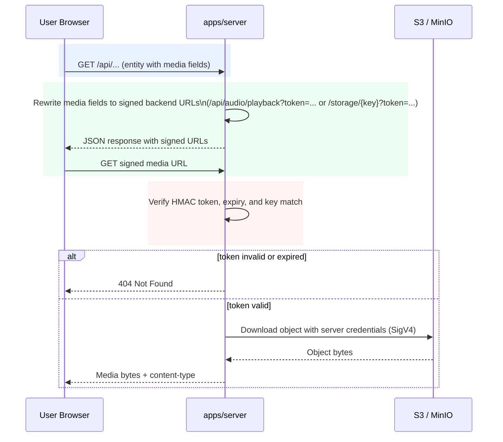

# Deployment Env Matrix (Linux Compose + EKS Split Domains)

This is the env reference for these two production-oriented deployment patterns:

1. Single Linux machine: `web + server + worker + db + redis + minio` (Docker Compose)
2. EKS: `web + server` only, with external PostgreSQL/Redis/S3

## Commands

For Linux Compose from repo root:

```bash
pnpm deploy:linux
pnpm redeploy:linux
```

For Helm-first EKS recommendations (chart topology + migration strategy), see:

- [`docs/architecture/eks-helm-recommendations.md`](./eks-helm-recommendations.md)

## CORS Rule (Both Patterns)

`CORS_ORIGINS` is optional and defaults to `*` (permissive bearer-token CORS).
Set an explicit comma-separated allowlist only if you want tighter browser access control.

Examples:

- permissive default: `CORS_ORIGINS=*`
- same-origin domain: `CORS_ORIGINS=https://studio.example.com`
- split origins: `CORS_ORIGINS=https://studio.example.com,https://api.example.com`
- port-based local ingress: `CORS_ORIGINS=https://studio.example.com:8086`

`pnpm deploy:linux` now defaults this to `*`.

## Common Signed Media Access Model

This sequence is the same across local MinIO, Linux VM + MinIO, and EKS + S3.



Security properties:

- Buckets remain private (no anonymous/public object reads).
- Browser never receives storage credentials.
- Access is short-lived and possession-based; leaked signed URLs work only until TTL expiry.

## Startup Migration Policy (Server)

`apps/server` supports startup migrations via `SERVER_RUN_DB_MIGRATIONS_ON_STARTUP`.

- `true`: server runs pending Drizzle migrations before opening the HTTP port.
- `false`: server skips migration execution and only verifies DB connectivity.

Current deployment defaults:

1. Docker runtime/server container defaults to `SERVER_RUN_DB_MIGRATIONS_ON_STARTUP=true`.
2. Linux Compose (`pnpm deploy:linux`) sets this to `true`.
3. Startup failure during migration is fail-fast (container exits non-zero).

EKS guidance:

1. Single replica or controlled rollout: `true` is acceptable and simplest.
2. Multi-replica parallel rollout: prefer a pre-deploy migration job and set app pods to `false` to avoid concurrent migration attempts.

## Common Required Env

Only list once here; these apply to both deployment patterns unless noted.

### Web (`apps/web` container)

Required:

- `PUBLIC_SERVER_URL`
- `PUBLIC_SERVER_API_PATH` (usually `/api`)
- `PUBLIC_AUTH_MODE` (keep aligned with server `AUTH_MODE`)

Optional:

- `PUBLIC_BASE_PATH` (default `/`)

### Server (`apps/server` container)

Required:

- `NODE_ENV` (`production` for prod)
- `SERVER_AUTH_SECRET`
- `AUTH_MODE` (`sso-only` in production)
- `SERVER_POSTGRES_URL`
- `SERVER_REDIS_URL`
- `PUBLIC_SERVER_URL`
- `PUBLIC_WEB_URL`
- `TRUST_PROXY=true` (required in production)

Conditionally required:

- `AUTH_MICROSOFT_CLIENT_ID`, `AUTH_MICROSOFT_CLIENT_SECRET`, `AUTH_MICROSOFT_TENANT_ID`, `AUTH_ROLE_ADMIN_GROUP_IDS`, `AUTH_ROLE_USER_GROUP_IDS` when `AUTH_MODE=sso-only`
- `GEMINI_API_KEY` when `USE_MOCK_AI=false`
- `S3_BUCKET`, `S3_REGION`, `S3_ACCESS_KEY_ID`, `S3_SECRET_ACCESS_KEY`
- `NODE_EXTRA_CA_CERTS` when `HTTPS_PROXY` or `HTTP_PROXY` is set

Common optional-but-important:

- `S3_ENDPOINT`, `S3_PUBLIC_ENDPOINT`
- `AUDIO_PLAYBACK_PROXY_ENABLED`, `STORAGE_ACCESS_PROXY_ENABLED`, `AUDIO_PLAYBACK_URL_TTL_SECONDS`
- `USE_MOCK_AI`
- `SERVER_RUN_DB_MIGRATIONS_ON_STARTUP` (default `true` in containerized deployment path)
- `CORS_ORIGINS` (default `*`; optional explicit allowlist)
- `HTTPS_PROXY`, `HTTP_PROXY`, `NO_PROXY`, `NODE_EXTRA_CA_CERTS`

## Special Notes By Pattern

### 1) Single Linux Machine (Compose, Same Domain)

Special behavior:

- `pnpm deploy:linux` generates `.env.deploy` and starts all services, including DB migrations and MinIO bucket init.
- Compose wires internal service URLs automatically (`db`, `redis`, `minio`).
- Web image builds with placeholder `PUBLIC_*`; real `PUBLIC_*` values are injected at runtime.

Minimal public URL alignment for same-domain deployment:

```env
PUBLIC_WEB_URL=https://studio.example.com
PUBLIC_SERVER_URL=https://studio.example.com
CORS_ORIGINS=*
```

If you expose web/server on different ports and want a strict allowlist, include the web origin and port in `CORS_ORIGINS`.

### 2) EKS (Web + Server, External DB/Redis/S3, Split Domains)

Special requirements:

- `PUBLIC_WEB_URL` and `PUBLIC_SERVER_URL` are different origins.
- `SERVER_POSTGRES_URL` and `SERVER_REDIS_URL` point to managed/external services.
- `S3_*` values point to external object storage (AWS S3 or compatible).
- Keep object ACLs private; backend serves audio and storage objects with short-lived signed URLs.

Typical split-domain core values:

```env
PUBLIC_WEB_URL=https://studio.example.com
PUBLIC_SERVER_URL=https://api.example.com
CORS_ORIGINS=*
TRUST_PROXY=true
```

For Kubernetes ingress templates, see:

- [`docs/architecture/eks-ingress-env-template.md`](./eks-ingress-env-template.md)
