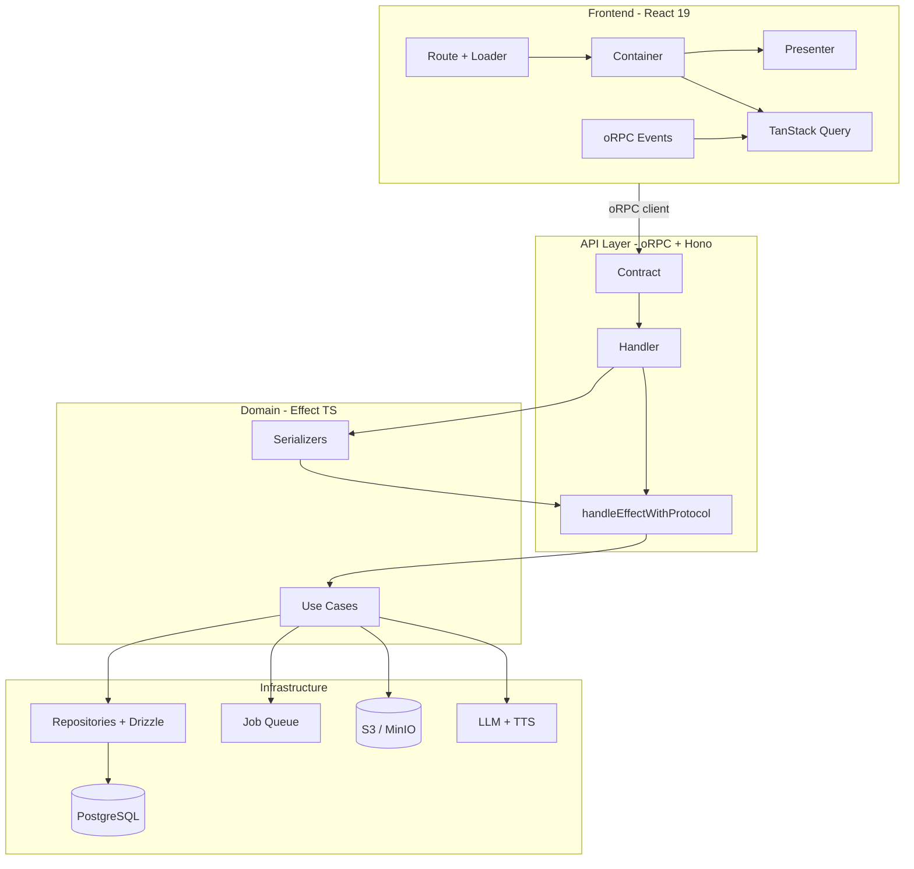

# System Architecture



## Package Boundaries
<!-- enforced-by: architecture -->

| Package | Owns | Depends On | Must NOT Import |
|---|---|---|---|
| `@repo/media` | Use cases, repos, domain errors | `@repo/db`, `@repo/queue`, `@repo/storage`, `@repo/ai`, `@repo/auth` | `@repo/api` |
| `@repo/api` | Contracts, handlers, router, serializers | `@repo/media`, `@repo/db`, `@repo/auth` | Frontend code |
| `@repo/db` | Schema, migrations, type definitions | `drizzle-orm` | `@repo/media`, `@repo/api` |
| `@repo/ai` | LLM/TTS provider implementations | `@repo/db` (schema types only) | `@repo/media`, `@repo/api` |
| `@repo/queue` | Job queue abstraction | `@repo/db` | `@repo/media`, `@repo/api` |
| `@repo/storage` | S3-compatible file storage | -- | `@repo/media`, `@repo/api` |
| `@repo/auth` | Authentication + authorization policy | `@repo/db` | `@repo/media`, `@repo/api` |
| `apps/web` | UI, features, routes | `@repo/api` (client only), `@repo/ui` | `@repo/media`, `@repo/db` directly |
| `apps/server` | HTTP entry point | `@repo/api`, `@repo/auth` | `@repo/media` directly |

## Request Lifecycle
<!-- enforced-by: architecture -->

1. **Client** calls oRPC contract method via typed client
2. **Hono middleware** validates session (AuthN via `better-auth`)
3. **oRPC router** resolves to handler, validates input against contract schema
4. **Handler** calls `handleEffectWithProtocol` with the use case effect and span name
5. **Effect runtime** resolves all services (repos, AI, storage, queue) from the managed runtime
6. **Use case** executes domain logic, yields typed errors on failure
7. **Serializer** transforms domain objects to API response shape (dates to strings, etc.)
8. **Error mapper** in `handleEffectWithProtocol` converts Effect typed errors to oRPC error codes
9. **Response** returned to client as JSON

## Layer Rules
<!-- enforced-by: types -->

| Layer | Can Do | Cannot Do |
|---|---|---|
| **Handler** | Orchestrate: one use case call + serialize result | Business logic, direct DB queries, direct AI calls |
| **Use case** | Business logic, call repos/services, yield typed errors | Import handler code, access HTTP context directly |
| **Repository** | Database queries via Drizzle, return domain types | Business logic, call other repos, import use cases |
| **Serializer** | Transform types (Date to string, add computed fields) | Side effects, DB calls |
| **Contract** | Define input/output schemas | Implementation logic |

## Monorepo Structure

```
apps/
  server/          # Hono HTTP server entry: src/server.ts
  web/             # React SPA (Vite + TanStack Router)
packages/
  ai/              # LLM + TTS providers (Google, OpenAI)
  api/             # oRPC contracts, router, handlers
  auth/            # better-auth integration
  db/              # Drizzle schema + migrations (PostgreSQL)
  media/           # Domain logic: podcasts, voiceovers, documents, infographics
  queue/           # Postgres-backed job queue
  storage/         # S3-compatible file storage
  testing/         # Shared test utilities
  ui/              # Radix UI + Tailwind component library
```

## Effect Runtime
<!-- enforced-by: types -->

The application uses a `ManagedRuntime` that provides all services as Effect layers. Services are composed using `Layer.mergeAll` and provided to handlers via `handleEffectWithProtocol`.

Key files:
- Runtime construction: `packages/api/src/server/runtime.ts`
- Effect handler: `packages/api/src/server/effect-handler.ts`
- Layer construction rules: `docs/patterns/effect-runtime.md`

## Cross-Cutting Concerns

| Concern | Mechanism | Standard |
|---|---|---|
| Authentication | `better-auth` middleware on Hono | `docs/architecture/access-control.md` |
| Authorization | `getCurrentUser` FiberRef in use cases | `docs/architecture/access-control.md` |
| Error handling | Typed Effect errors mapped to oRPC codes | `docs/patterns/error-handling.md` |
| Observability | `withSpan` on every use case | `docs/architecture/observability.md` |
| Real-time updates | oRPC event iterators (SSE) | `docs/frontend/real-time.md` |
| Background jobs | Postgres-backed queue + worker | `docs/patterns/job-queue.md` |
| Safety primitives | Invariant-tested wrappers | `docs/patterns/safety-primitives.md` |

## Related Standards

- `docs/patterns/use-case.md` -- Use case structure
- `docs/patterns/repository.md` -- Repository pattern
- `docs/patterns/api-handler.md` -- Handler + serialization pipeline
- `docs/patterns/effect-runtime.md` -- Layer construction rules
- `docs/patterns/error-handling.md` -- Error class definitions
