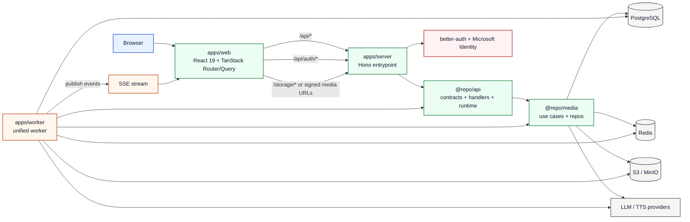
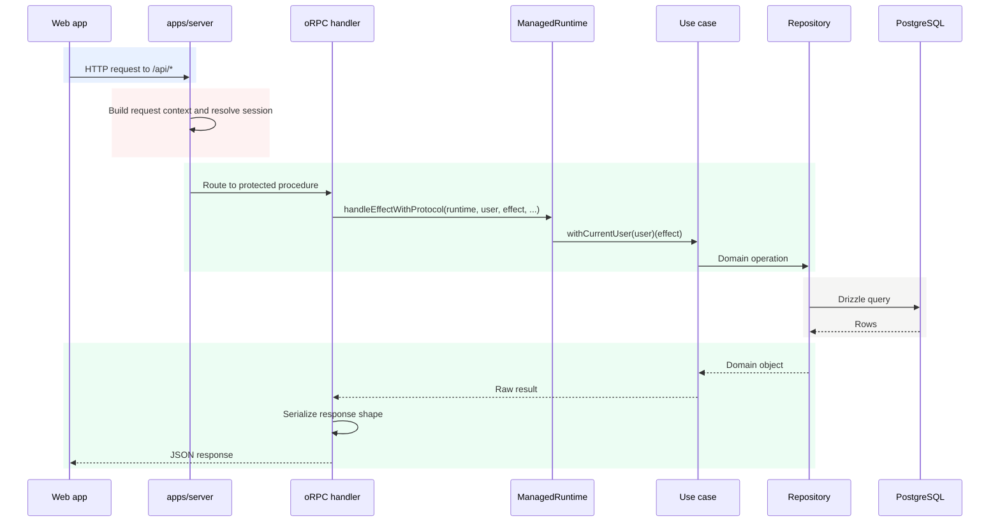
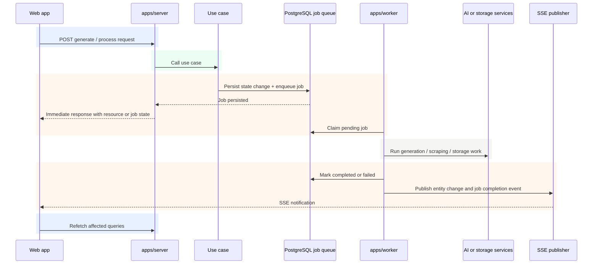

# System Architecture

This page is the fast path for understanding how the system fits together.

## Diagram Legend

| Color | Meaning |
|---|---|
| Blue | Caller or entry point |
| Green | Owned runtime path |
| Amber | Async handoff or background path |
| Gray | Data store or external dependency |
| Red | Security or trust-boundary control |

## System Topology

```mermaid
flowchart LR
  classDef entry fill:#e8f1ff,stroke:#1d4ed8,color:#0f172a,stroke-width:1.5px;
  classDef runtime fill:#ecfdf3,stroke:#15803d,color:#0f172a,stroke-width:1.5px;
  classDef async fill:#fff7ed,stroke:#c2410c,color:#0f172a,stroke-width:1.5px;
  classDef store fill:#f5f5f4,stroke:#57534e,color:#0f172a,stroke-width:1.5px;
  classDef control fill:#fef2f2,stroke:#b91c1c,color:#0f172a,stroke-width:1.5px;

  Browser[Browser]
  Web[apps/web<br/>React 19 + TanStack Router/Query]
  Server[apps/server<br/>Hono entrypoint]
  API["@repo/api<br/>contracts + handlers + runtime"]
  Media["@repo/media<br/>use cases + repos"]
  Worker[apps/worker<br/>unified worker]
  Auth[better-auth + Microsoft Identity]
  DB[(PostgreSQL)]
  Redis[(Redis)]
  Storage[(S3 / MinIO)]
  AI[LLM / TTS providers]
  SSE[SSE stream]

  Browser --> Web
  Web -->|/api/*| Server
  Web -->|/api/auth/*| Server
  Web -->|/storage/* or signed media URLs| Server

  Server --> API
  API --> Media
  Server --> Auth

  Media --> DB
  Media --> Redis
  Media --> Storage
  Media --> AI

  Worker --> API
  Worker --> Media
  Worker --> DB
  Worker --> Redis
  Worker --> Storage
  Worker --> AI

  Worker -->|publish events| SSE
  SSE --> Web

  class Browser entry;
  class Web,Server,API,Media runtime;
  class Worker,SSE async;
  class DB,Redis,Storage,AI store;
  class Auth control;
```

## Runtime Responsibilities

| Runtime | Owns | Talks to | Notes |
|---|---|---|---|
| `apps/web` | Routes, feature UI, query cache, auth refresh, SSE subscription | `apps/server` | No direct domain or DB imports |
| `apps/server` | Hono middleware, auth routes, `/api/*`, `/storage/*`, media proxying | Auth provider, DB, Redis, storage, AI | Builds one shared `ManagedRuntime` at boot |
| `apps/worker` | Job claim loop, generation handlers, stale job recovery, SSE publishing | DB, Redis, storage, AI | Reuses the same shared runtime factory as the server |
| `@repo/api` | Contracts, router handlers, effect handler, runtime composition | `@repo/media`, `@repo/auth`, `@repo/db` | Server boundary between HTTP and domain |
| `@repo/media` | Use cases, repos, domain services, domain errors | DB, queue, storage, AI, auth policy | Core business logic layer |

## Request Lifecycle

```mermaid
sequenceDiagram
  participant W as Web app
  participant S as apps/server
  participant O as oRPC handler
  participant R as ManagedRuntime
  participant U as Use case
  participant P as Repository
  participant DB as PostgreSQL

  rect rgb(232, 241, 255)
    W->>S: HTTP request to /api/*
  end
  rect rgb(254, 242, 242)
    S->>S: Build request context and resolve session
  end
  rect rgb(236, 253, 243)
    S->>O: Route to protected procedure
    O->>R: handleEffectWithProtocol(runtime, user, effect, ...)
    R->>U: withCurrentUser(user)(effect)
    U->>P: Domain operation
  end
  rect rgb(245, 245, 244)
    P->>DB: Drizzle query
    DB-->>P: Rows
  end
  rect rgb(236, 253, 243)
    P-->>U: Domain object
    U-->>O: Raw result
    O->>O: Serialize response shape
    O-->>W: JSON response
  end
```

## Async Generation Lifecycle

```mermaid
sequenceDiagram
  participant W as Web app
  participant S as apps/server
  participant UC as Use case
  participant Q as PostgreSQL job queue
  participant WK as apps/worker
  participant AI as AI or storage services
  participant EV as SSE publisher

  rect rgb(232, 241, 255)
    W->>S: POST generate / process request
  end
  rect rgb(236, 253, 243)
    S->>UC: Call use case
  end
  rect rgb(255, 247, 237)
    UC->>Q: Persist state change + enqueue job
    Q-->>S: Job persisted
    S-->>W: Immediate response with resource or job state
    WK->>Q: Claim pending job
  end
  rect rgb(245, 245, 244)
    WK->>AI: Run generation / scraping / storage work
  end
  rect rgb(255, 247, 237)
    WK->>Q: Mark completed or failed
    WK->>EV: Publish entity change and job completion event
    EV-->>W: SSE notification
  end
  rect rgb(232, 241, 255)
    W->>S: Refetch affected queries
  end
```

## Package Boundaries
<!-- enforced-by: architecture -->

| Package | Owns | Depends on | Must not import |
|---|---|---|---|
| `@repo/media` | Use cases, repos, domain errors | `@repo/db`, `@repo/queue`, `@repo/storage`, `@repo/ai`, `@repo/auth` | `@repo/api` |
| `@repo/api` | Contracts, handlers, router, runtime wiring | `@repo/media`, `@repo/db`, `@repo/auth` | Web-only UI code |
| `@repo/db` | Schema, migrations, serializers, telemetry layer | `drizzle-orm` and OpenTelemetry libs | `@repo/media`, `@repo/api` |
| `@repo/auth` | Better Auth integration and authorization policy | `@repo/db` | `apps/web` implementation details |
| `@repo/queue` | Job queue abstraction and notifications | `@repo/db` | `@repo/media`, `@repo/api` |
| `@repo/storage` | Object storage interface and providers | AWS/S3-compatible SDKs | `@repo/media`, `@repo/api` |
| `@repo/ai` | LLM, research, image, and TTS providers | Provider SDKs and shared schema types | `@repo/media`, `@repo/api` |
| `apps/web` | SPA routes, features, shared UI | `@repo/api` client, `@repo/ui` | `@repo/media`, `@repo/db` directly |
| `apps/server` | HTTP entrypoint, auth/api/static routes | `@repo/api/server`, `@repo/auth/server` | `@repo/media` directly |
| `apps/worker` | Background execution loop | `@repo/api/server`, `@repo/media` | Web-only modules |

## Layer Rules
<!-- enforced-by: types -->

| Layer | Can do | Cannot do |
|---|---|---|
| Handler | One use case call, serialization, protocol mapping, request metadata | Business logic, direct DB queries, direct AI calls |
| Use case | Business logic, authorization, repo/service orchestration | Access HTTP context directly, import handlers |
| Repository | Drizzle queries and persistence concerns | Cross-repo business logic, handler imports |
| Contract | Define input/output and streaming schemas | Runtime implementation |
| Web route | Route guards and page wiring | Feature business logic or query key hardcoding |

## Read Next

- [`docs/architecture/design.md`](./design.md)
- [`docs/architecture/security.md`](./security.md)
- [`docs/architecture/access-control.md`](./access-control.md)
- [`docs/patterns/use-case.md`](../patterns/use-case.md)
- [`docs/patterns/api-handler.md`](../patterns/api-handler.md)
