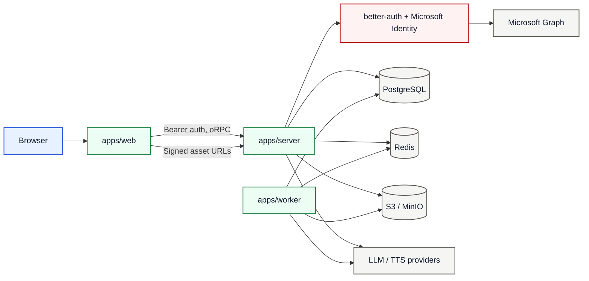
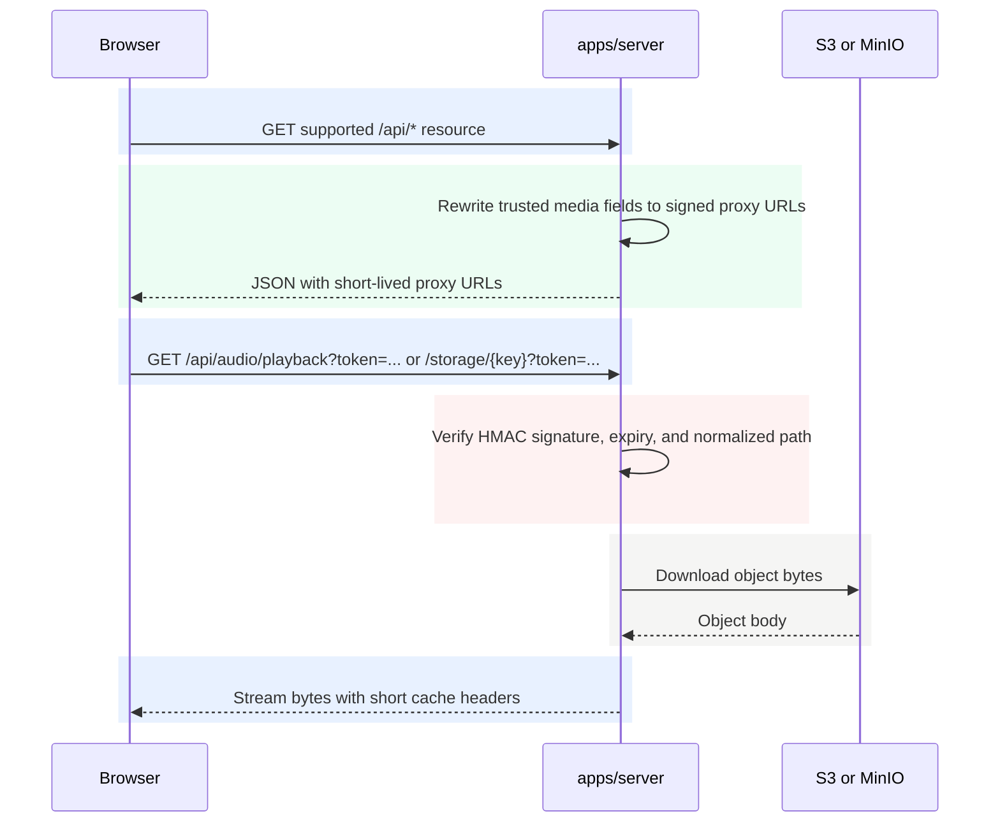

# Security Architecture

This page describes the security model that sits around the core architecture.

For role and ownership rules, see [`docs/architecture/access-control.md`](./access-control.md).

## Diagram Legend

| Color | Meaning |
|---|---|
| Blue | Caller or browser edge |
| Green | Owned runtime path |
| Amber | Async handoff |
| Gray | Data store or external dependency |
| Red | Security control or trust check |

## Trust Boundaries

## Control Matrix

| Control | Where it is enforced | Current behavior |
|---|---|---|
| Authentication | `packages/auth/src/server/auth.ts`, `packages/api/src/server/orpc.ts`, `apps/server/src/routes/auth.ts` | Browser and API calls use bearer tokens; the only supported login modes are `dev-password` and `sso-only`; protected oRPC procedures reject missing sessions |
| Authorization | `getCurrentUser`, `requireOwnership`, `requireRole`, ownership-aware repo methods | Existing-resource mutations authorize in the use case layer and conceal owner-only misses with `404` |
| Role synchronization | Better Auth Microsoft callback plus Graph lookup | `sso-only` sign-in fails closed if group resolution or mapping fails |
| Token storage | `apps/web/src/shared/lib/auth-token.ts` | Browser token is in memory only; full reload clears it |
| CORS and trusted origins | `apps/server/src/config.ts`, `apps/server/src/middleware/cors-policy.ts`, `apps/server/src/auth-trusted-origins.ts` | API and auth routes allow bearer-token requests without credentialed cookies; trusted auth origins are derived from `PUBLIC_WEB_URL` plus explicit allowlists |
| Secure headers | `apps/server/src/index.ts` | `secureHeaders()` is enabled for all requests |
| Request limits | `apps/server/src/routes/api-body-limit.ts` | API payloads are capped at `16 MiB` |
| Rate limiting | `apps/server/src/middleware/rate-limit.ts` | Auth and API routes apply rate limiting, using Redis when available and an in-memory fallback if the store fails |
| Asset protection | `apps/server/src/audio-playback-proxy.ts`, `apps/server/src/storage-access-proxy.ts`, `apps/server/src/routes/api.ts`, `apps/server/src/routes/static.ts` | Audio playback URLs and trusted storage-key fields on supported API payloads can be rewritten to short-lived HMAC-signed proxy URLs |
| Request correlation | `apps/server/src/middleware/request-id.ts` | Every request gets `X-Request-Id` for logs and trace correlation |
| Request logging | `apps/server/src/middleware/request-log.ts`, `apps/server/src/index.ts` | Request logs include method plus path only; query strings such as signed `token=` parameters are omitted |
| Production guardrails | `apps/server/src/env.ts` | Production rejects `AUTH_MODE=dev-password`, requires HTTPS URLs, requires `TRUST_PROXY=true`, and requires a signing secret when either audio or storage proxying is enabled |
| Telemetry scope | `docs/architecture/observability.md` | Telemetry is backend-only by default; browser telemetry is intentionally absent |

## Signed Asset Flow

Storage response rewriting is intentionally narrow:

- it only runs for `/api/podcasts`, `/api/personas`, `/api/infographics`, and `/api/sources`
- it only signs trusted schema-backed storage fields such as `avatarStorageKey`, `coverImageStorageKey`, `imageStorageKey`, `thumbnailStorageKey`, and source `contentKey`
- it does not traverse user-editable `metadata`

## Security Posture Notes

1. Bearer-only auth is intentional because web and API are expected to run on different origins.
2. Cookie-based ambient auth is intentionally avoided in the SPA/API path.
3. `CORS_ORIGINS=*` is allowed by default for bearer-token browser calls; tighten it if compliance or deployment policy requires an explicit allowlist.
4. `AUDIO_PLAYBACK_PROXY_ENABLED` and `STORAGE_ACCESS_PROXY_ENABLED` are independent controls.
5. If `STORAGE_ACCESS_PROXY_ENABLED=false`, `/storage/*` serves bytes for any normalized storage key without a token; keep it enabled outside local development unless direct object reads are an explicit choice.
6. Path-only request logging prevents signed `token=` query parameters from being written to default request logs.
7. There is no separate service-to-service user-token flow today; the worker uses shared infrastructure directly instead of calling protected HTTP APIs.

## Read Next

- [`docs/architecture/access-control.md`](./access-control.md)
- [`docs/architecture/observability.md`](./observability.md)
- [`docs/architecture/deployment-env-matrix.md`](./deployment-env-matrix.md)
- [`docs/architecture/eks-helm-recommendations.md`](./eks-helm-recommendations.md)
