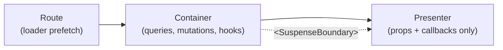

# Components



## Golden Principles

1. Containers fetch and orchestrate; presenters render props only <!-- enforced-by: manual-review -->
2. No data fetching, mutations, or route params in presenters <!-- enforced-by: manual-review -->
3. Wrap containers in `<SuspenseBoundary resetKeys={[id]}>` <!-- enforced-by: manual-review -->
4. `useSuspenseQuery` when data is required + Suspense boundary; `useQuery` when optional <!-- enforced-by: manual-review -->

## Responsibility Matrix

| Concern | Container | Presenter |
|---------|-----------|-----------|
| Data fetching (`useSuspenseQuery`) | Yes | No |
| Mutations (`useMutation`) | Yes | No |
| Route params (`Route.useParams()`) | Yes | No |
| Custom hooks (orchestration) | Yes | No |
| Props + callbacks | Passes down | Receives |
| Local UI state (open/close, tabs) | No | Yes |
| Event handlers (click, submit) | Defines | Calls via callback |

## Naming

| Type | Pattern | Example |
|------|---------|---------|
| Container | `{Domain}{View}Container.tsx` | `podcast-detail-container.tsx` |
| Presenter | `{Domain}{View}.tsx` | `podcast-detail.tsx` |

## Container Pattern

Containers orchestrate queries, mutations, and hooks, then pass plain data to presenters.

**Canonical example:** `apps/web/src/features/podcasts/components/podcast-detail-container.tsx`

```tsx
// Container shape — queries + hooks, passes props to presenter
export function PodcastDetailContainer({ podcastId }: { podcastId: string }) {
  const { data: podcast } = usePodcast(podcastId);
  const actions = usePodcastActions({ podcastId, podcast, ... });

  return (
    <PodcastDetail
      podcast={podcast}
      onSave={actions.handleSave}
      onDelete={actions.handleDelete}
    />
  );
}
```

## Presenter Pattern

Presenters are pure render functions driven by props. No hooks that touch server state.

**Canonical example:** `apps/web/src/features/podcasts/components/podcast-detail.tsx`

## Suspense Boundaries

### Route-Level (preferred)

Routes wrap containers in `<SuspenseBoundary>` which combines `<ErrorBoundary>` + `<Suspense>`.

**Canonical example:** `apps/web/src/routes/_protected/podcasts/$podcastId.tsx`

```tsx
export const Route = createFileRoute('/_protected/podcasts/$podcastId')({
  loader: ({ params }) =>
    queryClient.ensureQueryData(
      apiClient.podcasts.get.queryOptions({ input: { id: params.podcastId } }),
    ),
  component: PodcastPage,
});

function PodcastPage() {
  const { podcastId } = Route.useParams();
  return (
    <SuspenseBoundary resetKeys={[podcastId]}>
      <PodcastDetailContainer podcastId={podcastId} />
    </SuspenseBoundary>
  );
}
```

**Reference:** `apps/web/src/shared/components/suspense-boundary.tsx`

### Component-Level

For nested async boundaries within an already-loaded page:

```tsx
<SuspenseBoundary fallback={<VoiceListSkeleton />}>
  <VoiceSelector />
</SuspenseBoundary>
```

### Query Hook Selection

| Scenario | Hook | Suspense boundary required? |
|----------|------|-----------------------------|
| Required data (page content) | `useSuspenseQuery` | Yes |
| Optional/conditional data | `useQuery` | No (use `isPending`) |
| Data dependent on user action | `useQuery` + `enabled` | No (use `isPending`) |

## Stale Local State from Props

When a presenter holds local edits derived from server data, use the `hasUserEditsRef` pattern to avoid overwriting user work on background refetches.

```tsx
function ScriptEditor({ segments }: { segments: Segment[] }) {
  const [localSegments, setLocalSegments] = useState(segments);
  const hasUserEditsRef = useRef(false);

  // Sync from server ONLY when user hasn't edited
  useEffect(() => {
    if (!hasUserEditsRef.current) {
      setLocalSegments(segments);
    }
  }, [segments]);

  const handleEdit = (index: number, text: string) => {
    hasUserEditsRef.current = true;
    setLocalSegments(prev => prev.map((s, i) => i === index ? { ...s, line: text } : s));
  };

  const handleSave = () => {
    hasUserEditsRef.current = false; // Reset after save
    onSave(localSegments);
  };
}
```

## Skeleton Fallbacks

Skeletons must match the layout of the component they replace (same height, width, spacing). Use `@repo/ui` Skeleton primitives. Reference existing skeletons in `apps/web/src/shared/components/` for patterns.

| Rule | Detail |
|------|--------|
| Match layout | Same grid/flex structure as real component |
| Animate | Use `animate-pulse` class |
| No data | Never show real text in skeletons |
| Consistent height | Prevent layout shift on load |

## File Organization

```
features/{domain}/
  components/
    {domain}-detail-container.tsx   # Container
    {domain}-detail.tsx             # Presenter
    {domain}-list-container.tsx     # Container
    {domain}-list.tsx               # Presenter
  hooks/
    use-{domain}.ts                 # Query hook
    use-{domain}-actions.ts         # Mutation orchestration
```
