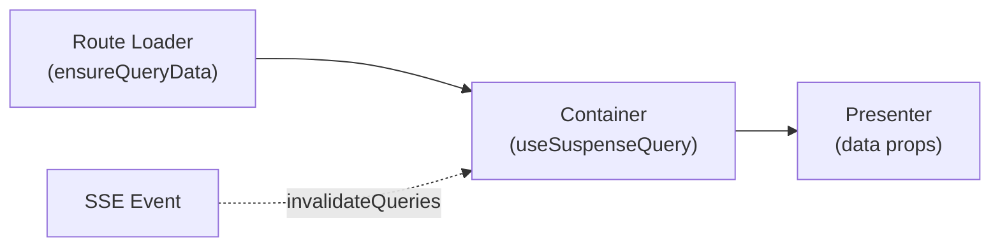

# Data Fetching



## Golden Principles

1. Query keys come from oRPC `queryOptions()` -- never hardcode <!-- enforced-by: manual-review -->
2. Prefetch in route loaders with `ensureQueryData` for instant navigation <!-- enforced-by: manual-review -->
3. `useSuspenseQuery` for required data; `useQuery` for optional <!-- enforced-by: manual-review -->
4. SSE handles cache invalidation, not `onSettled` <!-- enforced-by: manual-review -->

## oRPC Query Integration

All queries go through the typed oRPC client. Never construct query keys manually.

```tsx
// Route loader — prefetch for instant navigation
export const Route = createFileRoute('/_protected/podcasts/$podcastId')({
  loader: ({ params }) =>
    queryClient.ensureQueryData(
      apiClient.podcasts.get.queryOptions({ input: { id: params.podcastId } }),
    ),
  component: PodcastPage,
});
```

**Canonical example:** `apps/web/src/routes/_protected/podcasts/$podcastId.tsx`

## Custom Query Hooks

Features expose custom hooks that wrap oRPC query options. Components never call `apiClient` directly.

```tsx
// features/podcasts/hooks/use-podcast.ts
export function usePodcast(podcastId: string) {
  return useSuspenseQuery(
    apiClient.podcasts.get.queryOptions({ input: { id: podcastId } }),
  );
}
```

**Reference:** `apps/web/src/features/podcasts/hooks/use-podcast.ts`

## Query Hook Selection

| Scenario | Hook | Loading UI | Boundary required? |
|----------|------|------------|-------------------|
| Required page data | `useSuspenseQuery` | `<SuspenseBoundary>` | Yes |
| Optional/supplementary | `useQuery` | `isPending` check | No |
| Conditional (user action) | `useQuery` + `enabled` | `isPending` check | No |
| Infinite list | `useSuspenseInfiniteQuery` | `<SuspenseBoundary>` | Yes |

## Stale Time Defaults

| Setting | Value | Rationale |
|---------|-------|-----------|
| `staleTime` | `60_000` (1 min) | Prevents redundant refetches during navigation |
| `gcTime` | `300_000` (5 min) | Keeps cache for back-navigation |

Configure in the shared QueryClient:

```tsx
const queryClient = new QueryClient({
  defaultOptions: {
    queries: {
      staleTime: 60_000,
      gcTime: 300_000,
      retry: (count, error) => {
        if (isNotFoundError(error)) return false;
        return count < 3;
      },
    },
  },
});
```

**Reference:** `apps/web/src/clients/queryClient.ts`

## Prefetching Strategy

| Navigation type | Strategy |
|----------------|----------|
| Route navigation | `ensureQueryData` in route `loader` |
| Hover prefetch | `queryClient.prefetchQuery` on mouse enter |
| Pagination | Prefetch next page in `useEffect` |

## Rules

- One query hook per feature entity (e.g., `usePodcast`, `useDocumentList`) <!-- enforced-by: manual-review -->
- Hooks live in `features/{domain}/hooks/` <!-- enforced-by: manual-review -->
- Index files re-export hooks for public API <!-- enforced-by: manual-review -->
- Never use `queryClient.fetchQuery` in components -- use hooks <!-- enforced-by: manual-review -->
- Error retry: disable for 404s, retry 3x for transient errors <!-- enforced-by: manual-review -->
