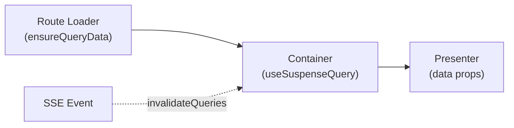

# Data Fetching


```mermaid
graph LR
  Loader["Route Loader<br/>(ensureQueryData)"] --> Container["Container<br/>(useSuspenseQuery)"]
  Container --> Presenter["Presenter<br/>(data props)"]
  SSE["SSE Event"] -.->|invalidateQueries| Container
```

## Golden Principles

1. Query keys come from oRPC `queryOptions()` -- never hardcode <!-- enforced-by: manual-review -->
2. Prefetch in route loaders with `ensureQueryData` for instant navigation <!-- enforced-by: manual-review -->
3. `useSuspenseQuery` for required data; `useQuery` for optional <!-- enforced-by: manual-review -->
4. SSE handles cache invalidation, not `onSettled` <!-- enforced-by: manual-review -->
5. Mutation invalidation must use exported key helpers derived from `queryOptions().queryKey` <!-- enforced-by: lint -->

## oRPC Query Integration

All queries go through the typed oRPC client. Never construct query keys manually.

```tsx
// Route loader — prefetch for instant navigation
export const Route = createFileRoute("/_protected/podcasts/$podcastId")({
  loader: ({ params }) =>
    queryClient.ensureQueryData(
      apiClient.podcasts.get.queryOptions({ input: { id: params.podcastId } }),
    ),
  component: PodcastPage,
});
```

**Canonical example:** `apps/web/src/routes/_protected/podcasts/$podcastId.tsx`

## Custom Query Hooks

Features expose custom hooks that wrap oRPC query options. Components should
prefer domain hooks instead of calling `apiClient` directly.

Exception for shared bulk helpers: container components may pass
`apiClient.<domain>.delete.mutationOptions().mutationFn!` into shared utilities
like `useBulkDelete` when the utility needs a raw mutation function.

```tsx
// features/podcasts/hooks/use-podcast.ts
export function usePodcast(podcastId: string) {
  return useSuspenseQuery(
    apiClient.podcasts.get.queryOptions({ input: { id: podcastId } }),
  );
}
```

**Reference:** `apps/web/src/features/podcasts/hooks/use-podcast.ts`

## Query Hook Selection

| Scenario                  | Hook                       | Loading UI           | Boundary required? |
| ------------------------- | -------------------------- | -------------------- | ------------------ |
| Required page data        | `useSuspenseQuery`         | `<SuspenseBoundary>` | Yes                |
| Optional/supplementary    | `useQuery`                 | `isPending` check    | No                 |
| Conditional (user action) | `useQuery` + `enabled`     | `isPending` check    | No                 |
| Infinite list             | `useSuspenseInfiniteQuery` | `<SuspenseBoundary>` | Yes                |

## Stale Time Defaults

| Setting     | Value             | Rationale                                      |
| ----------- | ----------------- | ---------------------------------------------- |
| `staleTime` | `60_000` (1 min)  | Prevents redundant refetches during navigation |
| `gcTime`    | `300_000` (5 min) | Keeps cache for back-navigation                |
| `defaultPreloadStaleTime` (router) | `0` | Lets React Query own freshness for loader-backed data |

Configure in the shared QueryClient:

```tsx
const queryClient = new QueryClient({
  defaultOptions: {
    queries: {
      staleTime: 60_000,
      gcTime: 300_000,
      retry: (failureCount, error) => {
        if (isApiLikeError(error)) {
          if (error.code === 'NOT_FOUND' || error.code.endsWith('_NOT_FOUND')) {
            return false;
          }
          if (error.code === 'UNAUTHORIZED' || error.code === 'FORBIDDEN') {
            return false;
          }
        }
        return failureCount < 3;
      },
      retryDelay: (attempt, error) => {
        if (isApiLikeError(error) && error.code === 'RATE_LIMITED') {
          const retryAfterMs = error.data?.retryAfter;
          if (typeof retryAfterMs === 'number' && retryAfterMs > 0) {
            return retryAfterMs;
          }
        }
        // Exponential backoff up to 30s for other transient failures.
        return Math.min(1000 * 2 ** attempt, 30_000);
      },
    },
  },
});
```

**Reference:** `apps/web/src/clients/queryClient.ts`

Set router preload freshness to `0` when route loaders use `ensureQueryData` so Query cache settings control data staleness:

```tsx
const router = createRouter({
  routeTree,
  defaultPreload: 'intent',
  defaultPreloadStaleTime: 0,
});
```

**Reference:** `apps/web/src/router.tsx`

## Prefetching Strategy

| Navigation type  | Strategy                                   |
| ---------------- | ------------------------------------------ |
| Route navigation | `ensureQueryData` in route `loader`        |
| Hover prefetch   | `queryClient.prefetchQuery` on mouse enter |
| Pagination       | Prefetch next page in `useEffect`          |

## Rules

- One query hook per feature entity (e.g., `usePodcast`, `useDocumentList`) <!-- enforced-by: manual-review -->
- Hooks live in `features/{domain}/hooks/` <!-- enforced-by: manual-review -->
- Index files re-export hooks for public API <!-- enforced-by: manual-review -->
- For shared bulk helpers (for example `useBulkDelete`), container-level `mutationFn` extraction from `apiClient.<domain>.delete.mutationOptions().mutationFn!` is allowed; keep direct `apiClient` usage scoped to these adapter points only <!-- enforced-by: manual-review -->
- For invalidation, prefer `getXQueryKey()` helpers rather than inline arrays <!-- enforced-by: lint -->
- Never use `queryClient.fetchQuery` in components -- use hooks <!-- enforced-by: manual-review -->
- Error retry: disable for `*_NOT_FOUND` and auth (`UNAUTHORIZED`/`FORBIDDEN`), retry transient failures up to 3 times <!-- enforced-by: manual-review -->
- Rate limits: honor `RATE_LIMITED.data.retryAfter` when provided, otherwise use exponential backoff <!-- enforced-by: manual-review -->
