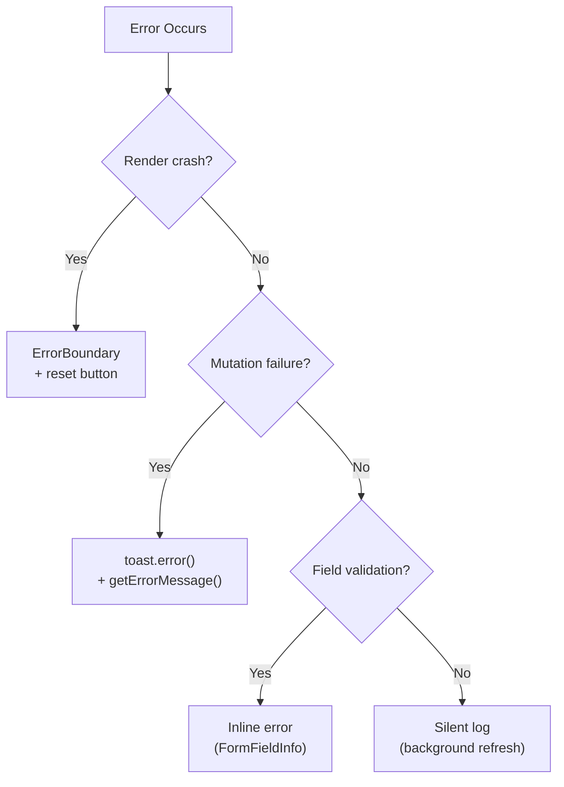

# Error Handling



## Golden Principles

1. Use `getErrorMessage(error, fallback)` for all user-facing error messages <!-- enforced-by: manual-review -->
2. Check `isDefinedError()` for typed oRPC error handling <!-- enforced-by: types -->
3. Error boundaries for render crashes, toasts for mutation failures <!-- enforced-by: manual-review -->

## Error Hierarchy

| Level | Mechanism | When |
|-------|-----------|------|
| **Crash** | `<ErrorBoundary>` via `<SuspenseBoundary>` | Unhandled render errors |
| **Action failure** | `toast.error()` | Mutation errors, API failures |
| **Field validation** | `<FormFieldInfo>` inline | Form field validation errors |
| **Background** | Silent (console only) | Background refresh failures, SSE reconnect |

## `getErrorMessage` Utility

Translates API error codes into user-friendly messages with structured data interpolation.

**Reference:** `apps/web/src/shared/lib/errors.ts`

```tsx
// In mutation onError:
onError: (error) => {
  toast.error(getErrorMessage(error, 'Failed to save changes'));
}
```

## Error Code Reference

| Code | Structured Data | User Message |
|------|----------------|--------------|
| `DOCUMENT_TOO_LARGE` | `{ fileName, fileSize, maxSize }` | "{fileName} ({size}) exceeds {max} limit" |
| `UNSUPPORTED_FORMAT` | `{ fileName, mimeType, supportedFormats }` | "{mimeType} not supported. Use: {formats}" |
| `RATE_LIMITED` | `{ retryAfter? }` | "Too many requests. Try again in {n} seconds." |
| `DOCUMENT_QUOTA_EXCEEDED` | `{ count, limit }` | "Reached document limit ({count}/{limit})." |
| `GENERATION_IN_PROGRESS` | -- | "Already being generated. Please wait." |
| `DOCUMENT_NOT_FOUND` | -- | "Document not found. May have been deleted." |
| `PODCAST_NOT_FOUND` | -- | "Podcast not found. May have been deleted." |
| `VALIDATION_ERROR` | `{ field? }` | "Invalid value for {field}" or raw message |
| `SERVICE_UNAVAILABLE` | -- | "AI service temporarily unavailable." |
| `JOB_NOT_FOUND` | -- | "Job not found. May have expired." |

## Error Boundary Integration

Error boundaries wrap containers via `<SuspenseBoundary>`. See `components.md` for placement.

**Reference:** `apps/web/src/shared/components/suspense-boundary.tsx`

```tsx
// Route page — standard pattern
<SuspenseBoundary resetKeys={[entityId]}>
  <EntityDetailContainer id={entityId} />
</SuspenseBoundary>
```

`resetKeys` ensures the boundary resets when navigating between entities (e.g., `/podcasts/1` to `/podcasts/2`).

## Retry Configuration

| Error type | Retry? | Rationale |
|-----------|--------|-----------|
| 404 Not Found | No | Entity deleted, won't recover |
| 401/403 Auth | No | Redirect to login |
| 429 Rate Limited | Yes (with backoff) | Transient |
| 500 Server Error | Yes (3x) | Transient |
| Network Error | Yes (3x) | Transient |

Configure in QueryClient:

```tsx
retry: (count, error) => {
  if (isNotFoundError(error)) return false;
  return count < 3;
}
```

## Navigation Errors

When a mutation error means the entity no longer exists (404), navigate away:

```tsx
onError: (error) => {
  if (isNotFoundError(error)) {
    navigate({ to: '/podcasts' });
    toast.error('Podcast not found');
    return;
  }
  toast.error(getErrorMessage(error, 'Operation failed'));
}
```

## Rules

- Never show raw error messages to users -- always use `getErrorMessage()` <!-- enforced-by: manual-review -->
- Never catch and swallow errors silently in user-facing flows <!-- enforced-by: manual-review -->
- Add new error codes to `getErrorMessage` switch when adding API error types <!-- enforced-by: manual-review -->
