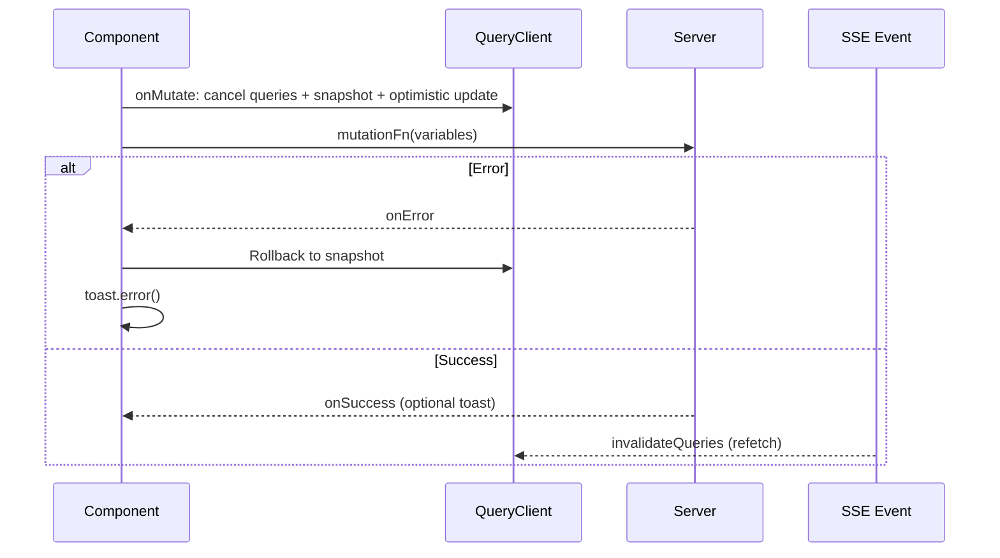

# Mutations



## Golden Principles

1. Every mutation must update or invalidate cache on success <!-- enforced-by: manual-review -->
2. SSE handles invalidation -- no refetch in `onSettled` <!-- enforced-by: manual-review -->
3. Always cancel in-flight queries before optimistic update <!-- enforced-by: manual-review -->
4. Always return `{ previous }` from `onMutate` for rollback <!-- enforced-by: manual-review -->

## Optimistic Mutation Flow (6 Steps)

1. **Cancel** in-flight queries: `await queryClient.cancelQueries({ queryKey })`
2. **Snapshot** current cache: `queryClient.getQueryData(queryKey)`
3. **Optimistic update**: `queryClient.setQueryData(queryKey, optimisticData)`
4. **Return** `{ previous }` for rollback context
5. **On error**: restore `previous` + show error toast
6. **SSE event** invalidates cache (no `onSettled` needed)

## `useOptimisticMutation` Factory

Use the shared `useOptimisticMutation` hook to implement all optimistic mutations consistently.

**Reference:** `apps/web/src/shared/hooks/use-optimistic-mutation.ts`

```tsx
// Usage — features/podcasts/hooks/use-optimistic-save-changes.ts
export function useOptimisticSaveChanges(podcastId: string) {
  const queryKey = getPodcastQueryKey(podcastId);

  return useOptimisticMutation<ResponseType, InputType, CacheType>({
    queryKey,
    mutationFn: apiClient.podcasts.saveChanges.mutationOptions().mutationFn!,
    getOptimisticData: (current, variables) => ({
      ...current,
      status: VersionStatus.GENERATING_AUDIO,
      segments: variables.segments ?? current.segments,
    }),
    successMessage: 'Regenerating audio...',
    errorMessage: 'Failed to save changes',
    showSuccessToast: true,
  });
}
```

**Canonical example:** `apps/web/src/features/podcasts/hooks/use-optimistic-save-changes.ts`

## Cache Update Decision Tree

| Mutation changes cached data? | Other components read this cache? | Needs instant feedback? | Strategy |
|------|------|------|------|
| No | -- | -- | None |
| Yes | No | -- | None |
| Yes | Yes | Yes | Optimistic (`onMutate`) |
| Yes | Yes | No | Update in `onSuccess` |

## Toast Policy

| Scenario | Toast type | When |
|----------|-----------|------|
| Mutation error | `toast.error(getErrorMessage(error, fallback))` | Always |
| Long operation started | `toast.success("Regenerating audio...")` | Only when `showSuccessToast: true` |
| SSE confirms completion | `toast.success` in SSE handler | For user-visible completions |
| Quick CRUD | No success toast | SSE provides confirmation |

## Non-Optimistic Mutations

For mutations where optimistic update is not appropriate (delete with navigation, create with redirect):

```tsx
const deleteMutation = useMutation({
  ...apiClient.podcasts.delete.mutationOptions(),
  onSuccess: () => {
    queryClient.invalidateQueries({ queryKey: listQueryKey });
    navigate({ to: '/podcasts' });
    toast.success('Podcast deleted');
  },
  onError: (error) => {
    toast.error(getErrorMessage(error, 'Failed to delete podcast'));
  },
});
```

## Mutation Hook Organization

| Pattern | Location |
|---------|----------|
| Shared factory | `apps/web/src/shared/hooks/use-optimistic-mutation.ts` |
| Feature mutations | `apps/web/src/features/{domain}/hooks/use-optimistic-*.ts` |
| Action orchestration | `apps/web/src/features/{domain}/hooks/use-{domain}-actions.ts` |

## Rules

- Extract `mutationFn` from oRPC: `apiClient.{route}.{method}.mutationOptions().mutationFn!` <!-- enforced-by: manual-review -->
- Never call `queryClient.invalidateQueries` in `onSettled` -- SSE handles it <!-- enforced-by: manual-review -->
- Use `getErrorMessage()` for all error toasts (see `error-handling.md`) <!-- enforced-by: manual-review -->
- Container calls mutation; presenter calls callback prop <!-- enforced-by: manual-review -->
