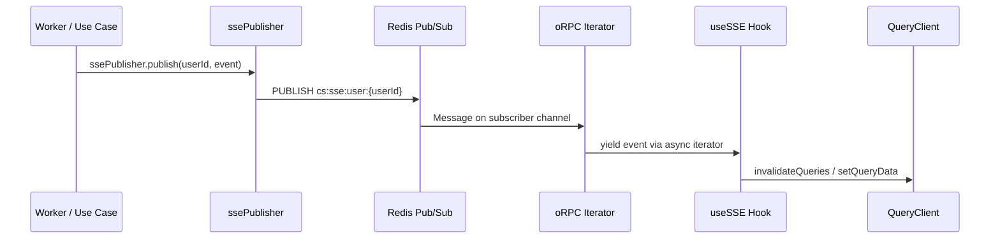

# Real-Time (SSE)



## Golden Principles

1. Use oRPC event iterators, NOT EventSource <!-- enforced-by: architecture -->
2. Workers publish via `ssePublisher.publish(userId, event)` <!-- enforced-by: architecture -->
3. Client subscribes via `rawApiClient.events.subscribe()` <!-- enforced-by: architecture -->
4. Events invalidate query cache -- no polling, no `onSettled` refetch <!-- enforced-by: manual-review -->

## Architecture Overview

| Layer | Component | Location |
|-------|-----------|----------|
| Publish | `ssePublisher.publish(userId, event)` | `packages/api/src/server/publisher.ts` |
| Transport | Redis Pub/Sub (production) or in-memory `EventPublisher` (dev) | Same file |
| Subscribe (server) | `subscribeToSSEEvents(userId, { signal })` | Same file |
| Contract | oRPC `eventIterator` contract | `packages/api/src/contracts/events.ts` |
| Subscribe (client) | `rawApiClient.events.subscribe()` | `apps/web/src/shared/hooks/use-sse.ts` |
| Handle | `useSSE` hook + `sse-handlers.ts` | Same directory |

## Server: Publishing Events

Workers and use cases publish events after completing work:

```tsx
import { ssePublisher } from '@repo/api/server/publisher';

// After podcast generation completes:
ssePublisher.publish(userId, {
  type: 'job_completion',
  jobId,
  jobType: 'generate-podcast',
  status: 'completed',
  podcastId,
});
```

The `ssePublisher` is fire-and-forget -- it logs errors internally but never throws.

## Client: Subscribing to Events

The `useSSE` hook connects via oRPC event iterator and dispatches to typed handlers.

**Reference:** `apps/web/src/shared/hooks/use-sse.ts`

```tsx
// Core pattern inside useSSE:
const iterator = await rawApiClient.events.subscribe(undefined, {
  signal: controller.signal,
});

for await (const event of iterator) {
  switch (event.type) {
    case 'job_completion':
      handleJobCompletion(event, queryClient);
      break;
    case 'entity_change':
      handleEntityChange(event, queryClient);
      break;
    // ... other event types
  }
}
```

## Event Types

| Event Type | Payload | Cache Action |
|-----------|---------|-------------|
| `connected` | -- | Reset reconnection counter |
| `job_completion` | `{ jobId, jobType, status, podcastId }` | Invalidate podcast + job queries |
| `voiceover_job_completion` | `{ jobId, status, voiceoverId }` | Invalidate voiceover queries |
| `infographic_job_completion` | `{ jobId, status, infographicId }` | Invalidate infographic queries |
| `document_job_completion` | `{ jobId, status, documentId }` | Invalidate document queries |
| `entity_change` | `{ entityType, changeType, entityId }` | Invalidate entity list + detail |
| `activity_logged` | `{ activityType }` | Invalidate activity queries |

## Reconnection

The `useSSE` hook handles reconnection with exponential backoff:

| Parameter | Value |
|-----------|-------|
| Max attempts | 10 |
| Base delay | 1,000ms |
| Max delay | 30,000ms |
| Jitter | Random 0-1,000ms added |
| Reset | On `connected` event, attempts reset to 0 |

After `MAX_ATTEMPTS`, connection state becomes `'error'`. The hook exposes `reconnect()` for manual retry.

## Cache Invalidation in Handlers

SSE handlers in `apps/web/src/shared/hooks/sse-handlers.ts` invalidate the appropriate TanStack Query caches:

```tsx
export function handleJobCompletion(event: JobCompletionEvent, qc: QueryClient) {
  qc.invalidateQueries({ queryKey: ['podcasts', 'get', event.podcastId] });
  qc.invalidateQueries({ queryKey: ['podcasts', 'list'] });
  qc.invalidateQueries({ queryKey: ['jobs'] });
}
```

## Rules

- Mount `useSSE` once at the app root (inside auth boundary) <!-- enforced-by: architecture -->
- Never use `EventSource` or `streamSSE` -- those are the old pattern <!-- enforced-by: architecture -->
- Mutations rely on SSE for cache refresh -- no `onSettled` invalidation <!-- enforced-by: manual-review -->
- Event types are defined in `packages/api/src/contracts/events.ts` <!-- enforced-by: types -->
