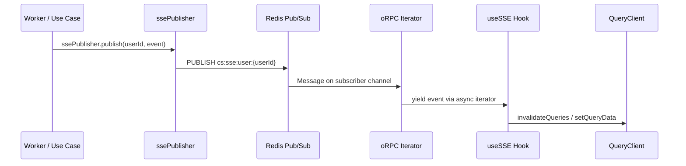

# Real-Time (SSE)


```mermaid
sequenceDiagram
  participant Worker as Worker / Use Case
  participant Pub as ssePublisher
  participant Redis as Redis Pub/Sub
  participant ORPC as oRPC Iterator
  participant Client as useSSE Hook
  participant QC as QueryClient

  Worker->>Pub: ssePublisher.publish(userId, event)
  Pub->>Redis: PUBLISH cs:sse:user:{userId}
  Redis->>ORPC: Message on subscriber channel
  ORPC->>Client: yield event via async iterator
  Client->>QC: invalidateQueries / setQueryData
```

## Golden Principles

1. Use oRPC event iterators, NOT EventSource <!-- enforced-by: architecture -->
2. Workers publish via `ssePublisher.publish(userId, event)` <!-- enforced-by: architecture -->
3. Client subscribes via `rawApiClient.events.subscribe()` <!-- enforced-by: architecture -->
4. Events invalidate query cache -- no polling, no `onSettled` refetch <!-- enforced-by: manual-review -->

## Architecture Overview

| Layer              | Component                                                      | Location                               |
| ------------------ | -------------------------------------------------------------- | -------------------------------------- |
| Publish            | `ssePublisher.publish(userId, event)`                          | `packages/api/src/server/publisher.ts` |
| Transport          | Redis Pub/Sub (production) or in-memory `EventPublisher` (dev) | Same file                              |
| Subscribe (server) | `subscribeToSSEEvents(userId, { signal })`                     | Same file                              |
| Contract           | oRPC `eventIterator` contract                                  | `packages/api/src/contracts/events.ts` |
| Subscribe (client) | `rawApiClient.events.subscribe()`                              | `apps/web/src/shared/hooks/use-sse.ts` |
| Handle             | `useSSE` hook + `sse-handlers.ts`                              | Same directory                         |

## Server: Publishing Events

Workers and use cases publish events after completing work:

```tsx
import { ssePublisher } from "@repo/api/server/publisher";

// After podcast generation completes:
ssePublisher.publish(userId, {
  type: "job_completion",
  jobId,
  jobType: "generate-podcast",
  status: "completed",
  podcastId,
});
```

The `ssePublisher` is fire-and-forget -- it logs errors internally but never throws.

Multi-phase jobs can also publish intermediate `entity_change` updates before the
terminal `*_job_completion` event. Podcast generation uses this after script
generation so the workbench can render script content while audio is still
processing.

## Client: Subscribing to Events

The `useSSE` hook connects via oRPC event iterator and dispatches to typed handlers.

**Reference:** `apps/web/src/shared/hooks/use-sse.ts`

```tsx
// Core pattern inside useSSE:
const iterator = await rawApiClient.events.subscribe(undefined, {
  signal: controller.signal,
});

for await (const event of iterator) {
  switch (event.type) {
    case "job_completion":
      handleJobCompletion(event, queryClient);
      break;
    case "source_job_completion":
      handleSourceJobCompletion(event, queryClient);
      break;
    case "entity_change":
      handleEntityChange(event, queryClient);
      break;
  }
}
```

## Event Types

| Event Type                   | Payload                                 | Cache Action                     |
| ---------------------------- | --------------------------------------- | -------------------------------- |
| `connected`                  | `{ userId }`                            | Reset reconnection counter       |
| `job_completion`             | `{ jobId, jobType, status, podcastId }` | Invalidate podcast + job queries |
| `voiceover_job_completion`   | `{ jobId, status, voiceoverId }`        | Invalidate voiceover queries     |
| `infographic_job_completion` | `{ jobId, status, infographicId }`      | Invalidate infographic queries   |
| `source_job_completion`      | `{ jobId, jobType, status, sourceId }`  | Invalidate source queries        |
| `entity_change`              | `{ entityType, changeType, entityId }`  | Invalidate entity list + detail  |

Admin activity views are intentionally not part of the SSE contract. They refresh through their normal query lifecycle rather than a dedicated `activity_logged` event.

## Reconnection

The `useSSE` hook handles reconnection with exponential backoff:

| Parameter     | Value                                                                                                                               |
| ------------- | ----------------------------------------------------------------------------------------------------------------------------------- |
| Max attempts  | 10                                                                                                                                  |
| Base delay    | 1,000ms                                                                                                                             |
| Max delay     | 30,000ms                                                                                                                            |
| Jitter        | Random 0-1,000ms added                                                                                                              |
| Reset         | On `connected` event, attempts reset to 0                                                                                           |
| Resume cursor | Only replayable events advance `lastEventId`; `connected(id=0)` is an acknowledgement sentinel and never replaces the stored cursor |

After `MAX_ATTEMPTS`, connection state becomes `'error'`. The hook exposes `reconnect()` for manual retry.

## Cache Invalidation in Handlers

SSE handlers in `apps/web/src/shared/hooks/sse-handlers.ts` invalidate the appropriate TanStack Query caches:

```tsx
const getPodcastQueryKey = (podcastId: string) =>
  apiClient.podcasts.get.queryOptions({ input: { id: podcastId } }).queryKey;

const getPodcastsListQueryKey = () =>
  apiClient.podcasts.list.queryOptions({ input: {} }).queryKey;

export function handleJobCompletion(
  event: JobCompletionEvent,
  qc: QueryClient,
) {
  if (event.podcastId) {
    qc.invalidateQueries({ queryKey: getPodcastQueryKey(event.podcastId) });
  }
  qc.invalidateQueries({ queryKey: getPodcastsListQueryKey() });
}
```

## Event Replay on Reconnect

When a connection drops, events published during the gap are replayed on reconnect via `lastEventId`.

### How It Works

| Step | Component        | Action                                                                         |
| ---- | ---------------- | ------------------------------------------------------------------------------ |
| 1    | Server publisher | Pushes every event into per-user `SSEReplayBuffer`, assigns monotonic ID       |
| 2    | Server handler   | Tags each yielded event with `withEventMeta(event, { id })`                    |
| 3    | Client hook      | Stores the latest replayable event ID in `lastEventIdRef` via `getEventMeta()` |
| 4    | On reconnect     | Client passes `lastEventId` to subscribe call                                  |
| 5    | Server handler   | Replays buffered events with `id > lastEventId`, then deduplicates live stream |

The `connected` event is a transport acknowledgement only. Its sentinel ID (`0`) resets the reconnect-attempt counter, but it does not advance the replay cursor.

### Limitations

- **In-memory only** — buffer is lost on server restart
- **120-second TTL** — events older than 2 minutes are evicted
- **Per-server buffer** — in multi-server deployments, replay only covers events buffered on the reconnected server
- **200 events per user** — oldest events are evicted when the cap is reached

## Rules

- Mount `useSSE` once at the app root (inside auth boundary) <!-- enforced-by: architecture -->
- Never use `EventSource` or `streamSSE` -- those are the old pattern <!-- enforced-by: architecture -->
- Mutations rely on SSE for cache refresh -- no `onSettled` invalidation <!-- enforced-by: manual-review -->
- Event types are defined in `packages/api/src/contracts/events.ts` <!-- enforced-by: types -->
