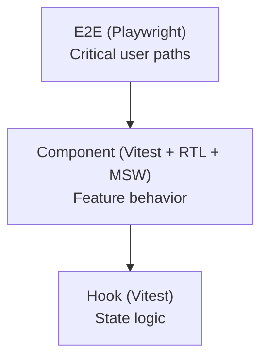

# Frontend Testing



## Golden Principles

1. Test what users see, not implementation details <!-- enforced-by: manual-review -->
2. One MSW handler file per feature: `__tests__/handlers.ts` <!-- enforced-by: manual-review -->
3. Use `renderWithQuery` for component tests <!-- enforced-by: manual-review -->
4. E2E: Page Object Model + `authenticatedTest` fixture <!-- enforced-by: manual-review -->
5. Selector priority: `getByRole` > `getByText` (scoped to container) <!-- enforced-by: manual-review -->

## Test Types

| Type | Tool | Scope | Location |
|------|------|-------|----------|
| Component | Vitest + RTL + MSW | Single feature | `features/{domain}/__tests__/` |
| Hook | Vitest + `renderHook` | Hook logic | `features/{domain}/__tests__/` or `shared/hooks/__tests__/` |
| E2E | Playwright | Full user flow | `apps/web/e2e/tests/` |

## Component Tests

### Setup

```tsx
import { describe, it, expect, beforeAll, afterEach, afterAll } from 'vitest';
import { screen, waitFor } from '@testing-library/react';
import { renderWithQuery, userEvent, server } from '@/test-utils';
import { handlers } from './handlers';

beforeAll(() => server.listen());
afterEach(() => server.resetHandlers());
afterAll(() => server.close());
```

**Reference:** `apps/web/src/test-utils/index.tsx` (renderWithQuery, server, handlers)

### MSW Handlers

One handler file per feature. Export an array of handlers and mock data factories.

```tsx
// features/documents/__tests__/handlers.ts
import { http, HttpResponse } from 'msw';

export const mockDocument = { id: '1', title: 'Test Doc', ... };

export const handlers = [
  http.get('/api/documents', () => HttpResponse.json([mockDocument])),
  http.get('/api/documents/:id', ({ params }) =>
    HttpResponse.json({ ...mockDocument, id: params.id }),
  ),
];
```

**Canonical example:** `apps/web/src/features/documents/__tests__/document-list.test.tsx`

### Test Structure

```tsx
describe('DocumentList', () => {
  it('renders document items', async () => {
    server.use(...handlers);
    renderWithQuery(<DocumentList />);

    expect(await screen.findByText('Test Doc')).toBeInTheDocument();
  });

  it('shows empty state when no documents', async () => {
    server.use(http.get('/api/documents', () => HttpResponse.json([])));
    renderWithQuery(<DocumentList />);

    expect(await screen.findByText(/no documents/i)).toBeInTheDocument();
  });
});
```

## Test Checklist by Component Type

| Component Type | Required Tests |
|---|---|
| **List** | Renders items, empty state, loading state, error state |
| **Form** | Valid submit calls mutation, validation errors display, submit disabled while submitting, error toast on failure |
| **Detail** | Displays data fields, loading state, not-found handling |
| **Hook** | Initializes with defaults, updates state on actions, tracks dirty state, resets after save |
| **Dialog/Modal** | Opens on trigger, closes on cancel, submits and closes on confirm |

## Hook Tests

```tsx
import { renderHook, act } from '@testing-library/react';

describe('useScriptEditor', () => {
  it('initializes with provided segments', () => {
    const { result } = renderHook(() =>
      useScriptEditor({ podcastId: '1', initialSegments: mockSegments }),
    );
    expect(result.current.segments).toEqual(mockSegments);
  });

  it('tracks changes after edit', () => {
    const { result } = renderHook(() =>
      useScriptEditor({ podcastId: '1', initialSegments: mockSegments }),
    );

    act(() => result.current.updateSegment(0, 'New text'));

    expect(result.current.hasChanges).toBe(true);
  });
});
```

**Canonical example:** `apps/web/src/features/podcasts/__tests__/use-script-editor.test.ts`

## E2E Tests (Playwright)

### Fixtures

Use `authenticatedTest` for tests requiring login. Page objects encapsulate selectors.

**Reference:** `apps/web/e2e/fixtures/index.ts`

```tsx
import { authenticatedTest, expect } from '../../fixtures';

authenticatedTest('creates a podcast', async ({ podcastsPage }) => {
  await podcastsPage.goto();
  await podcastsPage.clickCreate();
  await podcastsPage.fillTitle('My Podcast');
  await podcastsPage.submit();

  await expect(podcastsPage.successMessage).toBeVisible();
});
```

### Page Object Model

Each page gets a Page Object in `apps/web/e2e/pages/`.

```tsx
// e2e/pages/documents.page.ts
export class DocumentsPage extends BasePage {
  readonly heading = this.page.getByRole('heading', { name: 'Documents', level: 1 });
  readonly uploadButton = this.page.getByRole('button', { name: /upload/i });
  readonly documentList = this.page.getByRole('list', { name: /documents/i });

  async goto() {
    await this.page.goto('/documents');
    await this.heading.waitFor();
  }
}
```

**Canonical example:** `apps/web/e2e/pages/documents.page.ts`

### Selector Best Practices

| Priority | Selector | When |
|----------|---------|------|
| 1 | `getByRole('button', { name: /save/i })` | Interactive elements |
| 2 | `getByRole('heading', { name: /title/, level: 2 })` | Headings (always include level) |
| 3 | `getByText(/content/i)` scoped to container | Static text within a region |
| 4 | `getByTestId('loading-spinner')` | No accessible role available |

Scope selectors to containers to avoid ambiguity:

```tsx
const card = page.getByRole('article').filter({ hasText: 'My Podcast' });
await card.getByRole('button', { name: /edit/i }).click();
```

### E2E Test Organization

```
apps/web/e2e/
  fixtures/index.ts         # authenticatedTest, test, expect
  pages/                    # Page Objects
    base.page.ts
    documents.page.ts
    podcasts.page.ts
  tests/                    # Test specs by domain
    documents/
      list.spec.ts
      upload.spec.ts
    podcasts/
      create.spec.ts
      workbench.spec.ts
  utils/api.ts              # Direct API helper for test setup
```

## Rules

- Vitest runs frontend tests via `pnpm test` (included in workspace) <!-- enforced-by: architecture -->
- Never use Jest or ts-jest -- Vitest only <!-- enforced-by: architecture -->
- No `waitForNextUpdate` -- use `waitFor` or `findBy*` <!-- enforced-by: manual-review -->
- Prefer `userEvent` over `fireEvent` for realistic interactions <!-- enforced-by: manual-review -->
- E2E tests must not depend on specific database state -- use API helper to seed <!-- enforced-by: manual-review -->
- Fake timers and async iterators do not mix well -- prefer real timers with short delays for SSE tests <!-- enforced-by: manual-review -->
