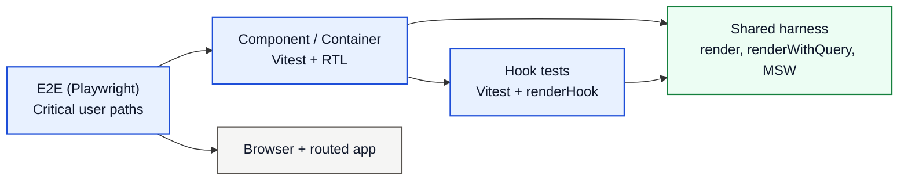

# Frontend Testing


```mermaid
flowchart LR
  classDef entry fill:#e8f1ff,stroke:#1d4ed8,color:#0f172a,stroke-width:1.5px;
  classDef runtime fill:#ecfdf3,stroke:#15803d,color:#0f172a,stroke-width:1.5px;
  classDef async fill:#fff7ed,stroke:#c2410c,color:#0f172a,stroke-width:1.5px;
  classDef store fill:#f5f5f4,stroke:#57534e,color:#0f172a,stroke-width:1.5px;
  classDef control fill:#fef2f2,stroke:#b91c1c,color:#0f172a,stroke-width:1.5px;

  E2E["E2E (Playwright)<br/>Critical user paths"]
  Component["Component / Container<br/>Vitest + RTL"]
  Hook["Hook tests<br/>Vitest + renderHook"]
  Harness["Shared harness<br/>render, renderWithQuery, MSW"]
  Browser["Browser + routed app"]

  E2E --> Component --> Hook
  E2E --> Browser
  Component --> Harness
  Hook --> Harness

  class E2E,Component,Hook entry;
  class Harness runtime;
  class Browser store;
```

## Golden Principles

1. Test what users see and do, not implementation trivia <!-- enforced-by: manual-review -->
2. Use `render` for pure UI tests and `renderWithQuery` when Query providers are required <!-- enforced-by: manual-review -->
3. Use MSW when transport behavior matters; use targeted `vi.mock(...)` when a feature test only needs to isolate hooks or mutations <!-- enforced-by: manual-review -->
4. E2E uses Page Objects plus `authenticatedTest` for logged-in paths <!-- enforced-by: manual-review -->
5. Prefer accessible selectors: `getByRole` first, then scoped text selectors <!-- enforced-by: manual-review -->

## Anti-Bloat Rules

<!-- enforced-by: manual-review -->

1. Cover behavior states, not every visual micro-variation.
2. Prefer one strong scenario test with multiple meaningful assertions over many one-assertion duplicates.
3. Do not add tests that only pin instructional, guidance, marketing, or static explanatory copy unless the text is itself a contract (accessibility name, destructive confirmation, legal/compliance text, or required CTA copy).
4. Keep prop-spy container tests only when they verify payload shaping, sanitization, blocker logic, loading/error branching, or success side effects.
5. Delete thin container tests that only prove callback pass-through such as `navigate(...)` or child prop wiring.
6. Keep E2E focused on critical outcomes: auth, create, upload, generate, save, delete.
7. Remove placeholder skipped tests quickly; either implement them or delete them.
8. Replace `waitForTimeout` with explicit UI assertions whenever possible.

## Frontend Unit Test Anti-Patterns

1. Copy-locking tests:
   Delete tests whose only value is preserving helper copy, onboarding prose, or descriptive headings.
2. Thin wiring tests:
   Replace container tests that only prove a child callback forwards into `navigate(...)`, `setState(...)`, or another pass-through prop with a branch that has unique behavioral value.
3. Fragmented render-state tests:
   When one dialog or async surface has a small state machine, prefer a few scenario tests that cover pending, error, confirm, and recovery paths instead of a separate test for each text fragment.
4. Styling-only assertions:
   Avoid tests that only assert utility class names (for example `bg-*`, `text-*`, `break-words`) without a user-visible behavior branch.
5. Low-level event overuse:
   Use `fireEvent` only for interactions `userEvent` cannot model well, such as image `error`.
6. Shared interaction state:
   Call `userEvent.setup()` inside each test so keyboard and pointer state never leaks across cases.
7. Shared query cache:
   `renderWithQuery(...)` should use a fresh `QueryClient` per test. Preserve the default test utility behavior and keep retries disabled in error-path tests unless retry logic is the thing under test.
8. Mixed mocking seams:
   Use MSW when transport behavior matters, or `vi.mock(...)` when isolating hooks/containers/components. Avoid mixing both in one test unless the extra seam is required by the assertion.

## Test Types

| Type                               | Tool                          | Scope                               | Typical location                                            |
| ---------------------------------- | ----------------------------- | ----------------------------------- | ----------------------------------------------------------- |
| Presenter / component              | Vitest + RTL                  | Pure rendering and UI events        | `features/{domain}/__tests__/`                              |
| Container / query-backed component | Vitest + RTL + Query provider | Hooks, query state, mutation wiring | `features/{domain}/__tests__/` or `shared/**/__tests__/`    |
| Hook                               | Vitest + `renderHook`         | Hook logic and local state          | `features/{domain}/__tests__/` or `shared/hooks/__tests__/` |
| E2E                                | Playwright                    | Full browser flow                   | `apps/web/e2e/tests/`                                       |

## Component And Container Tests

### Base Setup

```tsx
import { beforeEach, describe, expect, it, vi } from "vitest";
import { renderWithQuery, screen, userEvent, waitFor } from "@/test-utils";
```

**Reference:** `apps/web/src/test-utils/index.tsx`

Use:

- `render(...)` for pure presentational components that do not need Query context
- `renderWithQuery(...)` for anything using TanStack Query hooks, shared mutation helpers, or components built on query-driven child hooks

### Transport-Level Mocks With MSW

When the test cares about client transport behavior, keep handlers close to the feature:

```tsx
// apps/web/src/features/sources/__tests__/handlers.ts
import { http, HttpResponse } from "msw";

const API_BASE = "/rpc";

export const sourceHandlers = [
  http.post(`${API_BASE}/sources.list`, () => HttpResponse.json(mockSources)),
  http.post(`${API_BASE}/sources.get`, async ({ request }) => {
    const body = (await request.json()) as { id?: string };
    const source = mockSources.find((item) => item.id === body.id);
    return source
      ? HttpResponse.json(source)
      : HttpResponse.json({ error: "Source not found" }, { status: 404 });
  }),
];
```

**Canonical handler example:** `apps/web/src/features/sources/__tests__/handlers.ts`

### Hook- or Mutation-Mocked Feature Tests

Many current feature tests isolate the UI by mocking `apiClient` adapters or feature hooks directly.

```tsx
describe("AddSourceDialog", () => {
  beforeEach(() => {
    mockUseSources.mockReturnValue({ data: [], isLoading: false });
    mockFromUrlMutationFn.mockResolvedValue({
      id: "url-src-2",
      title: "URL Source",
      mimeType: "text/html",
      wordCount: 220,
    });
  });

  it("adds a source from URL and closes the dialog", async () => {
    const user = userEvent.setup();
    renderWithQuery(
      <AddSourceDialog
        open={true}
        onOpenChange={onOpenChange}
        currentSourceIds={[]}
        onAddSources={onAddSources}
      />,
    );

    await user.click(screen.getByRole("tab", { name: "From URL" }));
    await user.type(screen.getByLabelText("URL"), "https://example.com/news");
    await user.click(screen.getByRole("button", { name: "Add URL" }));

    await waitFor(() => expect(mockFromUrlMutationFn).toHaveBeenCalled());
    await waitFor(() => expect(onOpenChange).toHaveBeenCalledWith(false));
  });
});
```

**Canonical example:** `apps/web/src/shared/components/source-manager/__tests__/add-source-dialog.test.tsx`

## Test Checklist By Component Type

| Component type       | Required tests                                                                 |
| -------------------- | ------------------------------------------------------------------------------ |
| List                 | Renders items, empty state, search/no-results state, key actions               |
| Form / dialog        | Valid submit path, validation feedback, pending state, failure handling        |
| Detail container     | Correct derived props, loading / missing content branches, destructive actions |
| Hook                 | Default state, state transitions, dirty tracking, reset behavior               |
| Shared async wrapper | Error boundary behavior, retry wiring, suspense fallback behavior              |

## Hook Tests

```tsx
import { act, renderHook } from "@testing-library/react";

describe("useScriptEditor", () => {
  it("tracks changes after edit", () => {
    const { result } = renderHook(() =>
      useScriptEditor({ podcastId: "pod_1", initialSegments: mockSegments }),
    );

    act(() => result.current.updateSegment(0, "New text"));

    expect(result.current.hasChanges).toBe(true);
  });
});
```

**Canonical example:** `apps/web/src/features/podcasts/__tests__/use-script-editor.test.ts`

## E2E Tests (Playwright)

Preferred entrypoint:

```bash
pnpm test:e2e
```

The wrapper script provisions an ephemeral PostgreSQL Testcontainer, ensures the local Redis/MinIO Docker services are available, starts `apps/server`, `apps/worker`, and `apps/web`, and then runs Playwright.

For interactive debugging:

```bash
pnpm test:e2e:ui
```

### Fixtures

Use `authenticatedTest` for flows that require login.

```tsx
import { authenticatedTest, expect } from "../../fixtures";

authenticatedTest("uploads a source", async ({ sourcesPage }) => {
  await sourcesPage.goto();
  await sourcesPage.expectVisible();
  await sourcesPage.uploadFile("fixtures/source.txt");

  await expect(sourcesPage.getUploadDialog()).toBeHidden();
});
```

**Reference:** `apps/web/e2e/fixtures/index.ts`

### Page Object Model

Each major route gets a Page Object under `apps/web/e2e/pages/`.

```tsx
// apps/web/e2e/pages/sources.page.ts
export class SourcesPage extends BasePage {
  readonly uploadButton = this.page.getByRole("button", { name: /upload/i });
  readonly searchInput = this.page.getByPlaceholder(/search/i);

  async goto() {
    await this.page.goto("/sources");
    await this.waitForLoading();
  }

  async expectVisible() {
    await expect(
      this.page.getByRole("heading", { name: "Sources", level: 1 }),
    ).toBeVisible();
  }
}
```

**Canonical page object:** `apps/web/e2e/pages/sources.page.ts`

### Selector Best Practices

| Priority | Selector                                               | When                                 |
| -------- | ------------------------------------------------------ | ------------------------------------ |
| 1        | `getByRole('button', { name: /save/i })`               | Interactive elements                 |
| 2        | `getByRole('heading', { name: /sources/i, level: 1 })` | Headings                             |
| 3        | Scoped `getByText(...)`                                | Static text inside a known region    |
| 4        | `getByTestId(...)`                                     | No better accessible selector exists |

Scope selectors to a container when repeated UI exists on the page.

## E2E Test Organization

```
apps/web/e2e/
  fixtures/index.ts
  pages/
    base.page.ts
    dashboard.page.ts
    login.page.ts
    podcasts.page.ts
    register.page.ts
    sources.page.ts
    voiceovers.page.ts
  tests/
    auth/
    dashboard/
    podcasts/
    sources/
    voiceovers/
  utils/api.ts
```

Raw `playwright test` is still available for manual debugging, but the repo-standard path is `pnpm test:e2e` so the full runtime is started consistently.

## Rules

- Frontend Vitest projects are included in `pnpm test` <!-- enforced-by: architecture -->
- Never add Jest or ts-jest <!-- enforced-by: architecture -->
- Prefer `userEvent` over `fireEvent` <!-- enforced-by: manual-review -->
- Do not use `waitForNextUpdate`; use `findBy*`, `waitFor`, or explicit UI assertions <!-- enforced-by: manual-review -->
- E2E tests should seed or manipulate data through helpers, not assume existing database state <!-- enforced-by: manual-review -->
- Use MSW when you want to exercise transport behavior; use `vi.mock(...)` when the transport layer is not the point of the test <!-- enforced-by: manual-review -->
