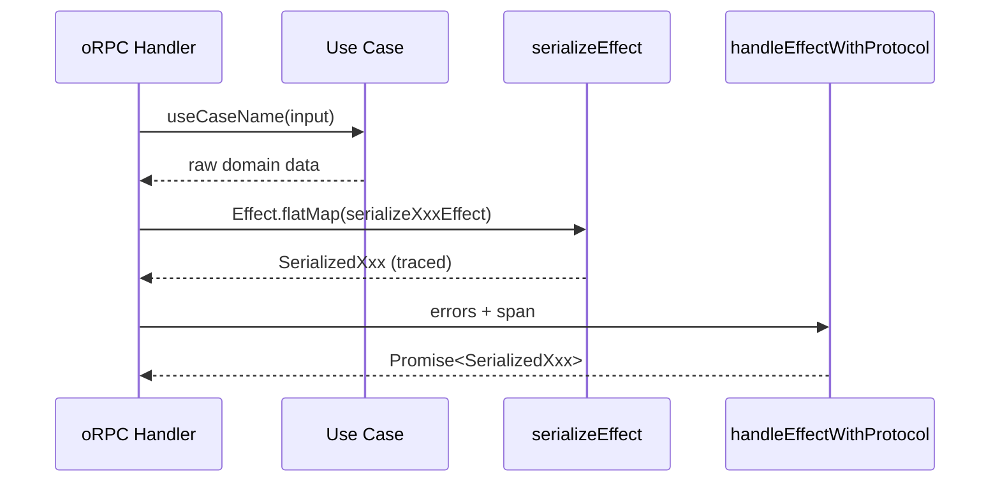

# API Handler Pattern

> Merged from `router-handler.md` and `serialization.md`.



## Golden Principles

1. **Call exactly ONE use case per handler** <!-- enforced-by: manual-review -->
2. **Use Effect-based serializers** (`serializeXxxEffect`) in handlers for tracing <!-- enforced-by: manual-review -->
3. **Span required**: every call to `handleEffectWithProtocol` must include `{ span }` <!-- enforced-by: types -->
4. **Don't serialize in use cases** -- handlers only <!-- enforced-by: invariant-test -->

## Canonical Example

> See `packages/api/src/server/router/document.ts`

```typescript
get: protectedProcedure.documents.get.handler(
  async ({ context, input, errors }) => {
    return handleEffectWithProtocol(
      context.runtime,
      context.user,
      getDocument({ id: input.id }).pipe(
        Effect.flatMap(serializeDocumentEffect),
      ),
      errors,
      { span: 'api.documents.get', attributes: { 'document.id': input.id } },
    );
  },
),
```

## Handler Pipeline

```
handler -> one use case -> Effect.flatMap(serializeXxxEffect) -> handleEffectWithProtocol(errors, { span })
```

Every handler follows this exact shape. Custom error overrides are rare -- only for business logic like upsell flows:

```typescript
handleEffectWithProtocol(runtime, user, effect, errors,
  { span: 'api.documents.create' },
  { DocumentQuotaExceeded: (e) => { throw errors.PAYMENT_REQUIRED({ message: '...' }); } },
);
```

## Span Naming <!-- enforced-by: invariant-test -->

| Layer | Format | Example |
|---|---|---|
| Handler | `api.{domain}.{action}` | `api.documents.get` |
| Serializer | `serialize.{entity}` | `serialize.document` |
| Batch serializer | `serialize.{entities}` | `serialize.documents` |

## Serializer Variants <!-- enforced-by: manual-review -->

Each entity in `packages/db/src/schemas/{entity}.ts` exports three variants:

| Variant | Where to Use | Tracing |
|---|---|---|
| `serializeXxxEffect(item)` | Handlers (single) | Yes |
| `serializeXxxsEffect(items)` | Handlers (batch/list) | Yes, parallel |
| `serializeXxx(item)` | Tests, intermediate transforms | No |

Batch is derived from single via `Effect.all(..., { concurrency: 'unbounded' })`.

### Serializer Implementation Pattern

```typescript
// Sync (base)
export const serializeDocument = (doc: Document): SerializedDocument => ({
  id: doc.id,
  title: doc.title,
  createdAt: doc.createdAt.toISOString(),
  updatedAt: doc.updatedAt.toISOString(),
  description: doc.description ?? null,
});

// Effect (traced) -- used in handlers
export const serializeDocumentEffect = (doc: Document) =>
  Effect.sync(() => serializeDocument(doc)).pipe(
    Effect.withSpan('serialize.document', { attributes: { 'document.id': doc.id } }),
  );

// Batch (traced, parallel) -- used in list handlers
export const serializeDocumentsEffect = (docs: Document[]) =>
  Effect.all(docs.map(serializeDocumentEffect), { concurrency: 'unbounded' }).pipe(
    Effect.withSpan('serialize.documents', { attributes: { count: docs.length } }),
  );
```

## Transformation Rules <!-- enforced-by: manual-review -->

| Field Type | Transformation |
|---|---|
| `Date` | `.toISOString()` |
| Optional / nullable | `?? null` |
| Nested entity | Recursive `serializeXxx(nested)` |
| Internal fields (`userId`) | Omit from serialized type |
| Computed fields | Derive in serializer (`wordCount`, `estimatedReadTime`) |

## Protocol-Based Errors <!-- enforced-by: invariant-test -->

Use `handleEffectWithProtocol` -- errors handle themselves via static HTTP protocol properties. No manual error mapping.

```typescript
// Correct
return handleEffectWithProtocol(runtime, user, effect, errors, { span });

// Wrong -- legacy manual mapping
return handleEffect(runtime, user, effect, { DocumentNotFound: (e) => { ... } }, { span });
```
