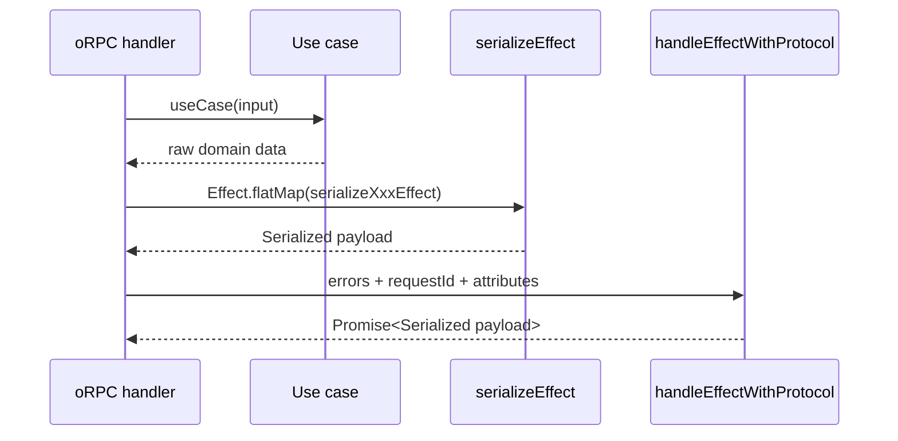

# API Handler Pattern

> Canonical guidance for routing, serialization, and protocol mapping lives here.


```mermaid
sequenceDiagram
  participant H as oRPC handler
  participant UC as Use case
  participant S as serializeEffect
  participant P as handleEffectWithProtocol

  H->>UC: useCase(input)
  UC-->>H: raw domain data
  H->>S: Effect.flatMap(serializeXxxEffect)
  S-->>H: Serialized payload
  H->>P: errors + requestId + attributes
  P-->>H: Promise<Serialized payload>
```

## Golden Principles

1. **Call exactly one use case per handler** <!-- enforced-by: manual-review -->
2. **Serialize in the handler, not the use case** <!-- enforced-by: invariant-test -->
3. **Bind or pass `requestId` into the protocol helper** for correlation and trace metadata <!-- enforced-by: manual-review -->
4. **Keep streaming contracts concretely typed** end-to-end <!-- enforced-by: lint -->
5. **Prefer Effect-based serializers** so serialization work is traced consistently <!-- enforced-by: manual-review -->

## Canonical Example

> See `packages/api/src/server/router/source.ts`

```typescript
get: protectedProcedure.sources.get.handler(
  async ({ context, input, errors }) => {
    return bindEffectProtocol({ context, errors }).run(
      getSource({ id: input.id }).pipe(Effect.flatMap(serializeSourceEffect)),
      {
        attributes: { 'source.id': input.id },
      },
    );
  },
),
```

## Handler Pipeline

```
handler -> bindEffectProtocol({ context, errors }) -> one use case -> Effect.flatMap(serializeXxxEffect) -> handleEffectWithProtocol(...)
```

Most handlers should bind the request context once, then call `.run(...)` or `.stream(...)`. Use direct `handleEffectWithProtocol(...)` only when you truly need a lower-level escape hatch. Use custom error overrides only when protocol behavior truly needs to differ from the typed domain error mapping.

## Request Context Binding

`bindEffectProtocol({ context, errors })` is the preferred router-level wrapper. It keeps the handler concise while still routing through `handleEffectWithProtocol(...)`, which is where:

- `requestId` is attached to the active span
- the authenticated user is scoped into Effect via `withCurrentUser(...)`
- tagged domain/app errors are mapped to oRPC protocol errors

This keeps FiberRef usage at the boundary where HTTP context enters Effect. Use cases should continue to read the user via `yield* getCurrentUser`, never from router context directly.

## Span Naming <!-- enforced-by: invariant-test -->

| Layer | Format | Example |
|---|---|---|
| Handler | `api.{domain}.{action}` | `api.sources.get` |
| Serializer | `serialize.{entity}` | `serialize.source` |
| Batch serializer | `serialize.{entity}.batch` | `serialize.source.batch` |

## Serializer Variants <!-- enforced-by: manual-review -->

Each entity serializer in `@repo/db/schema` typically exposes:

| Variant | Where to use | Tracing |
|---|---|---|
| `serializeXxxEffect(item)` | Single-item handlers | Yes |
| `serializeXxxsEffect(items)` | List handlers | Yes, parallel |
| `serializeXxx(item)` | Tests or intermediate transforms | No |

Batch serializers are derived from the single-item transform via `Effect.all(..., { concurrency: 'unbounded' })`.

### Serializer Implementation Pattern

Use the serializer factories from `packages/db/src/schemas/serialization.ts`:

```typescript
import { createBatchEffectSerializer, createEffectSerializer } from '@repo/db/schema';

const sourceTransform = (source: Source) => ({
  id: source.id,
  title: source.title,
  createdAt: source.createdAt.toISOString(),
  updatedAt: source.updatedAt.toISOString(),
  source: source.source,
});

export const serializeSourceEffect = createEffectSerializer('source', sourceTransform);
export const serializeSourcesEffect = createBatchEffectSerializer('source', sourceTransform);
export const serializeSource = sourceTransform;
```

## Activity Logging

Handlers can attach best-effort activity logging without blocking the main response:

```typescript
createSource(input).pipe(
  Effect.flatMap(serializeSourceEffect),
  tapLogActivity(context.runtime, context.user, 'created', 'source'),
)
```

## Transformation Rules <!-- enforced-by: manual-review -->

| Field type | Transformation |
|---|---|
| `Date` | `.toISOString()` |
| Optional or nullable | `?? null` |
| Nested entity | Recursive `serializeXxx(...)` or nested transform |
| Internal fields such as `userId` | Omit from serialized output |
| Computed fields | Derive in serializer, not the repo or use case |

## Protocol-Based Errors <!-- enforced-by: invariant-test -->

Use `bindEffectProtocol(...).run(...)` in routers so request context is bound once, or `handleEffectWithProtocol(...)` directly when you need lower-level control. Domain errors already carry their protocol mapping; avoid hand-written status mapping unless the behavior is intentionally exceptional.

```typescript
// Correct
return bindEffectProtocol({ context, errors }).run(effect);
```

## Streaming Handlers

For chat and SSE-like endpoints:

- Contract output must use concrete chunk types.
- Handler should return the typed stream directly, not `unknown`.
- Client code should not need manual casts to consume stream payloads.
- Prefer `bindEffectProtocol({ context, errors }).stream(effect)` so stream handlers use the same request-bound protocol path as non-stream handlers.
