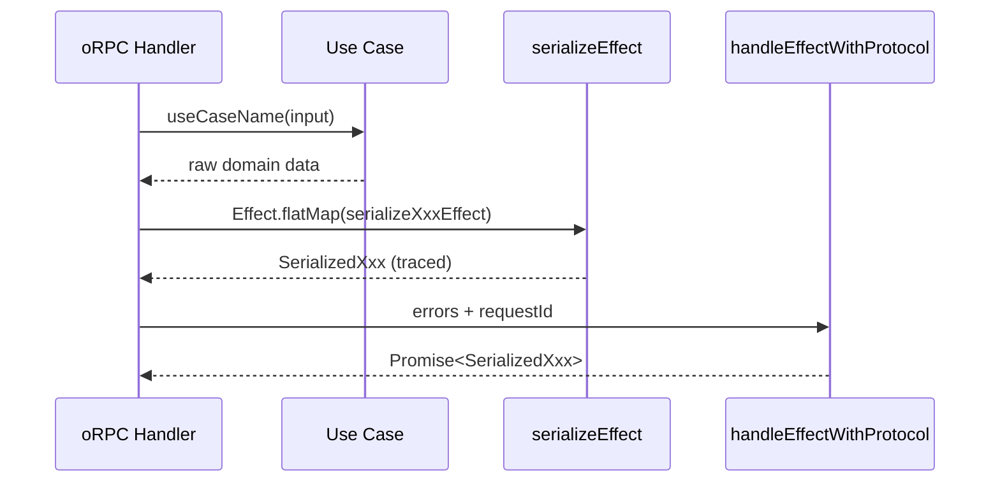

# API Handler Pattern

> Merged from [`router-handler.md`](router-handler.md) and [`serialization.md`](serialization.md).


```mermaid
sequenceDiagram
  participant H as oRPC Handler
  participant UC as Use Case
  participant S as serializeEffect
  participant P as handleEffectWithProtocol

  H->>UC: useCaseName(input)
  UC-->>H: raw domain data
  H->>S: Effect.flatMap(serializeXxxEffect)
  S-->>H: SerializedXxx (traced)
  H->>P: errors + requestId
  P-->>H: Promise<SerializedXxx>
```

## Golden Principles

1. **Call exactly ONE use case per handler** <!-- enforced-by: manual-review -->
2. **Use Effect-based serializers** (`serializeXxxEffect`) in handlers for tracing <!-- enforced-by: manual-review -->
3. **`requestId` recommended; span is auto-provided by @orpc/otel**: pass `{ requestId: context.requestId }` for log correlation <!-- enforced-by: manual-review -->
4. **Don't serialize in use cases** -- handlers only <!-- enforced-by: invariant-test -->
5. **Streaming endpoints must keep typed streams end-to-end** (no `unknown` stream payloads) <!-- enforced-by: lint -->

## Canonical Example

> See `packages/api/src/server/router/document.ts`

```typescript
get: protectedProcedure.documents.get.handler(
  async ({ context, input, errors }) => {
    return handleEffectWithProtocol(
      context.runtime,
      context.user,
      getDocument({ id: input.id }).pipe(
        Effect.flatMap(serializeDocumentEffect),
      ),
      errors,
      { requestId: context.requestId, attributes: { 'document.id': input.id } },
    );
  },
),
```

## Handler Pipeline

```
handler -> one use case -> Effect.flatMap(serializeXxxEffect) -> handleEffectWithProtocol(errors, { requestId })
```

Every handler follows this exact shape. Custom error overrides are rare -- only for business logic like upsell flows:

```typescript
handleEffectWithProtocol(
  runtime,
  user,
  effect,
  errors,
  { requestId: context.requestId },
  {
    DocumentQuotaExceeded: (e) => {
      throw errors.PAYMENT_REQUIRED({ message: "..." });
    },
  },
);
```

## Span Naming <!-- enforced-by: invariant-test -->

| Layer            | Format                  | Example               |
| ---------------- | ----------------------- | --------------------- |
| Handler          | `api.{domain}.{action}` | `api.documents.get`   |
| Serializer       | `serialize.{entity}`    | `serialize.document`  |
| Batch serializer | `serialize.{entity}.batch` | `serialize.document.batch` |

## Serializer Variants <!-- enforced-by: manual-review -->

Each entity in `packages/db/src/schemas/{entity}.ts` exports three variants:

| Variant                      | Where to Use                   | Tracing       |
| ---------------------------- | ------------------------------ | ------------- |
| `serializeXxxEffect(item)`   | Handlers (single)              | Yes           |
| `serializeXxxsEffect(items)` | Handlers (batch/list)          | Yes, parallel |
| `serializeXxx(item)`         | Tests, intermediate transforms | No            |

Batch is derived from single via `Effect.all(..., { concurrency: 'unbounded' })`.

### Serializer Implementation Pattern

Use the factory functions from `packages/db/src/schemas/serialization.ts`:

```typescript
import { createEffectSerializer, createBatchEffectSerializer } from '@repo/db/schema';

// 1. Transform function (pure, no tracing)
const documentTransform = (doc: Document): SerializedDocument => ({
  id: doc.id,
  title: doc.title,
  createdAt: doc.createdAt.toISOString(),
  updatedAt: doc.updatedAt.toISOString(),
  description: doc.description ?? null,
});

// 2. Effect serializers (traced, produces SerializationError on failure)
export const serializeDocumentEffect = createEffectSerializer('document', documentTransform);
export const serializeDocumentsEffect = createBatchEffectSerializer('document', documentTransform);

// 3. Plain export for tests / intermediate transforms
export const serializeDocument = documentTransform;
```

The factories wrap in `Effect.try` (catching into `SerializationError`) and add `Effect.withSpan` automatically.

## Activity Logging

Handlers can compose fire-and-forget activity logging via `tapLogActivity`:

```typescript
import { tapLogActivity } from '../log-activity';

createDocument(input).pipe(
  Effect.flatMap(serializeDocumentEffect),
  tapLogActivity(context.runtime, context.user, 'created', 'document'),
),
```

This logs asynchronously without blocking the response. Used in document, podcast, voiceover, and infographic handlers.

## Transformation Rules <!-- enforced-by: manual-review -->

| Field Type                 | Transformation                                          |
| -------------------------- | ------------------------------------------------------- |
| `Date`                     | `.toISOString()`                                        |
| Optional / nullable        | `?? null`                                               |
| Nested entity              | Recursive `serializeXxx(nested)`                        |
| Internal fields (`userId`) | Omit from serialized type                               |
| Computed fields            | Derive in serializer (`wordCount`, `estimatedReadTime`) |

## Protocol-Based Errors <!-- enforced-by: invariant-test -->

Use `handleEffectWithProtocol` -- errors handle themselves via static HTTP protocol properties. No manual error mapping.

```typescript
// Correct
return handleEffectWithProtocol(runtime, user, effect, errors, { requestId: context.requestId });

// Wrong -- legacy manual mapping
return handleEffect(runtime, user, effect, { DocumentNotFound: (e) => { ... } }, { span });
```

## Streaming Handlers

For chat/streaming endpoints:

- Contract output must use concrete chunk types (for chat: `eventIterator(type<UIMessageChunk>())`)
- Handler should return `streamToEventIterator(stream)` directly from the typed use-case stream
- Avoid `unknown` stream payload contracts that force client-side casting
