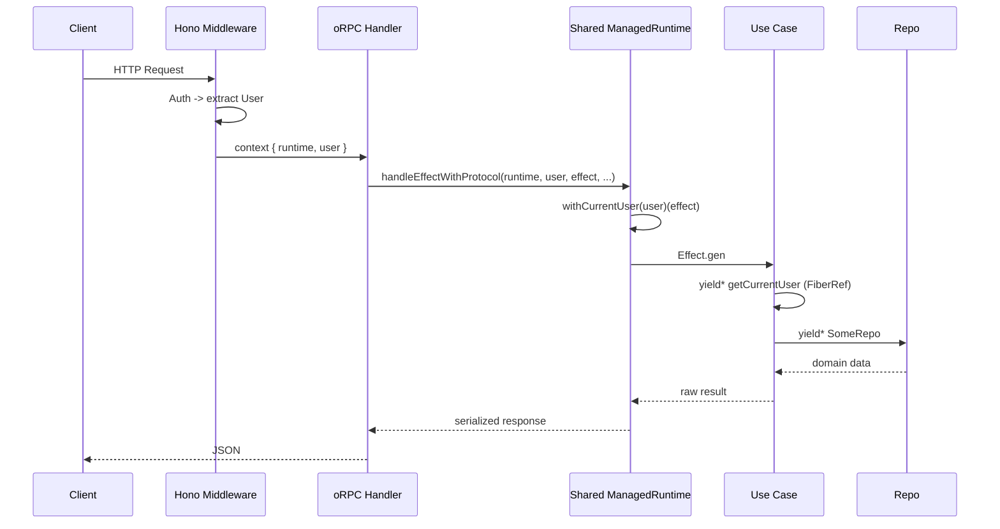

# Effect Runtime Patterns



## Golden Principles

1. **One shared ManagedRuntime per process** -- created at boot, reused for all requests <!-- enforced-by: architecture -->
2. **User context via FiberRef**, never `Context.Tag` <!-- enforced-by: architecture -->
3. **Never cast Effect requirements to `unknown`** -- let the compiler verify all deps are satisfied <!-- enforced-by: eslint -->
4. **Layer.succeed** (pure objects), **Layer.sync** (factories/`new`), **Layer.effect** (dependencies) <!-- enforced-by: eslint -->
5. **Derive env type from layer**: `type Env = Layer.Layer.Context<typeof Live>` <!-- enforced-by: types -->

## Shared ManagedRuntime

```typescript
// packages/api/src/server/runtime.ts
const runtime = createServerRuntime({ db, geminiApiKey, storageConfig });
// Reused for ALL requests -- connection pools, caches created once
await runtime.runPromise(effect);
```

## FiberRef for User Context

User is request-scoped, not service-scoped. FiberRef avoids layer rebuilding per request.

```typescript
// packages/auth/src/policy/user.ts
const CurrentUserRef = FiberRef.unsafeMake<User | null>(null);

export const getCurrentUser = Effect.gen(function* () {
  const user = yield* FiberRef.get(CurrentUserRef);
  if (!user) return yield* Effect.fail(new Unauthorized());
  return user;
});

export const withCurrentUser = (user: User) =>
  <A, E, R>(effect: Effect.Effect<A, E, R>) =>
    Effect.locally(CurrentUserRef, user)(effect);
```

Handler integration -- `handleEffectWithProtocol` calls `withCurrentUser` internally:

```typescript
return handleEffectWithProtocol(
  context.runtime, context.user, createDocument(input), errors,
  { span: 'api.documents.create' },
);
```

## Service Dependencies

Services declare deps **without** `CurrentUser`:

```typescript
// User is read from FiberRef inside the effect, not in the type
export const createDocument = (input: CreateInput) =>
  Effect.gen(function* () {
    const user = yield* getCurrentUser;   // FiberRef, not Context.Tag
    const repo = yield* DocumentRepo;
    return yield* repo.create({ ...input, userId: user.id });
  });
```

## Layer Construction Decision Table

| Constructor | When | Example | Side Effects? |
|---|---|---|---|
| `Layer.succeed(Tag, value)` | Pure object literal | Repos, plain config | No |
| `Layer.sync(Tag, () => make(cfg))` | Calls `new` or factory | SDK clients, providers | Deferred |
| `Layer.effect(Tag, Effect.gen(...))` | Needs to `yield*` other services | Layers with deps | Via Effect |

<!-- enforced-by: eslint -->

Rule of thumb: if `make*` calls `new SomeClass(...)` or `createSomeSDK(...)`, use `Layer.sync`.

## Adding New Services <!-- enforced-by: types -->

1. Define `Context.Tag` + Layer in the owning package
2. Add type to the bundled type: `type Media = DocumentRepo | PodcastRepo | NewRepo`
3. Add Layer to the bundled layer: `MediaLive = Layer.mergeAll(..., NewRepoLive)`
4. Run `pnpm typecheck` -- compiler verifies all use cases still compile

Derive the env type instead of maintaining it manually:

```typescript
export type MediaEnv = Layer.Layer.Context<typeof MediaLive>;
```

## Cross-System Integration Exception <!-- enforced-by: manual-review -->

Auth hooks (better-auth `databaseHooks`) run **outside** the Effect runtime. Use direct Drizzle queries, not Effect-based repos. Keep logic simple; if complex, consider a cron job.

> See `packages/auth/src/server/auth.ts` for the session-create invite-claim example.
