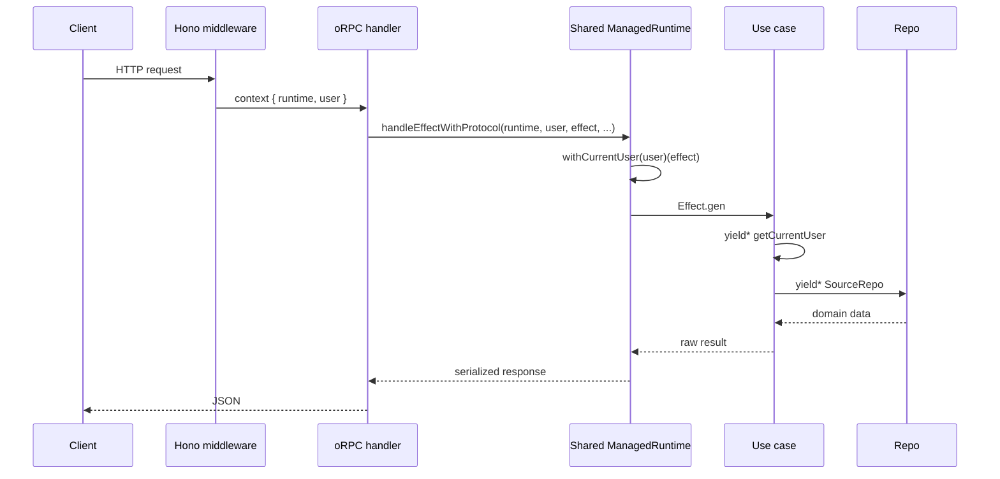

# Effect Runtime Patterns


```mermaid
sequenceDiagram
  participant Client
  participant Hono as Hono middleware
  participant Handler as oRPC handler
  participant RT as Shared ManagedRuntime
  participant UC as Use case
  participant Repo

  Client->>Hono: HTTP request
  Hono->>Handler: context { runtime, user }
  Handler->>RT: handleEffectWithProtocol(runtime, user, effect, ...)
  RT->>RT: withCurrentUser(user)(effect)
  RT->>UC: Effect.gen
  UC->>UC: yield* getCurrentUser
  UC->>Repo: yield* SourceRepo
  Repo-->>UC: domain data
  UC-->>RT: raw result
  RT-->>Handler: serialized response
  Handler-->>Client: JSON
```

## Golden Principles

1. **One shared `ManagedRuntime` per process**. Create it once at boot and reuse it. <!-- enforced-by: architecture -->
2. **User context comes from FiberRef**, never a request-scoped service layer. <!-- enforced-by: architecture -->
3. **Do not cast away Effect requirements**. Let the compiler prove the layer graph is complete. <!-- enforced-by: eslint -->
4. **Use the right layer constructor**: `Layer.succeed` for pure objects, `Layer.sync` for constructors and factories, `Layer.effect` for dependency-driven composition. <!-- enforced-by: eslint -->
5. **Derive environment types from layers** instead of maintaining them manually. <!-- enforced-by: types -->
6. **Inside `Effect.gen`, model failure with `Effect.fail` or `Effect.die`**, not raw `throw`. <!-- enforced-by: eslint -->

## Shared ManagedRuntime

```typescript
// packages/api/src/server/runtime.ts
const runtime = createServerRuntime({
  db,
  storageConfig,
  geminiApiKey,
});

await runtime.runPromise(effect);
```

The runtime is reused across all requests or jobs in the process. That means pools, SDK clients, and telemetry wiring are created once instead of per request.

## FiberRef For User Context

User identity is request-scoped. FiberRef lets the runtime set it per request without rebuilding layers.

```typescript
const CurrentUserRef = FiberRef.unsafeMake<User | null>(null);

export const withCurrentUser = (user: User) =>
  <A, E, R>(effect: Effect.Effect<A, E, R>) =>
    Effect.locally(CurrentUserRef, user)(effect);
```

`handleEffectWithProtocol` applies `withCurrentUser(...)` before running the effect, so use cases can simply call `yield* getCurrentUser`.

## Handler Integration

```typescript
return handleEffectWithProtocol(
  context.runtime,
  context.user,
  createSource(input).pipe(Effect.flatMap(serializeSourceEffect)),
  errors,
  { requestId: context.requestId },
);
```

## Service Dependencies

Effects declare only the services they truly need. The current user is read from FiberRef, not added as a `Context.Tag`.

```typescript
export const createSource = (input: CreateSourceInput) =>
  Effect.gen(function* () {
    const user = yield* getCurrentUser;
    const storage = yield* Storage;
    const sourceRepo = yield* SourceRepo;

    // business logic...
    return yield* sourceRepo.insert({ createdBy: user.id, ...input });
  });
```

## Layer Construction Decision Table

| Constructor | When to use it | Example |
|---|---|---|
| `Layer.succeed` | Pure object literal, no construction side effects | Repository objects, config objects |
| `Layer.sync` | Calls `new` or a factory | SDK clients, AI providers |
| `Layer.effect` | Construction needs other Effect services | Composite layers with dependencies |

Rule of thumb: if a helper calls `new SomeClass(...)` or `createSomeSDK(...)`, use `Layer.sync`.

## Adding New Services
<!-- enforced-by: types -->

1. Define the `Context.Tag` and layer in the owning package.
2. Add the service type to the shared runtime union.
3. Merge the new layer into the shared runtime composition.
4. Run `pnpm typecheck` and let the compiler reveal any missing requirements.

Derive environment types from the layer:

```typescript
export type SharedServices = Layer.Layer.Context<typeof SharedLive>;
```

## Forking Long-Lived Fibers From ManagedRuntime
<!-- enforced-by: manual-review -->

When forking a long-lived loop via `ManagedRuntime.runPromise`, use `Effect.forkDaemon`, not `Effect.fork`.

`Effect.fork` ties the child fiber to the caller scope, which is closed when `runPromise` returns. `Effect.forkDaemon` attaches the fiber to the runtime scope so it survives until explicit shutdown.

```typescript
// Wrong
const fiber = await runtime.runPromise(Effect.fork(longRunningLoop));

// Correct
const fiber = await runtime.runPromise(Effect.forkDaemon(longRunningLoop));
```

## Cross-System Integration Exception
<!-- enforced-by: manual-review -->

Better Auth hooks such as `databaseHooks` run outside the Effect runtime. Keep those paths simple and use direct Drizzle queries instead of trying to inject Effect repos.
