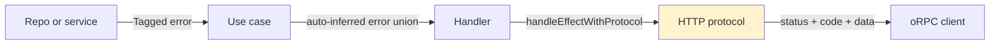

# Error Handling Pattern



## Golden Principles

1. **All domain and app errors extend `Schema.TaggedError`** and carry HTTP protocol statics. <!-- enforced-by: invariant-test -->
2. **Each package owns its own errors**. Import from the owning package, not a random shared barrel. <!-- enforced-by: eslint -->
3. **Use `handleEffectWithProtocol`**, not the old manual-mapping path. <!-- enforced-by: invariant-test -->
4. **Let Effect infer the error union** and export a derived alias only when needed. <!-- enforced-by: types -->
5. **Inside Effect logic, use `Effect.fail` or `Effect.die` instead of `throw`**. <!-- enforced-by: eslint -->
6. **Backend tests assert `_tag` and fields**, not `toBeInstanceOf(...)`, for tagged domain/app errors. <!-- enforced-by: eslint -->
7. **Avoid paranoid fallback values**; model real failures explicitly as typed errors. <!-- enforced-by: manual-review -->

## Error Template

```typescript
import { Schema } from 'effect';

export class SourceNotFound extends Schema.TaggedError<SourceNotFound>()(
  'SourceNotFound',
  {
    id: Schema.String,
    message: Schema.optional(Schema.String),
  },
) {
  static readonly httpStatus = 404 as const;
  static readonly httpCode = 'SOURCE_NOT_FOUND' as const;
  static readonly httpMessage = (e: SourceNotFound) =>
    e.message ?? `Source ${e.id} not found`;
  static readonly logLevel = 'silent' as const;

  static getData(e: SourceNotFound) {
    return { sourceId: e.id };
  }
}
```

### Required Static Properties <!-- enforced-by: invariant-test -->

| Property | Type | Description |
|---|---|---|
| `httpStatus` | `number` | HTTP status code |
| `httpCode` | `string` | Client error code such as `SOURCE_NOT_FOUND` |
| `httpMessage` | `string | (e) => string` | Response message |
| `logLevel` | `LogLevel` | Logging behavior |

### Optional `getData(e)` <!-- enforced-by: manual-review -->

Use `getData` when the client needs structured details such as limits, IDs, or retry metadata.

## Error Location Rules <!-- enforced-by: eslint -->

| Error type | Package | Example |
|---|---|---|
| Base / infrastructure | `@repo/db/errors` | `UnauthorizedError`, `ValidationError`, `DbError` |
| Media domain | `@repo/media/errors` | `SourceNotFound`, `PodcastNotFound`, `VoiceoverNotFound` |
| AI / provider | `@repo/ai/errors` | `LLMError`, `TTSError`, `VoiceNotFoundError` |
| Storage | `@repo/storage/errors` | `StorageError`, `StorageNotFoundError` |
| Queue / jobs | `@repo/queue/errors` | `QueueError`, `JobNotFoundError` |
| Auth / policy | `@repo/auth/errors` | `PolicyError`, `AuthSessionLookupError` |

Do not define domain error classes inline inside repos or handlers.

## Log Levels <!-- enforced-by: manual-review -->

| Level | When | Examples |
|---|---|---|
| `silent` | Expected user-facing failures | not-found, unauthorized, validation |
| `warn` | Unusual but anticipated failures | parse issues, quota or rate pressure |
| `error` | Unexpected recoverable failures | DB/service failures |
| `error-with-stack` | Internal failures that need debugging context | internal operation errors |

## HTTP Status Decision Table <!-- enforced-by: manual-review -->

| Status | When | Typical errors |
|---|---|---|
| 400 | Bad request / validation | `ValidationError`, `InvalidUrlError` |
| 401 | Not authenticated | `UnauthorizedError` |
| 403 | Not authorized | `ForbiddenError`, `PolicyError` |
| 404 | Resource not found or concealed | `SourceNotFound`, `PodcastNotFound`, `JobNotFoundError` |
| 409 | Conflict | `SourceAlreadyProcessing` |
| 413 | Payload too large | `SourceTooLargeError` |
| 415 | Unsupported media type | `UnsupportedSourceFormat` |
| 422 | Semantic processing failure | `SourceParseError`, `UrlFetchError` |
| 429 | Rate limited | `LLMRateLimitError` or mapped rate-limit protocol errors |
| 500 | Internal failure | `DbError`, `SourceError` |
| 503 | Service unavailable | `ExternalServiceError`, auth context lookup failure |

Auth context boundary rule:

- missing session remains an expected unauthenticated state
- auth/session infrastructure failures during context creation map to `SERVICE_UNAVAILABLE` with `requestId` and a stable auth-context tag in logs

## Error Type Inference <!-- enforced-by: types -->

Use cases should not manually annotate error unions.

```typescript
export const createSource = (input: CreateSourceInput) =>
  Effect.gen(function* () {
    // ...
  }).pipe(withUseCaseSpan('useCase.createSource'));

export type CreateSourceError = Effect.Effect.Error<
  ReturnType<typeof createSource>
>;
```

## Protocol Interface

`handleEffectWithProtocol` reads the static protocol fields from the thrown tagged error and converts them into the oRPC response automatically.

## Adding A New Error <!-- enforced-by: types -->

1. Define the tagged error class in the owning package.
2. Add the required protocol statics.
3. Export it from the package error barrel if appropriate.
4. Use it in the Effect flow with `Effect.fail(...)`.

No handler-level mapping is required for the normal case.
