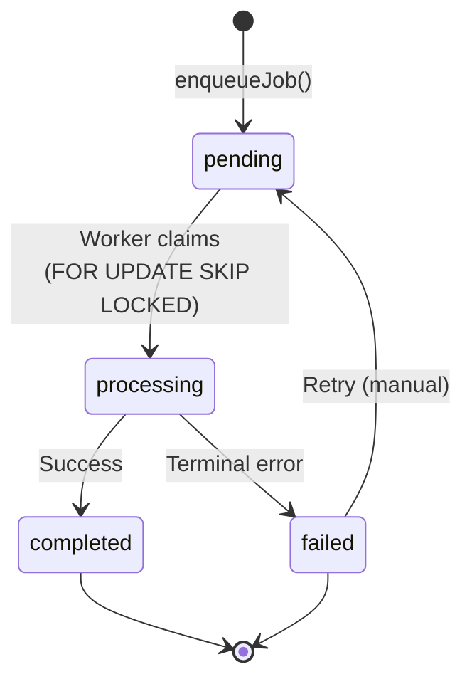

# Job Queue Pattern



## Golden Principles

1. **Postgres `job` table is queue of record** -- no external queue system <!-- enforced-by: architecture -->
2. **Use safety primitives** for all queue operations (`enqueueJob`, `withTransactionalStateAndEnqueue`) <!-- enforced-by: eslint, invariant-test -->
3. **Workers claim with `FOR UPDATE SKIP LOCKED`** -- prevents double-processing <!-- enforced-by: architecture -->
4. **Idempotent start flows**: check for active job before enqueue <!-- enforced-by: manual-review -->

## Architecture <!-- enforced-by: architecture -->

`@repo/queue` enqueue writes directly to the `job` table:

1. Use case calls `enqueueJob({ type, payload, userId })`
2. Worker polls and claims with `FOR UPDATE SKIP LOCKED`
3. Worker updates status: `processing` -> `completed` | `failed`

## Enqueue Rules

### Direct Enqueue <!-- enforced-by: eslint, invariant-test -->

Use cases must use `enqueueJob(...)` from safety primitives. Never call `queue.enqueue(...)` directly.

```typescript
// Correct
yield* enqueueJob({ type: 'podcast-generation', payload: { podcastId }, userId: user.id });

// Forbidden -- raw queue access in media use-cases
yield* queue.enqueue({ ... });
```

### State + Enqueue (Transactional) <!-- enforced-by: invariant-test -->

When a state change must be atomic with the enqueue:

```typescript
yield* withTransactionalStateAndEnqueue(
  repo.updateStatus(id, 'generating'),     // state change
  repo.updateStatus(id, 'draft'),           // compensating action on enqueue failure
);
```

On real DB: runs in one transaction. In tests: falls back to `withCompensatingAction`.

### Idempotent Start Flows <!-- enforced-by: manual-review -->

Always check for an active job before creating a new one:

```typescript
const existing = yield* findActiveJob({ type: 'podcast-generation', podcastId });
if (existing) return existing;   // already running -- return it
yield* enqueueJob({ type: 'podcast-generation', payload: { podcastId }, userId });
```

## Worker Claim Pattern <!-- enforced-by: architecture -->

Workers claim directly from `job` using Postgres row locking:

```sql
SELECT * FROM job
WHERE status = 'pending' AND type = $1
ORDER BY created_at
FOR UPDATE SKIP LOCKED
LIMIT 1;
```

This guarantees exactly-one-worker-per-job even with multiple worker instances.

## Retry Policy <!-- enforced-by: manual-review -->

| Error Type | Retryable? | Action |
|---|---|---|
| Transient (network, timeout) | Yes | Worker may auto-retry up to N times |
| Terminal (validation, not-found) | No | Mark `failed`, surface to user |
| Unknown | No | Mark `failed`, log with stack |

Failed jobs can be retried manually via user action (e.g., "Retry" button in UI).

## Job Ownership <!-- enforced-by: invariant-test -->

Use `getOwnedJobOrNotFound(jobId)` for any job polling endpoint. Non-owners receive `JobNotFoundError` (no existence leak).

See `docs/patterns/safety-primitives.md` for full primitives reference.

## Validation <!-- enforced-by: invariant-test -->

```bash
pnpm test:invariants     # safety invariants (queue access rules)
pnpm test                # includes job workflow tests
```
