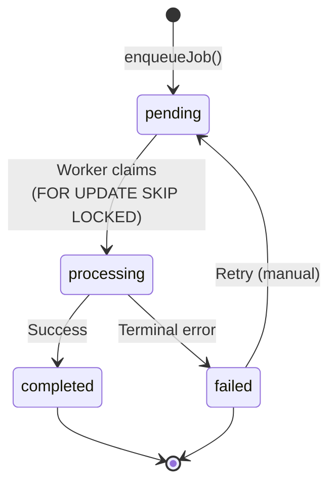

# Job Queue Pattern


```mermaid
stateDiagram-v2
  [*] --> pending : enqueueJob()
  pending --> processing : Worker claims<br/>(FOR UPDATE SKIP LOCKED)
  processing --> completed : Success
  processing --> failed : Terminal error
  failed --> pending : Retry (manual)
  completed --> [*]
  failed --> [*]
```

## Golden Principles

1. **Postgres `job` table is queue of record** -- no external queue system <!-- enforced-by: architecture -->
2. **Use safety primitives** for all queue operations (`enqueueJob`, `withTransactionalStateAndEnqueue`) <!-- enforced-by: eslint, invariant-test -->
3. **Workers claim with `FOR UPDATE SKIP LOCKED`** -- prevents double-processing <!-- enforced-by: architecture -->
4. **Idempotent start flows**: check for active job before enqueue <!-- enforced-by: manual-review -->
5. **Redis queue notifications are optimization-only** -- enqueue publish is best-effort; heartbeat polling is fallback <!-- enforced-by: manual-review -->
6. **Long-running jobs must heartbeat while `processing`** so stale recovery can distinguish active work from dead workers <!-- enforced-by: architecture -->

## Architecture <!-- enforced-by: architecture -->

`@repo/queue` enqueue writes directly to the `job` table:

1. Use case calls `enqueueJob({ type, payload, userId })`
2. Queue repo inserts into `job`, then best-effort publishes Redis channel `cs:queue:notify`
3. Worker subscribes to queue notifications and wakes claim loop immediately
4. Worker runs heartbeat fallback polling (60s default) so missed notifications never lose work
5. Worker updates status: `processing` -> `completed` | `failed`

## Enqueue Rules

### Direct Enqueue <!-- enforced-by: eslint, invariant-test -->

Use cases must use `enqueueJob(...)` from safety primitives. Never call `queue.enqueue(...)` directly.

```typescript
// Correct
yield* enqueueJob({ type: 'podcast-generation', payload: { podcastId }, userId: user.id });

// Forbidden -- raw queue access in media use-cases
yield* queue.enqueue({ ... });
```

### State + Enqueue (Transactional) <!-- enforced-by: invariant-test -->

When a state change must be atomic with the enqueue:

```typescript
yield* withTransactionalStateAndEnqueue(
  repo.updateStatus(id, 'generating'),     // state change
  repo.updateStatus(id, 'draft'),           // compensating action on enqueue failure
);
```

On real DB: runs in one transaction. In tests: falls back to `withCompensatingAction`.

### Idempotent Start Flows <!-- enforced-by: manual-review -->

Always check for an active job before creating a new one:

```typescript
const existing = yield* findActiveJob({ type: 'podcast-generation', podcastId });
if (existing) return existing;   // already running -- return it
yield* enqueueJob({ type: 'podcast-generation', payload: { podcastId }, userId });
```

## Worker Claim Pattern <!-- enforced-by: architecture -->

Workers claim directly from `job` using Postgres row locking. Claim can target one type or a set of currently-claimable types:

```sql
UPDATE job
SET status = 'processing', started_at = NOW(), updated_at = NOW()
WHERE id = (
  SELECT id FROM job
  WHERE status = 'pending' AND type IN (...)
  ORDER BY created_at
  LIMIT 1
  FOR UPDATE SKIP LOCKED
)
RETURNING *;
```

This guarantees exactly-one-worker-per-job even with multiple worker instances.

## Processing Heartbeats <!-- enforced-by: architecture -->

Jobs that may remain in `processing` for minutes at a time must periodically
touch their queue row (`updatedAt`) while work is still active. The stale-job
reaper uses the latest heartbeat timestamp, not just the original claim time,
to decide when a `processing` job has actually gone orphaned.

This is especially important for deep research, where a worker can spend a long
time polling an external provider without changing the job status.

## Timeout Budget Model <!-- enforced-by: manual-review -->

Keep long-running job budgets centralized in `@repo/queue` (`job-timeouts.ts`)
so worker stale recovery and media polling loops cannot drift apart.

- `SOURCE_RESEARCH_MAX_POLL_DURATION_MS` is the one-hour provider budget.
- `SOURCE_READINESS_MAX_POLL_DURATION_MS` is derived from research budget plus
  one steady poll window so podcast generation can observe the final ready-state
  write without racing the timeout edge.
- `PROCESSING_JOB_HEARTBEAT_MS` defines how often active workers refresh
  `updatedAt`.
- `STALE_JOB_MAX_AGE_MS` is derived from heartbeat cadence and missed-heartbeat
  tolerance, not from total expected job runtime.

Polling loops must measure timeout by wall-clock elapsed time (`Date.now() -
startedAt`) rather than by summing sleep intervals, since provider calls and DB
reads also consume real runtime.

## Concurrency Policy <!-- enforced-by: manual-review -->

Worker concurrency is two-dimensional:

1. global cap (`MAX_CONCURRENT_JOBS`, default `20`)
2. per-type caps (`DEFAULT_PER_TYPE_CONCURRENCY`)

Per-type caps are clamped by the global cap at runtime, so overrides cannot exceed total process capacity.

## Retry Policy <!-- enforced-by: manual-review -->

| Error Type | Retryable? | Action |
|---|---|---|
| Transient (network, timeout) | Yes | Worker may auto-retry up to N times |
| Terminal (validation, not-found) | No | Mark `failed`, surface to user |
| Unknown | No | Mark `failed`, log with stack |

Failed jobs can be retried manually via user action (e.g., "Retry" button in UI).
For deep research, stale-job recovery may also fail a dead `processing` job and
re-enqueue it automatically when the source is still mid-operation.

## Job Ownership <!-- enforced-by: invariant-test -->

Use `getOwnedJobOrNotFound(jobId)` for any job polling endpoint. Non-owners receive `JobNotFoundError` (no existence leak).

See [`docs/patterns/safety-primitives.md`](./safety-primitives.md) for full primitives reference.

## Validation <!-- enforced-by: invariant-test -->

```bash
pnpm test:invariants     # safety invariants (queue access rules)
pnpm test                # includes job workflow tests
```
