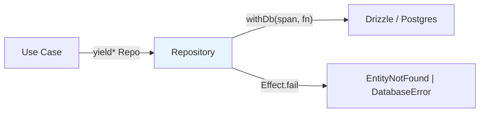

# Repository Pattern



## Golden Principles

1. **No business logic** -- repos are data access only <!-- enforced-by: manual-review -->
2. **Explicit error types** in interface signatures <!-- enforced-by: types -->
3. **All DB ops via `withDb(span, fn)`** for tracing and connection handling <!-- enforced-by: architecture -->
4. **No user context** -- never import `getCurrentUser`; pass `userId` as parameter <!-- enforced-by: invariant-test -->
5. **Require `Db` context** in every method's Effect type <!-- enforced-by: types -->

## File Location

```
packages/media/src/{domain}/repos/{entity}-repo.ts
```

## Canonical Example

> See `packages/media/src/document/repos/document-repo.ts`

The four-part structure: **Interface -> Tag -> `make` impl -> Layer**.

```typescript
import { Context, Effect, Layer } from 'effect';
import { withDb, type Db, type DatabaseError } from '@repo/db/effect';
import { EntityNotFound } from '../../errors';
import { entity, type Entity, type EntityId } from '@repo/db/schema';
import { eq, desc } from 'drizzle-orm';

// 1. Service Interface
export interface EntityRepoService {
  readonly findById: (id: string) => Effect.Effect<Entity, EntityNotFound | DatabaseError, Db>;
  readonly insert:   (data: InsertInput) => Effect.Effect<Entity, DatabaseError, Db>;
  readonly list:     (opts: ListOptions) => Effect.Effect<readonly Entity[], DatabaseError, Db>;
  readonly update:   (id: string, data: UpdateInput) => Effect.Effect<Entity, EntityNotFound | DatabaseError, Db>;
  readonly delete:   (id: string) => Effect.Effect<boolean, DatabaseError, Db>;
  readonly count:    (opts?: { createdBy?: string }) => Effect.Effect<number, DatabaseError, Db>;
}

// 2. Context Tag
export class EntityRepo extends Context.Tag('@repo/media/EntityRepo')<EntityRepo, EntityRepoService>() {}

// 3. Implementation
const make: EntityRepoService = {
  findById: (id) =>
    withDb('entityRepo.findById', (db) =>
      db.select().from(entity).where(eq(entity.id, id as EntityId)).limit(1).then(r => r[0])
    ).pipe(
      Effect.flatMap((row) =>
        row ? Effect.succeed(row) : Effect.fail(new EntityNotFound({ id }))
      ),
    ),
  // ... remaining methods follow same pattern
};

// 4. Layer
export const EntityRepoLive: Layer.Layer<EntityRepo, never, Db> =
  Layer.succeed(EntityRepo, make);
```

## Common Methods

| Method | Returns | Error on Missing | Notes |
|--------|---------|------------------|-------|
| `insert` | `Entity` | constraint violation | Single insert + returning |
| `findById` | `Entity` | `EntityNotFound` | Always fail, never return null |
| `list` | `Entity[]` | (empty array) | Paginated with `limit`/`offset` |
| `update` | `Entity` | `EntityNotFound` | Set `updatedAt: new Date()` |
| `delete` | `boolean` | (returns false) | Idempotent |
| `count` | `number` | (returns 0) | Optional filters |

## Rules

### 1. Span Naming in withDb <!-- enforced-by: architecture -->

Format: `{repoName}.{methodName}` -- e.g., `documentRepo.findById`.

### 2. Handle Not Found with Effect.flatMap <!-- enforced-by: types -->

Convert null DB results to typed errors, never return `Entity | null`:

```typescript
// findById returns Effect.Effect<Entity, EntityNotFound | DatabaseError, Db>
// NOT Effect.Effect<Entity | null, DatabaseError, Db>
```

### 3. Cast Branded IDs <!-- enforced-by: types -->

```typescript
.where(eq(table.id, id as EntityId))
```

### 4. Tag Naming Convention <!-- enforced-by: architecture -->

```typescript
'@repo/{package}/{EntityRepo}'   // e.g. '@repo/media/DocumentRepo'
```

### 5. Layer Uses `Layer.succeed` <!-- enforced-by: eslint -->

Repos are plain object literals with no side effects -- always use `Layer.succeed`.

### 6. No Serialization in Repos <!-- enforced-by: invariant-test -->

Return raw DB entities. Serialization belongs in the handler layer.

## Index File

```typescript
export { EntityRepo, EntityRepoLive, type EntityRepoService } from './entity-repo';
export type { ListOptions } from './entity-repo';
```
