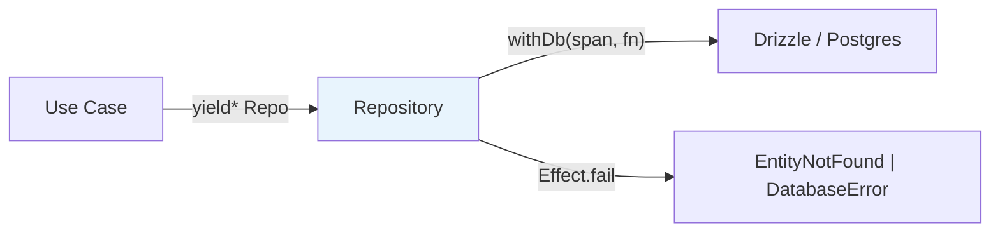

# Repository Pattern


```mermaid
flowchart LR
  A[Use Case] -->|"yield* Repo"| B[Repository]
  B -->|"withDb(span, fn)"| C[Drizzle / Postgres]
  B -->|"Effect.fail"| D["EntityNotFound | DatabaseError"]
  style B fill:#e8f4fd
```

## Golden Principles

1. **No business logic** -- repos are data access only <!-- enforced-by: manual-review -->
2. **Explicit error types** in interface signatures <!-- enforced-by: types -->
3. **All DB ops via `withDb(span, fn)`** for tracing and connection handling <!-- enforced-by: architecture -->
4. **Ownership-scoped access should use `userId` params** and conceal unauthorized access as typed not-found <!-- enforced-by: architecture -->
5. **Require `Db` context** in every method's Effect type <!-- enforced-by: types -->
6. **Use `Layer.succeed` for repo layers** when the repo is a pure object literal <!-- enforced-by: eslint, manual-review -->

## File Location

```
packages/media/src/{domain}/repos/{entity}-repo.ts
packages/media/src/{domain}/repos/{entity}-repo.reads.ts
packages/media/src/{domain}/repos/{entity}-repo.writes.ts
packages/media/src/{domain}/repos/{entity}-repo.methods.ts   # compact variant
```

## Canonical Example

> See `packages/media/src/source/repos/source-repo.ts`

The preferred structure is: **Contract (types + interface + tag) -> Read/Write method modules -> Layer assembly**.

```typescript
import { Context, Effect, Layer } from 'effect';
import { withDb, type Db, type DatabaseError } from '@repo/db/effect';
import { EntityNotFound } from '../../errors';
import { entity, type Entity, type EntityId } from '@repo/db/schema';
import { and, eq } from 'drizzle-orm';

// 1. Service Interface
export interface EntityRepoService {
  readonly findByIdForUser: (
    id: string,
    userId: string,
  ) => Effect.Effect<Entity, EntityNotFound | DatabaseError, Db>;
  readonly insert:   (data: InsertInput) => Effect.Effect<Entity, DatabaseError, Db>;
  readonly list: (
    options: ListOptions
  ) => Effect.Effect<readonly Entity[], DatabaseError, Db>;
  readonly update:   (id: string, data: UpdateInput) => Effect.Effect<Entity, EntityNotFound | DatabaseError, Db>;
  readonly delete:   (id: string) => Effect.Effect<boolean, DatabaseError, Db>;
  readonly count: (
    options?: { createdBy?: string }
  ) => Effect.Effect<number, DatabaseError, Db>;
}

// 2. Context Tag
export class EntityRepo extends Context.Tag('@repo/media/EntityRepo')<EntityRepo, EntityRepoService>() {}

// 3. Read methods
export const readMethods: Pick<EntityRepoService, 'findByIdForUser' | 'list' | 'count'> = {
  findByIdForUser: (id, userId) =>
    withDb('entityRepo.findByIdForUser', (db) =>
      db.select().from(entity).where(
        and(eq(entity.id, id as EntityId), eq(entity.createdBy, userId))
      ).limit(1).then(r => r[0])
    ).pipe(
      Effect.flatMap((row) =>
        row ? Effect.succeed(row) : Effect.fail(new EntityNotFound({ id }))
      ),
    ),
};

// 4. Layer assembly
const make: EntityRepoService = {
  ...readMethods,
  ...writeMethods,
};

export const EntityRepoLive: Layer.Layer<EntityRepo> =
  Layer.succeed(EntityRepo, make);
```

## Common Methods

| Method | Returns | Error on Missing | Notes |
|--------|---------|------------------|-------|
| `insert` | `Entity` | constraint violation | Single insert + returning |
| `findByIdForUser` | `Entity` | `EntityNotFound` | Conceals missing vs not-owned |
| `list` | `Entity[]` | (empty array) | Paginated with `limit`/`offset`; filter via `ListOptions` |
| `update` | `Entity` | `EntityNotFound` | Set `updatedAt: new Date()` |
| `delete` | `boolean` | (returns false) | Idempotent |
| `count` | `number` | (returns 0) | Optional `{ createdBy? }` filter |

## Rules

### 1. Span Naming in withDb <!-- enforced-by: architecture -->

Format: `{repoName}.{methodName}` -- e.g., `sourceRepo.findByIdForUser`.

### 2. Handle Not Found with Effect.flatMap <!-- enforced-by: types -->

Convert null DB results to typed errors, never return nullable values from ownership-scoped API methods:

```typescript
// findByIdForUser returns Effect.Effect<Entity, EntityNotFound | DatabaseError, Db>
// NOT Effect.Effect<Entity | null, DatabaseError, Db>
```

### 2a. Concealment for Ownership-Scoped Access <!-- enforced-by: architecture -->

For owner-only resources, repository methods should include `userId` in the query predicate and return the same typed not-found error for both:

- true missing record
- record exists but belongs to another user

### 3. Cast Branded IDs <!-- enforced-by: types -->

```typescript
.where(eq(table.id, id as EntityId))
```

### 4. Tag Naming Convention <!-- enforced-by: architecture -->

```typescript
'@repo/{package}/{EntityRepo}'   // e.g. '@repo/media/SourceRepo'
```

### 5. Layer Uses `Layer.succeed` <!-- enforced-by: eslint, manual-review -->

Repos are plain object literals with no side effects -- always use `Layer.succeed`.

ESLint rejects direct constructor or factory work inside `Layer.succeed(...)` in production code. Review still has to catch cases where construction was hoisted into an identifier before the layer assembly line.

### 6. No Serialization in Repos <!-- enforced-by: invariant-test -->

Return raw DB entities. Serialization belongs in the handler layer.

### 7. Split Triggers for Agentic Edits <!-- enforced-by: manual-review -->

Split repo files into read/write modules when any threshold is hit:

- File size >= 250 LOC
- Public repo methods >= 8
- Repo touches multiple aggregates/tables in distinct flows

## Prepared Statements

Use Drizzle's `.prepare()` with `sql.placeholder()` for high-frequency queries to avoid SQL string construction on every call and let PostgreSQL reuse query plans per connection.

### When to use

| Priority | Candidate | Reason |
|----------|-----------|--------|
| HIGH | `findById`, `findByIdForUser` | Called on every detail page load / worker lookup |
| HIGH | Queue `getJob` | Polled on every job status check |
| MEDIUM | `list`, `count`, `getJobsByUser` | Called on list pages; dynamic filters make single-statement prep harder |

### Pattern — repos using `withDb` (`Layer.succeed`)

Use the `prepared()` cache from `@repo/db/effect`. It caches per `DatabaseInstance` (WeakMap) so tests with different db instances get isolated caches.

```typescript
import { withDb, prepared } from '@repo/db/effect';
import { sql } from 'drizzle-orm';

findByIdForUser: (id, userId) =>
  withDb('entityRepo.findByIdForUser', (db) =>
    prepared(db, 'entityRepo.findByIdForUser', (db) =>
      db
        .select()
        .from(entity)
        .where(
          and(
            eq(entity.id, sql.placeholder('id')),
            eq(entity.createdBy, sql.placeholder('userId')),
          ),
        )
        .limit(1)
        .prepare('entityRepo_findByIdForUser'),
    )
      .execute({ id, userId })
      .then((rows) => rows[0]),
  ).pipe(requireEntity(id)),
```

### Pattern — services using `Layer.effect` (queue)

When the service captures `db` at construction via `yield* Db`, create prepared statements at init:

```typescript
const makeService = Effect.gen(function* () {
  const { db } = yield* Db;

  const getJobStmt = db
    .select()
    .from(job)
    .where(eq(job.id, sql.placeholder('jobId')))
    .limit(1)
    .prepare('queue_getJob');

  const getJob = (jobId: string) =>
    runQuery('getJob', async () => {
      const [row] = await getJobStmt.execute({ jobId });
      return row;
    }, 'Failed to get job');
});
```

### Naming convention

Prepared statement names use the format `{repoName}_{methodName}` (e.g. `sourceRepo_findByIdForUser`). The cache key in `prepared()` uses the span name format `{repoName}.{methodName}`.

### Queries NOT suited for `.prepare()`

- Queries with dynamic/optional WHERE clauses (varying filter combinations)
- Raw SQL via `db.execute(sql\`...\`)` (e.g. `claimNextJob` with `FOR UPDATE SKIP LOCKED`)
- Queries with `inArray()` where array length varies

## Connection Pool Sizing

`createDb()` in `packages/db/src/client.ts` exposes `max`, `idleTimeoutMillis`, and `connectionTimeoutMillis`. Callers should pass values tuned to their workload:

| App | `max` | `idleTimeoutMillis` | `connectionTimeoutMillis` | Rationale |
|-----|-------|---------------------|---------------------------|-----------|
| Server | 20 | 30 000 | 5 000 | Many short-lived HTTP requests |
| Worker | 5 | 60 000 | 10 000 | Fewer, longer-running job queries |
| CLI / tests | default (10) | default (30 000) | default (5 000) | Short-lived, low concurrency |

Each PostgreSQL connection uses ~10 MB backend RAM. Formula: `pool_max = total_db_connections / max_app_instances`. For managed PG with a 200-connection limit, 20 (server) + 5 (worker) = 25 per replica leaves headroom for migrations and admin tools.

## Index File

```typescript
export { EntityRepo, EntityRepoLive, type EntityRepoService } from './entity-repo';
export type { ListOptions } from './entity-repo';
```
