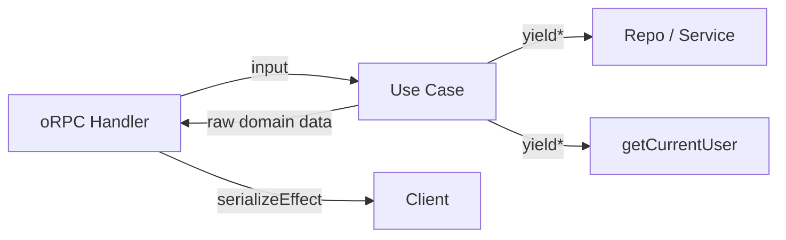

# Use Case Pattern



## Golden Principles

1. **Use safety primitives** for queue/content ops (`enqueueJob`, `replaceTextContentSafely`, etc.) <!-- enforced-by: eslint, invariant-test -->
2. **Return raw domain data** -- handler serializes, never the use case <!-- enforced-by: invariant-test -->
3. **Always `Effect.withSpan('useCase.{name}')`** with relevant attributes <!-- enforced-by: invariant-test -->
4. **Get user via `yield* getCurrentUser`** (FiberRef), never `Context.Tag` <!-- enforced-by: architecture -->
5. **Let Effect infer types**; export derived alias: `type XError = Effect.Effect.Error<ReturnType<typeof x>>` <!-- enforced-by: types -->

## File Location

```
packages/media/src/{domain}/use-cases/{action}.ts   # one file per use case
```

## Canonical Example

> See `packages/media/src/document/use-cases/get-document.ts`

```typescript
import { requireOwnership } from '@repo/auth/policy';
import { Effect } from 'effect';
import { DocumentRepo } from '../repos';

export interface GetDocumentInput { id: string }

export const getDocument = (input: GetDocumentInput) =>
  Effect.gen(function* () {
    const documentRepo = yield* DocumentRepo;
    const doc = yield* documentRepo.findById(input.id);
    yield* requireOwnership(doc.createdBy);
    return doc;                         // raw domain data
  }).pipe(
    Effect.withSpan('useCase.getDocument', {
      attributes: { 'document.id': input.id },
    }),
  );
```

## Rules

### 1. One File Per Use Case <!-- enforced-by: architecture -->

Each use case is a single exported function in its own file. Re-export from `index.ts`.

### 2. Let Effect Infer Types <!-- enforced-by: types -->

Never annotate the return type of a use case. Export a derived error alias when consumers need it:

```typescript
export type GetDocumentError = Effect.Effect.Error<ReturnType<typeof getDocument>>;
```

### 3. Span Naming <!-- enforced-by: invariant-test -->

Format: `useCase.{actionName}`. Pass domain IDs as attributes.

### 4. Compose Use Cases by Calling Other Use Cases <!-- enforced-by: architecture -->

```typescript
export const deleteDocument = (input: DeleteDocumentInput) =>
  Effect.gen(function* () {
    const usages = yield* getDocumentUsages({ documentId: input.id });
    if (usages.length > 0) {
      return yield* Effect.fail(new DocumentInUse({ id: input.id, podcastIds: usages.map(p => p.id) }));
    }
    const repo = yield* DocumentRepo;
    yield* repo.delete(input.id);
  }).pipe(Effect.withSpan('useCase.deleteDocument'));
```

### 5. Parallel Operations <!-- enforced-by: manual-review -->

Use `Effect.all` with `concurrency` instead of sequential loops:

```typescript
yield* Effect.all(ids.map(id => processDocument(id)), { concurrency: 10 });
```

### 6. Safety Primitives for High-Risk Ops <!-- enforced-by: eslint, invariant-test -->

| Operation | Required Primitive |
|---|---|
| Job polling | `getOwnedJobOrNotFound(jobId)` |
| Enqueue | `enqueueJob({ type, payload, userId })` |
| State + enqueue | `withTransactionalStateAndEnqueue(effect, compensate)` |
| Content replacement | `replaceTextContentSafely(...)` |

See `docs/patterns/safety-primitives.md`.

### 7. No Direct Repo Bypass <!-- enforced-by: manual-review -->

Use cases access data through repos, never via direct DB imports. If a repo method is missing, add it to the repo.

### 8. Propagate Errors <!-- enforced-by: manual-review -->

Never swallow errors with `Effect.catchAll(() => Effect.succeed(null))`. Propagate or handle explicitly.

## Index File

```typescript
// packages/media/src/{domain}/use-cases/index.ts
export * from './get-document';
export * from './create-document';
// ...
```
