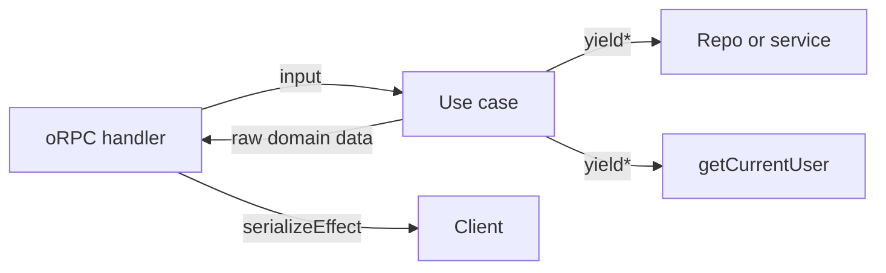

# Use Case Pattern


```mermaid
flowchart LR
  H[oRPC handler] -->|"input"| U[Use case]
  U -->|"yield*"| R[Repo or service]
  U -->|"yield*"| G[getCurrentUser]
  U -->|raw domain data| H
  H -->|serializeEffect| C[Client]
```

## Golden Principles

1. **Use safety primitives** for queue and content operations (`enqueueJob`, `replaceTextContentSafely`, and similar helpers) <!-- enforced-by: eslint, invariant-test -->
2. **Return raw domain data** from use cases; handlers serialize it <!-- enforced-by: invariant-test -->
3. **Always use `withUseCaseSpan(...)` and `annotateUseCaseSpan(...)`** so required trace attributes are attached <!-- enforced-by: invariant-test -->
4. **Get the user via `yield* getCurrentUser`** (FiberRef), never from direct HTTP context access <!-- enforced-by: architecture -->
5. **Let Effect infer types** and export derived aliases when needed <!-- enforced-by: types -->

## File Location

```
packages/media/src/{domain}/use-cases/{action}.ts
```

One file per use case, re-exported from the domain `index.ts`.

## Canonical Example

> See `packages/media/src/source/use-cases/get-source.ts`

```typescript
import { getCurrentUser } from '@repo/auth/policy';
import { Effect } from 'effect';
import { annotateUseCaseSpan, withUseCaseSpan } from '../../shared';
import { SourceRepo } from '../repos';

export interface GetSourceInput {
  id: string;
}

export const getSource = (input: GetSourceInput) =>
  Effect.gen(function* () {
    const user = yield* getCurrentUser;
    const sourceRepo = yield* SourceRepo;

    yield* annotateUseCaseSpan({
      userId: user.id,
      resourceId: input.id,
      attributes: { 'source.id': input.id },
    });

    return yield* sourceRepo.findByIdForUser(input.id, user.id);
  }).pipe(withUseCaseSpan('useCase.getSource'));
```

## Rules

### 1. One File Per Use Case <!-- enforced-by: architecture -->

Each use case exports one primary function from its own file. Re-export it from the domain `index.ts`.

### 2. Let Effect Infer Types <!-- enforced-by: types -->

Do not manually annotate the effect return type. When consumers need the error union, derive it:

```typescript
export type GetSourceError = Effect.Effect.Error<ReturnType<typeof getSource>>;
```

### 3. Span Naming <!-- enforced-by: invariant-test -->

Use `withUseCaseSpan('useCase.{ActionName}')` and attach domain IDs with `annotateUseCaseSpan(...)`.

### 4. Compose Use Cases Carefully <!-- enforced-by: architecture -->

If a flow truly needs another use case, call it explicitly rather than duplicating behavior. Keep the ownership check and trace attributes close to the mutation.

```typescript
export const updateSource = (input: UpdateSourceInput) =>
  Effect.gen(function* () {
    const user = yield* getCurrentUser;
    const sourceRepo = yield* SourceRepo;

    yield* annotateUseCaseSpan({
      userId: user.id,
      resourceId: input.id,
      attributes: { 'source.id': input.id },
    });

    const existing = yield* sourceRepo.findByIdForUser(input.id, user.id);
    // additional mutation logic...
    return existing;
  }).pipe(withUseCaseSpan('useCase.updateSource'));
```

### 5. Parallel Operations <!-- enforced-by: manual-review -->

Use `Effect.all(..., { concurrency })` instead of sequential loops when work can run safely in parallel.

```typescript
yield* Effect.all(sourceIds.map((id) => getSource({ id })), {
  concurrency: 10,
});
```

### 6. Safety Primitives For High-Risk Ops <!-- enforced-by: eslint, invariant-test -->

| Operation | Required primitive |
|---|---|
| Job polling | `getOwnedJobOrNotFound(jobId)` |
| Enqueue | `enqueueJob({ type, payload, userId })` |
| State + enqueue | `withTransactionalStateAndEnqueue(effect, compensate)` |
| Content replacement | `replaceTextContentSafely(...)` |

See [`docs/patterns/safety-primitives.md`](./safety-primitives.md).

### 7. No Direct Repo Bypass <!-- enforced-by: manual-review -->

Use cases go through repos and services, not direct DB imports. If a query is missing, add a repo method.

### 8. Propagate Errors Intentionally <!-- enforced-by: eslint, invariant-test -->

Do not swallow errors with generic `catchAll` fallbacks. Either propagate the typed error or handle it explicitly.

For intentional best-effort side effects, use `runBestEffortSideEffect(...)` from `packages/media/src/shared/best-effort-side-effect.ts`.

### 9. Never Throw Inside `Effect.gen` <!-- enforced-by: eslint -->

Inside use cases, model failures with `Effect.fail(...)` or `Effect.die(...)`, not raw `throw`.

### 10. Authorize Before Mutating Existing Data <!-- enforced-by: manual-review -->

For update and delete flows on existing resources:

- Load the existing resource first.
- Enforce ownership or role policy before the write.
- Do not rely on client-side filtering as authorization.

### 11. Sanitize User-Editable Structured Inputs <!-- enforced-by: manual-review -->

When persisting structured user input such as metadata or style controls:

- Trim whitespace.
- Drop empty entries.
- Normalize optional values before persistence or prompt composition.

## Index File

```typescript
// packages/media/src/{domain}/use-cases/index.ts
export * from './get-source';
export * from './create-source';
// ...
```
