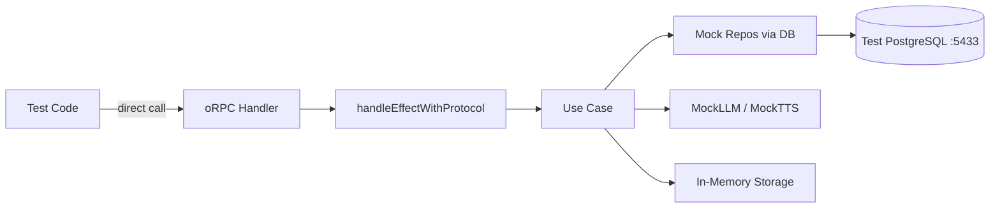

# Router Integration Tests



## Golden Principles

1. Every handler has at least one integration test.
<!-- enforced-by: manual-review -->

2. Direct handler calls, not HTTP requests.
<!-- enforced-by: manual-review -->

3. Test error protocol compliance: status code + error code match the error class.
<!-- enforced-by: manual-review -->

4. Update the integration test runtime when adding new services.
<!-- enforced-by: manual-review -->

5. Use `ctx.cleanup()` consistently in `afterEach`.
<!-- enforced-by: manual-review -->

## File Location

```
packages/api/src/server/router/__tests__/{router}.integration.test.ts
```

## Canonical Example

See: `packages/api/src/server/router/__tests__/document.integration.test.ts`

## Prerequisites

```bash
pnpm test:db:up       # Start test PostgreSQL on :5433
pnpm test:db:setup    # Push schema
pnpm --filter @repo/api test
```

## Test Dependencies

| Dependency | Source | Purpose |
|---|---|---|
| Test Database | Docker (`pnpm test:db:up`) | PostgreSQL on port 5433 |
| `createTestContext` | `@repo/testing` | DB connection + transaction |
| `createTestUser` / `toUser` | `@repo/testing` | Test user factory |
| `createInMemoryStorage` | `@repo/testing/mocks` | In-memory S3-compatible storage |
| `MockLLMLive` / `MockTTSLive` | `@repo/testing/mocks` | Mock AI service layers |
| `createMockContext` | `./helpers` | Mock oRPC context with runtime + user |
| `createMockErrors` | `./helpers` | Mock oRPC error factories |

**Test helpers:** `packages/api/src/server/router/__tests__/helpers.ts`

## Test Structure

```typescript
describe('{domain} router', () => {
  let ctx: TestContext;
  let runtime: ServerRuntime;
  let user: User;
  const errors = createMockErrors();

  beforeEach(async () => {
    resetAllFactories();
    ctx = await createTestContext();
    runtime = createTestRuntime(ctx);
    const testUser = createTestUser();
    user = toUser(testUser);
    await insertTestUser(ctx, testUser);
  });

  afterEach(async () => {
    await ctx.cleanup();
  });

  describe('{domain}.get', () => {
    it('returns serialized entity when found', async () => {
      const context = createMockContext(runtime, user);
      const result = await router.get['~orpc'].handler({ context, input, errors });
      expect(typeof result.createdAt).toBe('string'); // Dates serialized
    });

    it('throws NOT_FOUND when missing', async () => {
      const context = createMockContext(runtime, user);
      await expect(
        router.get['~orpc'].handler({ context, input: { id: 'nonexistent' }, errors })
      ).rejects.toThrow('NOT_FOUND');
    });
  });
});
```

## Runtime Setup

Build a minimal `ManagedRuntime` with mock AI and in-memory storage. Include only the layers the router under test requires.

```typescript
const createTestRuntime = (ctx: TestContext): ServerRuntime => {
  const inMemoryStorage = createInMemoryStorage();
  const mockAILayers = Layer.mergeAll(MockLLMLive, MockTTSLive, inMemoryStorage.layer);
  const repoLayer = EntityRepoLive.pipe(Layer.provide(ctx.dbLayer));

  return ManagedRuntime.make(
    Layer.mergeAll(ctx.dbLayer, mockAILayers, repoLayer)
  );
};
```

## Coverage Requirements
<!-- enforced-by: manual-review -->

| Category | Per Handler | What to Verify |
|---|---|---|
| Success | 1 | Correct serialized response shape |
| Authentication | 1 (shared per router) | `null` user throws UNAUTHORIZED |
| Authorization | 1-2 | Cross-user access returns NOT_FOUND |
| Error cases | 1 per error type | Error code matches protocol |
| Response format | 1 (shared per router) | Dates are strings, IDs match patterns |

## Why Test All Handlers

Missing service dependencies only fail at **runtime**, not compile time. A handler requiring `CollaboratorRepo` compiles even if `CollaboratorRepo` is missing from the production layer. Integration tests catch this by actually executing the handler through the Effect runtime.
<!-- enforced-by: manual-review -->

## Adding New Services
<!-- enforced-by: manual-review -->

When a new Effect service is added to the production runtime:

1. Add it to the bundled layer (see `docs/patterns/effect-runtime.md`)
2. Add the corresponding layer to `createTestRuntime` in **all affected** integration test files
3. Run `pnpm --filter @repo/api test` to verify

## Test Organization

```
describe('{Domain} Router Integration', () => {
  // Setup: ctx, runtime, user, errors
  // beforeEach / afterEach

  describe('{domain}.list', () => { ... });
  describe('{domain}.get', () => { ... });
  describe('{domain}.create', () => { ... });
  describe('{domain}.update', () => { ... });
  describe('{domain}.delete', () => { ... });
});
```

## Existing Integration Test Files

| File | Domain |
|---|---|
| `packages/api/src/server/router/__tests__/document.integration.test.ts` | Documents |
| `packages/api/src/server/router/__tests__/podcast.integration.test.ts` | Podcasts |
| `packages/api/src/server/router/__tests__/voiceover.integration.test.ts` | Voiceovers |
| `packages/api/src/server/router/__tests__/voices.integration.test.ts` | Voices |
