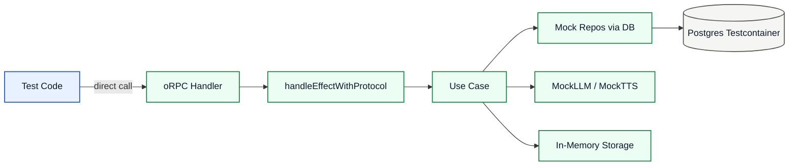

# Router Integration Tests


```mermaid
flowchart LR
  classDef entry fill:#e8f1ff,stroke:#1d4ed8,color:#0f172a,stroke-width:1.5px;
  classDef runtime fill:#ecfdf3,stroke:#15803d,color:#0f172a,stroke-width:1.5px;
  classDef async fill:#fff7ed,stroke:#c2410c,color:#0f172a,stroke-width:1.5px;
  classDef store fill:#f5f5f4,stroke:#57534e,color:#0f172a,stroke-width:1.5px;
  classDef control fill:#fef2f2,stroke:#b91c1c,color:#0f172a,stroke-width:1.5px;

  Test[Test Code] -->|direct call| Handler[oRPC Handler]
  Handler --> EH[handleEffectWithProtocol]
  EH --> UC[Use Case]
  UC --> MockRepo[Mock Repos via DB]
  UC --> MockAI[MockLLM / MockTTS]
  UC --> MockStorage[In-Memory Storage]
  MockRepo --> TestDB[(Postgres Testcontainer)]

  class Test entry;
  class Handler,EH,UC,MockRepo,MockAI,MockStorage runtime;
  class TestDB store;
```

## Golden Principles

1. Every handler has at least one integration test.
<!-- enforced-by: manual-review -->

2. Direct handler calls, not HTTP requests.
<!-- enforced-by: manual-review -->

3. Test error protocol compliance: status code + error code match the error class.
<!-- enforced-by: manual-review -->

4. Update the integration test runtime when adding new services.
<!-- enforced-by: manual-review -->

5. Use `ctx.rollback()` consistently in `afterEach`.
<!-- enforced-by: manual-review -->

## File Location

```
packages/api/src/server/router/__tests__/{router}.integration.test.ts
```

## Canonical Example

See: `packages/api/src/server/router/__tests__/source.integration.test.ts`

## Prerequisites

Docker is required. Integration tests use a PostgreSQL Testcontainer.

```bash
pnpm --filter @repo/api test
```

`@repo/api` Vitest global setup starts one PostgreSQL container, pushes the Drizzle schema, and sets `TEST_POSTGRES_URL` for test workers.

For full monorepo test runs, use root profile scripts:

```bash
# local development profile
pnpm test:local

# automation/CI profile
pnpm test:ci
```

Both profiles start one shared PostgreSQL Testcontainer for the full run and pass `TEST_POSTGRES_URL` to package test tasks.

Optional local speed-up across repeated runs:

```bash
TESTCONTAINERS_REUSE_ENABLE=true pnpm --filter @repo/api test
```

## Test Dependencies

| Dependency | Source | Purpose |
|---|---|---|
| Test Database (PostgreSQL) | `@testcontainers/postgresql` | Real PostgreSQL in Docker |
| `createTestContext` | `@repo/testing` | DB connection + transaction rollback isolation |
| `createTestUser` / `toUser` | `@repo/testing` | Test user factory |
| `createInMemoryStorage` | `@repo/storage/testing` | In-memory S3-compatible storage |
| `MockLLMLive` / `MockTTSLive` | `@repo/ai/testing` | Mock AI service layers |
| `createMockContext` | `packages/api/src/server/router/_shared/test-helpers.ts` | Mock oRPC context with runtime + user |
| `createMockErrors` | `packages/api/src/server/router/_shared/test-helpers.ts` | Mock oRPC error factories |
| `callORPCHandler` / `expectHandlerErrorCode` / `expectIsoTimestamp` | `packages/api/src/server/router/_shared/test-helpers.ts` | Shared handler invocation and protocol assertions |

**Test helpers:** `packages/api/src/server/router/_shared/test-helpers.ts`

## Test Structure

```typescript
describe('{domain} router', () => {
  let ctx: TestContext;
  let runtime: ServerRuntime;
  let user: User;
  const errors = createMockErrors();

  beforeEach(async () => {
    resetAllFactories();
    ctx = await createTestContext();
    runtime = createTestRuntime(ctx);
    const testUser = createTestUser();
    user = toUser(testUser);
    await insertTestUser(ctx, testUser);
  });

  afterEach(async () => {
    await ctx.rollback();
  });

  describe('{domain}.get', () => {
    it('returns serialized entity when found', async () => {
      const context = createMockContext(runtime, user);
      const result = await router.get['~orpc'].handler({ context, input, errors });
      expect(typeof result.createdAt).toBe('string'); // Dates serialized
    });

    it('throws NOT_FOUND when missing', async () => {
      const context = createMockContext(runtime, user);
      await expectHandlerErrorCode(
        () =>
          router.get['~orpc'].handler({
            context,
            input: { id: 'nonexistent' },
            errors,
          }),
        'NOT_FOUND',
      );
    });
  });
});
```

## Runtime Setup

Build a minimal `ManagedRuntime` with mock AI and in-memory storage. Include only the layers the router under test requires.

```typescript
const createTestRuntime = (ctx: TestContext): ServerRuntime => {
  const inMemoryStorage = createInMemoryStorage();
  const mockAILayers = Layer.mergeAll(MockLLMLive, MockTTSLive, inMemoryStorage.layer);
  const repoLayer = EntityRepoLive.pipe(Layer.provide(ctx.dbLayer));

  return ManagedRuntime.make(
    Layer.mergeAll(ctx.dbLayer, mockAILayers, repoLayer)
  );
};
```

## Coverage Requirements
<!-- enforced-by: manual-review -->

| Category | Per Handler | What to Verify |
|---|---|---|
| Success | 1 | Correct serialized response shape |
| Authentication | 1 (shared per router) | `null` user throws UNAUTHORIZED |
| Authorization | 1-2 | Cross-user access returns NOT_FOUND; admin-only suites usually share one non-admin FORBIDDEN test |
| Error cases | 1 per error type | Error code/status/data match protocol |
| Response format | 1 (shared per router) | Dates are strings, IDs match patterns; avoid repeating equivalent timestamp checks in every happy path |

## Anti-Bloat Rules
<!-- enforced-by: manual-review -->

1. Keep authentication checks shared at router level; do not repeat `UNAUTHORIZED` tests for every handler.
2. For admin-only router suites, prefer one shared non-admin `FORBIDDEN` test unless a handler has materially different auth behavior.
3. Keep response-format checks shared at router level; avoid per-handler ISO/date duplication unless shape differs.
4. For each handler, prefer one strong success case + only unique protocol failures for that handler.
5. Default to asserting protocol code/status/data; only assert message text when the message itself is a contract.
6. Extract repetitive oRPC call/test-runtime helpers into `packages/api/src/server/router/_shared/test-helpers.ts` instead of re-declaring them in each file.
7. Do not add integration tests that only restate type-level guarantees (for example, compile-time-only shapes).
8. Delete or merge tests that assert the same error code for the same failure mode through equivalent paths.
9. Avoid tests that only prove Effect/TypeScript compile-time constraints; keep integration assertions on runtime protocol, wiring, serialization, and authorization behavior.

## Why Test All Handlers

Missing service dependencies only fail at **runtime**, not compile time. A handler requiring `CollaboratorRepo` compiles even if `CollaboratorRepo` is missing from the production layer. Integration tests catch this by actually executing the handler through the Effect runtime.
<!-- enforced-by: manual-review -->

## Adding New Services
<!-- enforced-by: manual-review -->

When a new Effect service is added to the production runtime:

1. Add it to the bundled layer (see [`docs/patterns/effect-runtime.md`](../patterns/effect-runtime.md))
2. Add the corresponding layer to `createTestRuntime` in **all affected** integration test files
3. Run `pnpm --filter @repo/api test` to verify

## Test Organization

```
describe('{Domain} Router Integration', () => {
  // Setup: ctx, runtime, user, errors
  // beforeEach / afterEach

  describe('{domain}.list', () => { ... });
  describe('{domain}.get', () => { ... });
  describe('{domain}.create', () => { ... });
  describe('{domain}.update', () => { ... });
  describe('{domain}.delete', () => { ... });
});
```

## Existing Integration Test Files

| File | Domain |
|---|---|
| `packages/api/src/server/router/__tests__/activity.integration.test.ts` | Activity |
| `packages/api/src/server/router/__tests__/persona.integration.test.ts` | Personas |
| `packages/api/src/server/router/__tests__/podcast.integration.test.ts` | Podcasts |
| `packages/api/src/server/router/__tests__/source.integration.test.ts` | Sources |
| `packages/api/src/server/router/__tests__/voiceover.integration.test.ts` | Voiceovers |
| `packages/api/src/server/router/__tests__/voices.integration.test.ts` | Voices |

## How Testcontainers Works

Integration tests use `@testcontainers/postgresql` with PostgreSQL 16.

1. Global setup starts one container and pushes schema via `drizzle-kit/api`
2. `createTestContext()` opens a dedicated connection and starts `BEGIN`
3. `rollback()` runs `ROLLBACK`, then releases the connection

This keeps each test isolated while exercising real PostgreSQL behavior.
