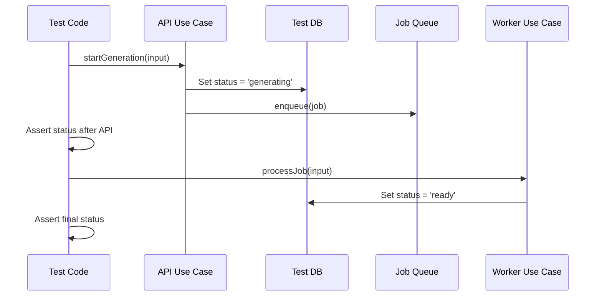

# Job Workflow Tests



## Golden Principles

1. Test the full API-to-Worker flow, not use cases in isolation.
<!-- enforced-by: manual-review -->

2. Assert status transitions at each phase.
<!-- enforced-by: manual-review -->

3. Test idempotency: duplicate calls return existing job.
<!-- enforced-by: manual-review -->

4. Use the exact same use cases the worker calls (not simulated DB updates).
<!-- enforced-by: manual-review -->

## File Location

```
packages/api/src/server/router/__tests__/{entity}-workflow.test.ts
```

## Canonical Examples

- `packages/api/src/server/router/__tests__/podcast-workflow.test.ts`
- `packages/api/src/server/router/__tests__/voiceover-workflow.test.ts`

## Why Workflow Tests Exist

Unit tests pass when each use case is tested in isolation. But the API might set status to `generating_audio` while the worker only accepts `drafting`. Workflow tests catch these **status mismatches** by executing the actual sequence of use case calls.

## Test Categories

### 1. API-to-Worker Flow
<!-- enforced-by: manual-review -->

Call the API use case, then call the worker use case using the same runtime. Verify the worker can process what the API set up.

```typescript
it('worker processes job after API enqueues it', async () => {
  await runtime.runPromise(withCurrentUser(user)(startGeneration({ id })));
  const result = await runtime.runPromise(withCurrentUser(user)(processJob({ id })));
  expect(result.status).toBe('ready');
});
```

### 2. Status Transition Verification
<!-- enforced-by: manual-review -->

Track the entity status at each phase and assert the full transition chain.

```typescript
expect(statusHistory).toEqual(['drafting', 'generating_audio', 'ready']);
```

### 3. Idempotency
<!-- enforced-by: manual-review -->

Duplicate requests must return the same job, not create a second one.

```typescript
const result1 = await runtime.runPromise(startGeneration({ id }));
const result2 = await runtime.runPromise(startGeneration({ id }));
expect(result1.jobId).toBe(result2.jobId);
```

### 4. Multi-Phase Workflows
<!-- enforced-by: manual-review -->

Some jobs have multiple phases (e.g., podcast: script generation then audio generation). Test the full chain.

```typescript
await runtime.runPromise(startGeneration({ podcastId }));
await runtime.runPromise(generateScript({ podcastId }));
expect(afterScript.status).toBe('script_ready');
await runtime.runPromise(generateAudio({ podcastId }));
expect(afterAudio.status).toBe('ready');
```

## Setup

Workflow tests share the same runtime setup as integration tests. See `docs/testing/integration-tests.md` for `createTestRuntime`, `createTestContext`, and mock layer configuration. The runtime must include the job queue layer.

## Coverage Requirements
<!-- enforced-by: manual-review -->

| Test Category | Purpose | Required |
|---|---|---|
| API-to-Worker flow | Verifies full workflow executes | 1 per job type |
| Status transitions | Documents expected state changes | 1 per job type |
| Status alignment | Catches API/worker mismatches | 1 per job type |
| Idempotency | Duplicate calls return same job | 1 per job type |
| Multi-phase (if applicable) | All phases complete in sequence | 1 per multi-phase job |

## When to Add Workflow Tests

- Creating a new job type
- Adding an API endpoint that enqueues jobs
- Modifying status transitions in API or worker use cases
- Fixing bugs related to job processing

## Relationship to Other Test Types

| Test Type | Catches |
|---|---|
| Unit tests | Logic bugs in a single use case |
| Integration tests | Missing services, serialization errors |
| **Workflow tests** | State mismatches between API and worker layers |
