# Testing Overview

```mermaid
graph TD
  subgraph Unit[Unit Tests]
    UC[Use Case Tests] --> MockRepo[Mock Repos + Layers]
  end

  subgraph Integration[Integration Tests]
    Handler[Handler Tests] --> EffectRuntime[Effect Runtime + Mock AI]
    Handler --> DB[(Test PostgreSQL)]
  end

  subgraph Workflow[Workflow Tests]
    API[API Endpoint] --> Queue[Job Queue]
    Queue --> Worker[Worker Use Case]
  end

  subgraph Invariant[Invariant Tests]
    AST[AST / Grep Scans] --> SafetyRules[Safety Primitives]
    AST --> ErrorMap[Error Mapping]
  end

  subgraph Frontend[Frontend Tests]
    Component[Component Tests] --> RTL[React Testing Library]
    Hook[Hook Tests] --> RTL
  end

  subgraph E2E[E2E Tests]
    PW[Playwright] --> Browser[Browser + Dev Server]
  end
```

## Pattern-to-Test Matrix
<!-- enforced-by: manual-review -->

| Change Type | Required Tests | Package | Command |
|---|---|---|---|
| Use case | Unit test + invariants | `@repo/media` | `pnpm --filter @repo/media test` + `pnpm test:invariants` |
| Handler / router | Integration test | `@repo/api` | `pnpm --filter @repo/api test` |
| Job workflow | Workflow test + invariants | `@repo/api` | `pnpm --filter @repo/api test` + `pnpm test:invariants` |
| Frontend component | Component test | `web` | `pnpm --filter web test` |
| Frontend hook | Hook test | `web` | `pnpm --filter web test` |
| Critical user flow | E2E test | root | `pnpm test:e2e` |
| New Effect service/layer | Update integration test runtime | `@repo/api` | `pnpm --filter @repo/api test` |
| Error class added | Invariant coverage | `@repo/api` | `pnpm test:invariants` |
| Safety primitive added | Invariant test | `@repo/media` | `pnpm test:invariants` |

## Coverage Expectations

| Test Type | Target | Notes |
|---|---|---|
| Use case unit | Every use case file has a test file | Success + error + edge + auth |
| Integration | Every handler has at least one test | Catches missing service wiring |
| Workflow | Every job type has a workflow test | Catches API/worker status mismatches |
| Invariant | All safety primitives enforced | AST-level, runs in CI |
| Frontend | All hooks and interactive components | RTL + vitest |
| E2E | Critical user flows only | Login, create, generate |

## Test File Locations

| Test Type | Path Pattern |
|---|---|
| Use case unit | `packages/media/src/{domain}/use-cases/__tests__/{action}.test.ts` |
| Integration | `packages/api/src/server/router/__tests__/{router}.integration.test.ts` |
| Workflow | `packages/api/src/server/router/__tests__/{entity}-workflow.test.ts` |
| Invariant (media) | `packages/media/src/shared/__tests__/safety-invariants.test.ts` |
| Invariant (API) | `packages/api/src/server/__tests__/effect-handler.invariants.test.ts` |
| Frontend | `apps/web/src/features/{domain}/__tests__/*.test.ts(x)` |
| Live | `packages/{ai,storage}/src/__tests__/live/*.live.test.ts` |
| E2E | `apps/web/e2e/*.spec.ts` |
