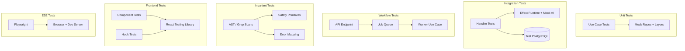

# Testing Overview


```mermaid
graph TD
  subgraph Unit[Unit Tests]
    UC[Use Case Tests] --> MockRepo[Mock Repos + Layers]
  end

  subgraph Integration[Integration Tests]
    Handler[Handler Tests] --> EffectRuntime[Effect Runtime + Mock AI]
    Handler --> DB[(Test PostgreSQL)]
  end

  subgraph Workflow[Workflow Tests]
    API[API Endpoint] --> Queue[Job Queue]
    Queue --> Worker[Worker Use Case]
  end

  subgraph Invariant[Invariant Tests]
    AST[AST / Grep Scans] --> SafetyRules[Safety Primitives]
    AST --> ErrorMap[Error Mapping]
  end

  subgraph Frontend[Frontend Tests]
    Component[Component Tests] --> RTL[React Testing Library]
    Hook[Hook Tests] --> RTL
  end

  subgraph E2E[E2E Tests]
    PW[Playwright] --> Browser[Browser + Dev Server]
  end
```

## Pattern-to-Test Matrix
<!-- enforced-by: manual-review -->

| Change Type | Required Tests | Package | Command |
|---|---|---|---|
| Use case | Unit test + invariants | `@repo/media` | `pnpm --filter @repo/media test` + `pnpm test:invariants` |
| Handler / router | Integration test | `@repo/api` | `pnpm --filter @repo/api test` |
| Job workflow | Workflow test + invariants | `@repo/api` | `pnpm --filter @repo/api test` + `pnpm test:invariants` |
| Frontend component | Component test | `web` | `pnpm --filter web test` |
| Frontend hook | Hook test | `web` | `pnpm --filter web test` |
| Critical user flow | E2E test | root | `pnpm test:e2e` |
| New Effect service/layer | Update integration test runtime | `@repo/api` | `pnpm --filter @repo/api test` |
| Error class added | Invariant coverage | `@repo/api` | `pnpm test:invariants` |
| Safety primitive added | Invariant test | `@repo/media` | `pnpm test:invariants` |

## Coverage Expectations

| Test Type | Target | Notes |
|---|---|---|
| Use case unit | Every use case file has a test file | Success + error + edge + auth |
| Integration | Every handler has at least one test | Catches missing service wiring |
| Workflow | Every job type has a workflow test | Catches API/worker status mismatches |
| Invariant | All safety primitives enforced | AST-level, runs in CI |
| Frontend | All hooks and interactive components | RTL + vitest |
| E2E | Critical user flows only | Login, create, generate |

## Anti-Bloat Rules
<!-- enforced-by: manual-review -->

1. One test per behavior branch, not one test per assertion detail.
2. Avoid cross-layer duplication:
   Keep deep state-transition checks in workflow tests, not repeated in unit + integration + E2E.
3. Prefer shared coverage checks:
   For each router, keep one shared authentication check and one shared response-format check.
4. Remove low-signal tests:
   Do not keep tests that only render/click without asserting user-visible outcomes.
5. Use table-driven tests (`it.each`) for matrix-like permutations to reduce boilerplate.
6. Use shared test utilities/factories before creating inline mocks in each file.
7. Replace arbitrary sleeps with deterministic waits/assertions.
8. If a test failure would not identify a user-impacting regression, delete or merge that test.
9. Do not add tests for compile-time guarantees from TypeScript/Effect typing alone; only test runtime behavior and runtime validation boundaries.

## Test File Locations

| Test Type | Path Pattern |
|---|---|
| Use case unit | `packages/media/src/{domain}/use-cases/__tests__/{action}.test.ts` |
| Integration | `packages/api/src/server/router/__tests__/{router}.integration.test.ts` |
| Workflow | `packages/api/src/server/router/__tests__/{entity}-workflow.test.ts` |
| Invariant (media) | `packages/media/src/shared/__tests__/safety-invariants.test.ts` |
| Invariant (API) | `packages/api/src/server/__tests__/effect-handler.invariants.test.ts` |
| Frontend | `apps/web/src/features/{domain}/__tests__/*.test.ts(x)` |
| Live | `packages/{ai,storage}/src/__tests__/live/*.live.test.ts` |
| E2E | `apps/web/e2e/*.spec.ts` |

## Test Profiles

- `pnpm test:local`:
  - Starts one shared PostgreSQL Testcontainer for the monorepo run.
  - Defaults to laptop-friendly concurrency/worker limits.
  - Best for interactive local development and repeated worktree runs.
- `pnpm test:ci`:
  - Starts one shared PostgreSQL Testcontainer for the monorepo run.
  - Defaults to higher throughput values intended for CI runners.
  - Best for automation lanes and pre-merge confidence checks.
- `pnpm test`:
  - Auto-selects profile by environment (`CI` => CI profile, otherwise local profile).
- `pnpm test:unit`:
  - Fast unit-focused gate (excludes `@repo/api` integration/workflow suite).
  - Use during feature iteration before running full profile tests.

For profile and `pnpm test` runs, you can tune concurrency without editing code:

- `TURBO_TEST_CONCURRENCY` controls package/app-level parallelism in Turbo (default: `50%`)
- `VITEST_MAX_WORKERS` controls per-package Vitest workers (default: `50%`)
- `VITEST_MAX_WORKERS_API` caps API worker count (default: `35%` local, `50%` CI)
- `VITEST_MAX_WORKERS_MEDIA` caps Media worker count (default: `35%` local, `50%` CI)
- `VITEST_MAX_WORKERS_WEB` caps Web worker count (default: `40%` local, `60%` CI)

Examples:

```bash
# Explicit local profile
pnpm test:local

# Explicit CI profile
pnpm test:ci

# Unit-focused quick loop
pnpm test:unit

# Cooler laptop profile override
TURBO_TEST_CONCURRENCY=35% VITEST_MAX_WORKERS=35% pnpm test:local

# Faster CI runner override
TURBO_TEST_CONCURRENCY=100% VITEST_MAX_WORKERS=100% pnpm test:ci
```
