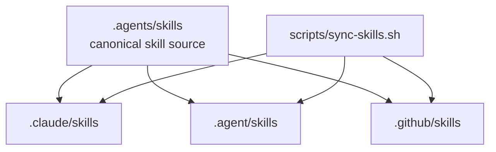
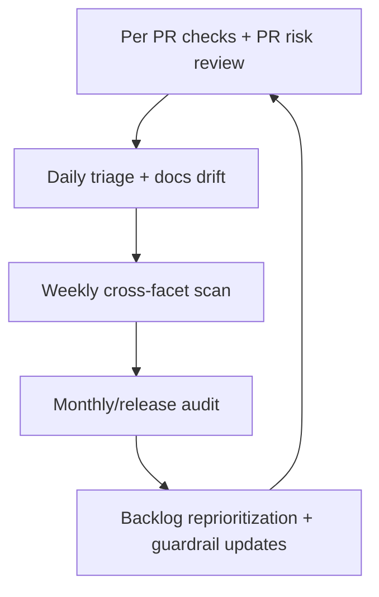
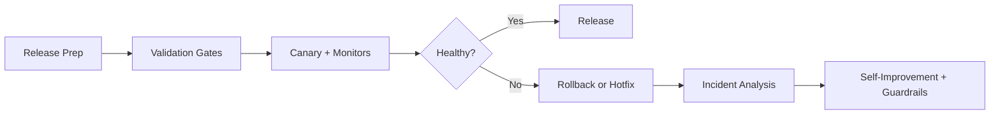
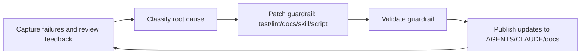

# AI Workflow

This project is AI-authored and docs-driven. Skills and standards are first-class engineering controls, not optional guidance.

## Skill Topology

`.agents/skills` is the source of truth. Other agent runtimes consume symlinks.

Run `scripts/sync-skills.sh` after any skill add/update/delete.

## Workflow Stack

Use the smallest set of workflows needed for a change, but keep memory updates mandatory for every workflow run.

| Workflow | Primary Skill | Typical Trigger | Memory Key |
|---|---|---|---|
| Intake + Triage | `content-studio-intake-triage` | New request/refactor/bug | `Intake + Triage` |
| Feature Delivery | `content-studio-feature-delivery` | Implementation/refactor execution | `Feature Delivery` |
| TanStack + Vite Guardrails | `content-studio-tanstack-vite` | `apps/web` data/routing/forms/build changes | `TanStack + Vite` |
| Architecture + ADR Guard | `content-studio-architecture-adr-guard` | Boundary/layer/runtime changes | `Architecture + ADR Guard` |
| PR Risk Review | `content-studio-pr-risk-review` | Pre-merge review | `PR Risk Review` |
| Test Surface Steward | `content-studio-test-surface-steward` | Coverage drift, flaky tests, risky changes | `Test Surface Steward` |
| Security + Dependency Hygiene | `content-studio-security-dependency-hygiene` | Dependency updates, release prep, weekly audits | `Security + Dependency Hygiene` |
| Performance + Cost Guard | `content-studio-performance-cost-guard` | Perf-sensitive changes, weekly/release checks | `Performance + Cost Guard` |
| Docs + Knowledge Drift | `content-studio-docs-knowledge-drift` | Behavior/docs mismatch, onboarding confusion | `Docs + Knowledge Drift` |
| Periodic Scans | `content-studio-periodic-scans` | Daily/weekly/monthly quality loops | `Periodic Scans` |
| Release + Incident Response | `content-studio-release-incident-response` | Release train, hotfix, production incident | `Release + Incident Response` |
| Self-Improvement | `content-studio-self-improvement` | Repeat failures, escaped defects, notable incidents | `Self-Improvement` |

Persistent memory system: `docs/workflow-memory/` (`events`, `index`, `summaries`, `guardrails`).

## Happy Path: Request To Merge

```mermaid
flowchart LR
  R[Request] --> I[Intake + Triage]
  I --> D[Read docs/**/* relevant to change]
  D --> P[Plan vertical slices and tests]
  P --> V{Frontend impact?}
  V -->|Yes| FD[Apply TanStack + design guardrails]
  V -->|No| W
  FD --> W[Implement slice]
  W --> A{Boundary/layer changes?}
  A -->|Yes| AG[Architecture + ADR guard]
  A -->|No| T
  AG --> T[Run targeted tests]
  T --> Q{All slice checks pass?}
  Q -->|No| W
  Q -->|Yes| N[Next slice]
  N --> M{More slices?}
  M -->|Yes| W
  M -->|No| G[Run repo quality gates]
  G --> RR[PR Risk Review + Test Surface Steward]
  RR --> PR[Open PR with evidence]
  PR --> RV[Review and address findings]
  RV --> MG[Merge]
  MG --> DK[Docs + knowledge drift check]
  DK --> C[Compound learnings + memory entry]
  C --> SI[Trigger self-improvement if pattern repeats]
```

## Happy Path Skill Set

1. `content-studio-intake-triage`
2. `content-studio-feature-delivery`
3. `content-studio-tanstack-vite` for `apps/web` changes
4. `content-studio-architecture-adr-guard` when boundaries/layers change
5. `content-studio-pr-risk-review` before merge
6. `content-studio-test-surface-steward` when coverage confidence is weak
7. `content-studio-docs-knowledge-drift` when behavior/docs changed
8. `content-studio-self-improvement` when repeat patterns emerge

## E2E Delivery Checklist

1. Read standards docs before edits.
2. Define behavior expectations and test plan before coding.
3. Implement one vertical slice at a time.
4. Keep boundaries explicit:
`queryOptions().queryKey`-derived keys, auth before writes, sanitized user-editable structured fields.
Composition-first React APIs, explicit UI states, and accessibility baseline.
5. Validate each slice quickly, then run full gates:
`pnpm typecheck`, `pnpm test`, `pnpm test:invariants` (backend), `pnpm --filter web build` (frontend).
6. Run PR risk review and test surface check before merge.
7. Update docs for behavior/guardrail changes.
8. Append workflow memory notes for workflows used.
9. Merge only with validation evidence and unresolved risk notes.

## Continuous And Periodic Scans

## Scan Cadence

| Cadence | Goal | Minimum Actions |
|---|---|---|
| Per PR | Prevent regressions before merge | `pnpm typecheck`, `pnpm test`, invariants/build as needed, PR risk review |
| Daily | Keep delivery healthy | Triage failures/flakes, docs drift checks, dependency/security quick scan |
| Weekly | Detect systemic gaps | Cross-facet audit: architecture, authz, tests, perf/cost, security, docs |
| Monthly/Release | Recalibrate standards | Full audit, release readiness, incident trend review, guardrail roadmap updates |

Use `content-studio-periodic-scans` for scan execution and reporting format.

## Release + Incident Loop

Use `content-studio-release-incident-response` for release trains and hotfix/incident handling.

For security-sensitive or high-impact releases, pair with:

- `content-studio-security-dependency-hygiene`
- `content-studio-performance-cost-guard`

## Self-Improvement Loop

## Self-Improvement Triggers

- A defect escapes to main.
- A failure pattern repeats across 2+ merges.
- Review comments repeat in the same category.
- Periodic scan identifies systemic risk.

When triggered, run `content-studio-self-improvement` and update shared instructions and skills in the same cycle.

## Workflow Memory Protocol

All workflows persist learnings to `docs/workflow-memory/events/YYYY-MM.jsonl` and update `docs/workflow-memory/index.json`.

Minimum event fields:

1. `id`
2. `date`
3. `workflow`
4. `title`
5. `trigger`
6. `finding`
7. `evidence`
8. `followUp`
9. `owner`
10. `status`

If the same pattern appears in 2+ memory entries, escalate immediately to `content-studio-self-improvement` and land a concrete prevention mechanism (test, lint, docs rule, skill update, or automation script).

Use the write helper to avoid schema drift:

`node scripts/workflow-memory/add-entry.mjs --help`

Run weekly compaction to control growth:

`node scripts/workflow-memory/compact-memory.mjs --archive-closed --days 90`

Agent retrieval order:

1. `docs/workflow-memory/guardrails.md`
2. latest `docs/workflow-memory/summaries/YYYY-MM.md`
3. filtered rows from `docs/workflow-memory/index.json`
4. top 3-5 relevant records from `docs/workflow-memory/events/*.jsonl`

Legacy migration helper:

`node scripts/workflow-memory/migrate-legacy-memory.mjs`
