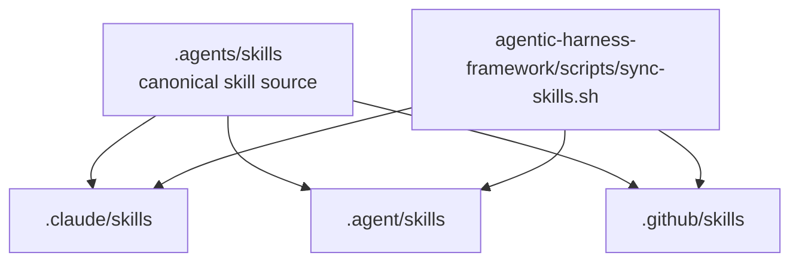
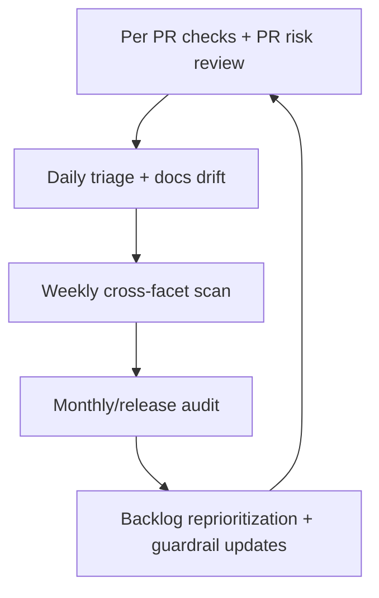
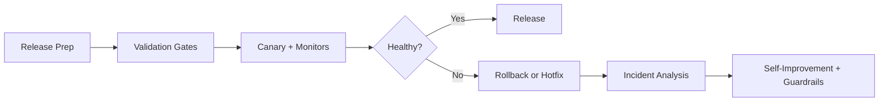
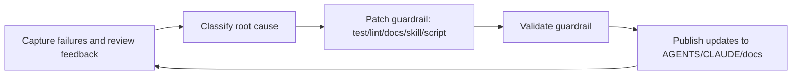

# AI Workflow (Experimental Agent Harnessing)

This project uses an experimental engineering technique called **Agent Harnessing**.
We steer AI-authored changes with specs, skills, and quality gates.
Skills and standards are first-class engineering controls, but this workflow is intentionally iterative and may change as we learn.

## Skill Topology

`.agents/skills` is the source of truth. Other agent runtimes consume symlinks.

Run `agentic-harness-framework/scripts/sync-skills.sh` after any skill add/update/delete.
Then run `pnpm skills:check:strict` to catch metadata/path/mirror drift.

## Workflow Stack

Use the smallest set of workflows needed for a change, but keep memory updates mandatory for every workflow run.

| Workflow | Primary Skill | Typical Trigger | Memory Key |
|---|---|---|---|
| Intake + Triage | `intake-triage` | New request/refactor/bug | `Intake + Triage` |
| Feature Delivery | `feature-delivery` | Implementation/refactor execution | `Feature Delivery` |
| TanStack + Vite Guardrails | `tanstack-vite` | `apps/web` data/routing/forms/build changes | `TanStack + Vite` |
| Architecture + ADR Guard | `architecture-adr-guard` | Boundary/layer/runtime changes | `Architecture + ADR Guard` |
| PR Risk Review | `pr-risk-review` | Pre-merge review | `PR Risk Review` |
| Test Surface Steward | `test-surface-steward` | Coverage drift, flaky tests, risky changes | `Test Surface Steward` |
| Security + Dependency Hygiene | `security-dependency-hygiene` | Dependency updates, release prep, weekly audits | `Security + Dependency Hygiene` |
| Performance + Cost Guard | `performance-cost-guard` | Perf-sensitive changes, weekly/release checks | `Performance + Cost Guard` |
| Docs + Knowledge Drift | `docs-knowledge-drift` | Behavior/docs mismatch, onboarding confusion | `Docs + Knowledge Drift` |
| Periodic Scans | `periodic-scans` | Daily/weekly/monthly quality loops | `Periodic Scans` |
| Release + Incident Response | `release-incident-response` | Release train, hotfix, production incident | `Release + Incident Response` |
| Self-Improvement | `self-improvement` | Repeat failures, escaped defects, notable incidents | `Self-Improvement` |
| Quality Closure Loop (support) | `quality-closure-loop` | One-pass scan -> triage -> fixes -> guardrails execution | Use workflow keys executed in the loop |
| Code Simplifier (support) | `code-simplifier` | Post-change readability/maintainability cleanup with no behavior change | Use parent workflow memory key |
| Codebase Navigation (support) | `codebase-nav` | Fast orientation for file paths and test locations | Use parent workflow memory key |
| Debug + Fix (support) | `debug-fix` | Failing tests, regressions, or uncertain root cause | Use parent workflow memory key |

Persistent memory system: `agentic-harness-framework/workflow-memory/` (`events`, `index`, `summaries`, `guardrails`).

## Happy Path: Request To Merge

```mermaid
flowchart LR
  R[Request] --> I[Intake + Triage]
  I --> D[Read docs/**/* relevant to change]
  D --> P[Plan vertical slices and tests]
  P --> V{Frontend impact?}
  V -->|Yes| FD[Apply TanStack + design guardrails]
  V -->|No| W
  FD --> W[Implement slice]
  W --> A{Boundary/layer changes?}
  A -->|Yes| AG[Architecture + ADR guard]
  A -->|No| T
  AG --> T[Run targeted tests]
  T --> Q{All slice checks pass?}
  Q -->|No| W
  Q -->|Yes| N[Next slice]
  N --> M{More slices?}
  M -->|Yes| W
  M -->|No| G[Run repo quality gates]
  G --> RR[PR Risk Review + Test Surface Steward]
  RR --> PR[Open PR with evidence]
  PR --> RV[Review and address findings]
  RV --> MG[Merge]
  MG --> DK[Docs + knowledge drift check]
  DK --> C[Compound learnings + memory entry]
  C --> SI[Trigger self-improvement if pattern repeats]
```

## Happy Path Skill Set

1. `intake-triage`
2. `feature-delivery`
3. `tanstack-vite` for `apps/web` changes
4. `architecture-adr-guard` when boundaries/layers change
5. `pr-risk-review` before merge
6. `test-surface-steward` when coverage confidence is weak
7. `docs-knowledge-drift` when behavior/docs changed
8. `self-improvement` when repeat patterns emerge
9. `code-simplifier` for post-change clarity cleanup with no behavior changes
10. `quality-closure-loop` to execute scan findings through fix and guardrail closure
11. `codebase-nav` when rapid repo orientation is needed
12. `debug-fix` when narrowing and fixing failing tests

## E2E Delivery Checklist

1. Read standards docs before edits.
2. Define behavior expectations and test plan before coding.
3. Implement one vertical slice at a time.
4. Keep boundaries explicit:
`queryOptions().queryKey`-derived keys, auth before writes, sanitized user-editable structured fields.
Composition-first React APIs, explicit UI states, and accessibility baseline.
5. Validate each slice quickly, then run full gates:
`pnpm typecheck`, `pnpm test`, `pnpm test:invariants` (backend), `pnpm --filter web build` (frontend).
6. Run PR risk review and test surface check before merge.
7. Update docs for behavior/guardrail changes.
8. Append workflow memory notes for workflows used and include each event `id` in delivery notes.
9. For skill edits, run `pnpm skills:check:strict` and `agentic-harness-framework/scripts/sync-skills.sh`.
10. Merge only with validation evidence and unresolved risk notes.

## Continuous And Periodic Scans

## Scan Cadence

| Cadence | Goal | Minimum Actions |
|---|---|---|
| Per PR | Prevent regressions before merge | `pnpm typecheck`, `pnpm test`, invariants/build as needed, PR risk review |
| Daily | Keep delivery healthy | Triage failures/flakes, docs drift checks, dependency/security quick scan |
| Weekly | Detect systemic gaps | Cross-facet audit: architecture, authz, tests, perf/cost, security, docs |
| Monthly/Release | Recalibrate standards | Full audit, release readiness, incident trend review, guardrail roadmap updates |

Use `periodic-scans` for scan execution and reporting format.

## Release + Incident Loop

Use `release-incident-response` for release trains and hotfix/incident handling.

For security-sensitive or high-impact releases, pair with:

- `security-dependency-hygiene`
- `performance-cost-guard`

## Self-Improvement Loop

## Self-Improvement Triggers

- A defect escapes to main.
- A failure pattern repeats across 2+ merges.
- Review comments repeat in the same category.
- Periodic scan identifies systemic risk.

When triggered, run `self-improvement` and update shared instructions and skills in the same cycle.

## Workflow Memory Protocol

All workflows persist learnings to `agentic-harness-framework/workflow-memory/events/YYYY-MM.jsonl` and update `agentic-harness-framework/workflow-memory/index.json`.

Minimum event fields:

1. `id`
2. `date`
3. `workflow`
4. `title`
5. `trigger`
6. `finding`
7. `evidence`
8. `followUp`
9. `owner`
10. `status`

Optional fields:

- `reflection`: what went well or should be repeated
- `feedback`: what to improve or avoid
- `importance` (0-1): higher = more critical or reusable
- `recency` (0-1): higher = more recent; overrides computed recency if needed
- `confidence` (0-1): higher = more reliable evidence

Taxonomy tagging checklist ([`agentic-harness-framework/workflow-memory/taxonomy.md`](../agentic-harness-framework/workflow-memory/taxonomy.md)):

- If tags include `memory` or `workflow-memory`, include all three dimensions:
  - `memory-form:*`
  - `memory-function:*`
  - `memory-dynamics:*`
- For agent-run diagnostics/evals, include at least one `capability:*` and one
  `failure:*` tag.

During retrieval and self-improvement, scan `reflection` and `feedback` for repeatable guardrails or missing checks.

If the same pattern appears in 2+ memory entries, escalate immediately to `self-improvement` and land a concrete prevention mechanism (test, lint, docs rule, skill update, or automation script).

Use the write helper to avoid schema drift:

`node agentic-harness-framework/scripts/workflow-memory/add-entry.mjs --help`

Retrieval helper (ranked by importance/recency/tag match/confidence):

`node agentic-harness-framework/scripts/workflow-memory/retrieve.mjs --help`

Run coverage audit weekly (and before release readiness reviews):

`pnpm workflow-memory:coverage:strict`

If coverage reports a workflow as missing and that workflow was run, add the missing event immediately.
If `coverage:strict` fails during an active quality closure cycle because workflows are missing for the current month, run lightweight passes for each missing workflow and append those workflow events in the same cycle before closing.

Run weekly compaction to control growth:

`node agentic-harness-framework/scripts/workflow-memory/compact-memory.mjs --archive-closed --days 90`

Agent retrieval order:

1. [`agentic-harness-framework/workflow-memory/guardrails.md`](../agentic-harness-framework/workflow-memory/guardrails.md)
2. [`agentic-harness-framework/workflow-memory/taxonomy.md`](../agentic-harness-framework/workflow-memory/taxonomy.md)
3. latest [`agentic-harness-framework/workflow-memory/summaries/YYYY-MM.md`](../agentic-harness-framework/workflow-memory/summaries/)
4. filtered rows from `agentic-harness-framework/workflow-memory/index.json`
5. top 3-5 relevant records from `agentic-harness-framework/workflow-memory/events/*.jsonl`
