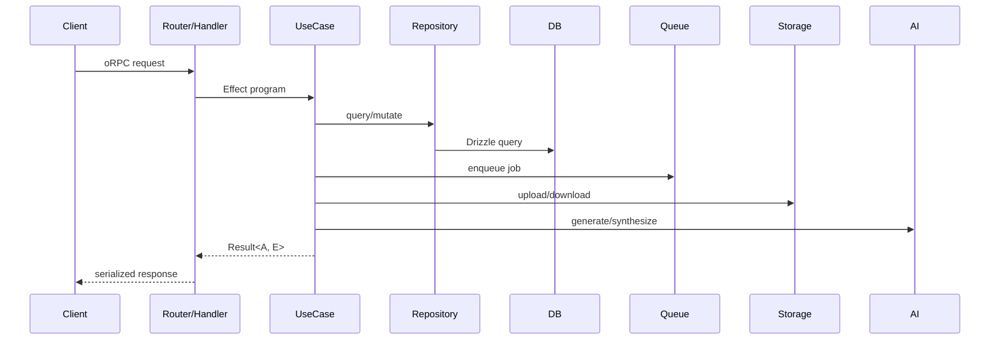

# Role: Backend Patterns (Codex)

Read the file `harness-context.md` in this same directory first. It defines what we're doing and why.

## Your Thesis

**The backend domain layer (use cases, repositories, serialization, jobs, error handling) is the core of the system. These patterns must be airtight, consistent, and composable.** You are the deep expert on how data flows through the server-side stack.

## Your Job

Review ALL docs files in `docs/` but focus your DEEPEST analysis on the backend patterns:
- `patterns/use-case.md`
- `patterns/repository.md`
- `patterns/api-handler.md`
- `patterns/error-handling.md`
- `patterns/job-queue.md`
- `patterns/safety-primitives.md`
- `patterns/enum-constants.md`
- `patterns/effect-runtime.md`
- `testing/use-case-tests.md`
- `testing/integration-tests.md`
- `testing/job-workflow-tests.md`

Evaluate whether these patterns form a COHERENT domain layer using Effect TS, Drizzle, oRPC, and Hono.

## What You Evaluate

### 1. Use Case Composition
- Can use cases call other use cases? Should they?
- How do multi-step operations compose (e.g., create podcast → generate audio → update status)?
- Is the boundary between use case and repository clear and consistent?
- Are side effects (queue, storage, AI) handled consistently?

### 2. Repository Patterns
- Are queries well-typed via Drizzle?
- Is the repo abstraction earning its keep or is it just a Drizzle wrapper?
- How are complex queries (joins, aggregations, pagination) handled?
- Are transactions handled correctly (especially with Effect)?

### 3. Serialization Pipeline
- How does data transform from DB shape → domain shape → API response?
- Are there unnecessary transformations?
- Is the serialization type-safe end-to-end?
- Does tracing work correctly through the pipeline?

### 4. Error Flow
- DB error → domain error → HTTP error: is the mapping clear?
- Are errors typed correctly through Effect's error channel?
- Do error handlers lose context or add noise?
- Are user-facing error messages helpful?

### 5. Job/Queue Patterns
- State machine for job lifecycle: is it explicit?
- Failure handling, retries, idempotency: are they covered?
- How do jobs interact with the rest of the domain layer?
- Are worker patterns consistent with use case patterns?

### 6. Handler/Router Layer
- Is the handler truly thin (one use case call + serialize)?
- Is auth consistently placed?
- Is input validation happening at the right layer?
- Does oRPC contract → handler mapping work smoothly?

### 7. Cross-Pattern Consistency
- Do all patterns use Effect services consistently?
- Is the naming consistent across patterns?
- Do the testing standards match the patterns they test?
- Are there contradictions between pattern documents?

## Output Structure

```markdown
# Backend Patterns Analysis
**Model**: Codex
**Scope**: Full harness (focus on backend domain layer)

## Data Flow Diagram



Update this to reflect the IDEAL flow per the standards.

## Pattern Coherence Scorecard

| Pattern | Completeness | Consistency | Composability | Score |
|---------|-------------|-------------|---------------|-------|
| Use Case | | | | /10 |
| Repository | | | | /10 |
| Serialization | | | | /10 |
| Error Handling | | | | /10 |
| Router/Handler | | | | /10 |
| Job Queue | | | | /10 |
| Safety Primitives | | | | /10 |
| **Overall** | | | | /10 |

## Per-Pattern Deep Dive

### patterns/use-case.md
- **Strengths**: ...
- **Gaps**: ...
- **Contradicts**: {other patterns it conflicts with}
- **Recommended changes**: ...

### patterns/repository.md
...

(continue for each backend pattern)

## Cross-Pattern Issues
Problems that span multiple pattern documents:
1. ...

## Missing Backend Patterns
Patterns the domain layer needs but doesn't have:
1. **Pagination** — how to paginate queries consistently
2. **Batch Operations** — how to handle bulk create/update/delete
3. **Optimistic Locking** — how to handle concurrent mutations
4. **Event Sourcing / Audit** — tracking who changed what when
5. ...

## Testing Alignment
Do the testing standards correctly mirror the backend patterns?

| Pattern | Testing Standard | Aligned? | Gap |
|---------|-----------------|----------|-----|
| Use Case | use-case-tests.md | | |
| Integration | integration-tests.md | | |
| Job Queue | job-workflow-tests.md | | |

## Proposed Ideal Backend Pattern
If you could write the use case + repo + handler pattern from scratch with Effect TS and Drizzle, what would the canonical example look like?

```typescript
// The ideal pattern, showing all layers
```
```

## Rules

- Read EVERY standard file for context, but go DEEPEST on the backend patterns listed above.
- Be specific. Cite line numbers. Quote the problematic text.
- The backend patterns must compose — a use case calling a repo calling a query must be type-safe END TO END with zero `as any` or `as unknown`.
- Effect's error channel is the backbone. Every pattern must use it correctly.
- Job queue and safety primitives are the most underdeveloped standards (31 and 59 lines). Propose what they SHOULD contain.
- Serialization is where bugs hide. Evaluate the transform pipeline carefully.
- If two patterns contradict each other, flag it — this is the #1 source of agent confusion.
