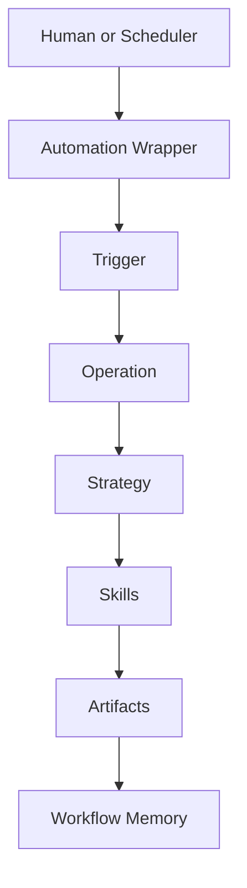

# Software Factory

Software Factory is the execution control plane for repository automation and agent-driven delivery.

## Canonical Terms

1. `Trigger`
- Schedule or event policy that starts an operation.
- Source of truth lives in [`software-factory/triggers/`](./triggers/).

2. `Operation`
- Runnable unit in the CLI.
- Example: `ready-for-dev-executor`, `issue-evaluator`.

3. `Strategy`
- Internal execution contract selected by an operation.
- Source of truth lives in [`software-factory/workflows/`](./workflows/).

4. `Skill`
- Reusable method used while executing strategy phases.
- Source of truth lives in [`.agents/skills/`](../.agents/skills/).

## Roles And Responsibilities

| Role | Owns | Does Not Own | Source |
|---|---|---|---|
| Human operator | Picks priorities, approves direction, reviews outcomes | Runtime routing internals | GitHub issues/PRs + repo docs |
| Automation wrapper (`automations/*/*.toml`) | Scheduler entrypoint only | Delivery logic, model routing, strategy logic | [`software-factory/automations/`](./automations/) |
| Trigger | Maps schedule/event to an operation ID | Workflow implementation details | [`software-factory/triggers/registry.json`](./triggers/registry.json) |
| Operation | Launch contract, argument handling, model/thinking defaults, operation runner | Reusable skill definitions | [`software-factory/operations/registry.json`](./operations/registry.json) |
| Strategy | Execution contract and workflow intent | Scheduler policy and wrapper prompts | [`software-factory/workflows/`](./workflows/) |
| Skill | Reusable execution methods during strategy phases | Trigger/operation registration | [`.agents/skills/`](../.agents/skills/) |
| Workflow memory | Compounding run history and retrieval surface | Scheduling or execution control | [`software-factory/workflow-memory/`](./workflow-memory/) |

## System Flow



```text
Trigger -> Operation -> Strategy -> Skill -> Artifacts
```

## CLI Surfaces

1. `pnpm software-factory operation list`
2. `pnpm software-factory operation run <operation-id> ...`
3. `pnpm software-factory trigger list`
4. `pnpm software-factory trigger fire <trigger-id> ...`
5. `pnpm software-factory doctor`

## Source Of Truth

| Surface | Path |
|---|---|
| Operations registry | [`software-factory/operations/registry.json`](./operations/registry.json) |
| Triggers registry | [`software-factory/triggers/registry.json`](./triggers/registry.json) |
| Strategies catalog | [`software-factory/workflows/registry.json`](./workflows/registry.json) |
| Automation playbooks | [`software-factory/automations/`](./automations/) |
| Workflow memory | [`software-factory/workflow-memory/`](./workflow-memory/) |

## Next Read

1. [`software-factory/operations/README.md`](./operations/README.md)
2. [`software-factory/triggers/README.md`](./triggers/README.md)
3. [`software-factory/workflows/README.md`](./workflows/README.md)
4. [`software-factory/automations/README.md`](./automations/README.md)
5. [`software-factory/workflow-memory/README.md`](./workflow-memory/README.md)
