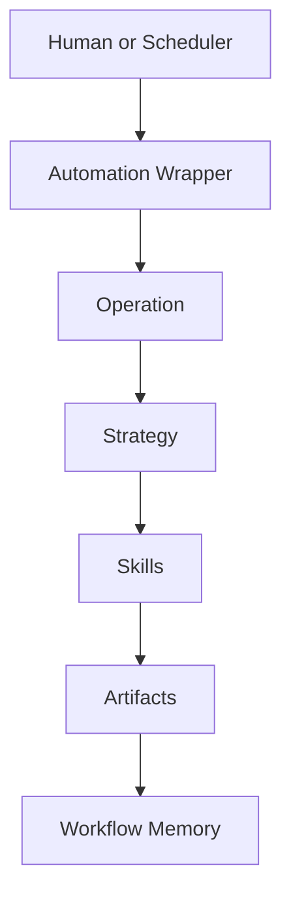

# Software Factory

Software Factory is the operation control plane for repository automation and agent-driven delivery.

## Canonical Terms

1. `Operation`
- Runnable unit in the CLI.
- Source of truth lives in [`software-factory/operations/`](./operations/).

2. `Strategy`
- Internal execution contract selected by an operation.
- Source of truth lives in [`software-factory/workflows/`](./workflows/).

3. `Skill`
- Reusable method used while executing strategy phases.
- Source of truth lives in [`.agents/skills/`](../.agents/skills/).

4. `Automation`
- External scheduler wrapper that calls `operation run`.
- Source of truth lives in [`automations/`](../automations/).

## System Flow



```text
Automation -> Operation -> Strategy -> Skill -> Artifacts
```

## CLI Surfaces

1. `pnpm software-factory operation list`
2. `pnpm software-factory operation explain --operation-id <operation-id>`
3. `pnpm software-factory operation run --operation-id <operation-id> ...`
4. `pnpm software-factory doctor`

## Execution Choice

- Use `operation run` for both manual execution and automation wrappers.
- Use `operation explain` to inspect ownership, defaults, args, and runner behavior before running.

## Source Of Truth

| Surface | Path |
|---|---|
| Operations registry | [`software-factory/operations/registry.json`](./operations/registry.json) |
| Strategies catalog | [`software-factory/workflows/registry.json`](./workflows/registry.json) |
| Automation wrappers + playbooks | [`automations/`](../automations/) |
| Workflow memory | [`software-factory/workflow-memory/`](./workflow-memory/) |

## Next Read

1. [`software-factory/operations/README.md`](./operations/README.md)
2. [`software-factory/workflows/README.md`](./workflows/README.md)
3. [`automations/README.md`](../automations/README.md)
4. [`software-factory/workflow-memory/README.md`](./workflow-memory/README.md)
