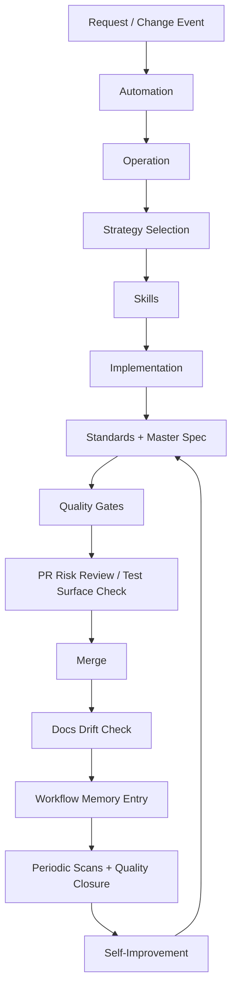

# Repository Operating Framework

This is the navigation layer for how repository governance works in Content Studio.
It explains how standards docs, specs, skills, lint/invariants/tests, workflow memory,
and automation lanes fit into one operating system.

Start with [`software-factory/README.md`](./README.md), then use this page for the detailed control map and linked source-of-truth docs.

## Terminology Contract

- `Operation`: runnable CLI entrypoint (cataloged in `software-factory/operations/registry.json`).
- `Strategy`: internal execution contract + memory key (implemented under `software-factory/workflows/`).
- `Automation`: schedule/event policy wrapper (`automations/*`).
- `Skill`: reusable execution method (canonical in `.agents/skills/*/SKILL.md`).

Relationship rule:
- automations invoke operations.
- operations select strategies.
- strategies invoke skills.

## Why This Exists

The repo already has strong controls, but they are distributed across:

- `docs/`
- `.agents/skills/`
- `software-factory/scripts/`
- invariant tests and lint rules
- `automations/`

This framework reduces orientation time by showing one coherent model.

## System Map

## Control Planes

| Plane | Source Of Truth | Primary Enforcement | Evidence Artifact |
|---|---|---|---|
| Standards | [`docs/README.md`](../docs/README.md) and `docs/{architecture,patterns,frontend,testing}` | Type/lint/tests/manual review | Updated standards docs + passing gates |
| Product/system spec | [`docs/master-spec.md`](../docs/master-spec.md) + `docs/spec/generated/*` | `pnpm spec:generate`, `pnpm spec:check` | Generated snapshots + spec drift gate |
| Strategy catalog | `software-factory/workflows/registry.json`, `software-factory/workflows/*/README.md` | `pnpm workflows:generate`, docs review | Generated catalog + per-strategy pages |
| Operation catalog | `software-factory/operations/registry.json` | `pnpm software-factory operation list` | Runnable operation inventory + args |
| Skill system | `.agents/skills/*/SKILL.md` | `software-factory/scripts/sync-skills.sh`, `pnpm skills:check:strict` | Canonical skills + synced mirrors |
| Static/dynamic guardrails | `tools/eslint/*`, invariant tests, package tests | `pnpm lint`, `pnpm test:invariants`, `pnpm test:unit` (fast loop), `pnpm test:local` (developer), `pnpm test:ci` (automation/CI), `pnpm typecheck`, `pnpm build` | CI/test logs + invariant pass/fail |
| Workflow memory | `software-factory/workflow-memory/*` | `software-factory/scripts/workflow-memory/*.ts`, coverage checks | JSONL events + index + summaries |
| Automation lanes | `automations/*/*.md` + `automations/*/*.toml` | Playbook contracts + lane-specific gate checklists | Issues/PRs + run summaries + memory events |

## Execution Model

1. Scope the work with `intake-triage`.
2. Align behavior with [`docs/master-spec.md`](../docs/master-spec.md) and standards docs.
3. Execute via operation -> strategy -> skills.
4. Run gate ladder:
`pnpm typecheck`, `pnpm lint`, `pnpm test:unit` (or workspace-targeted tests), `pnpm test:local` (or `pnpm test:ci` in automation), `pnpm test:invariants`, `pnpm build`
and `pnpm spec:check` when behavior/spec surface changes.
5. Run pre-merge risk/coverage checks (`pr-risk-review`, `test-surface-steward` as needed).
6. Persist workflow memory entries for each workflow used.
7. Periodically run scan loops and self-improvement updates.

## Documentation Strategy (Recommended)

Keep docs layered to avoid duplication:

1. Framework map (this folder): how controls connect.
2. Standards docs (`docs/architecture`, `docs/patterns`, `docs/frontend`, `docs/testing`): what rules are.
3. Operation/strategy/skills docs ([`software-factory/operations/`](./operations/), [`software-factory/workflows/`](./workflows/), `.agents/skills/*`): how work is executed.
4. Enforcement artifacts (`software-factory/scripts/`, lint rules, invariants, CI): what is automatically checked.
5. Memory/automation docs (`software-factory/workflow-memory`, `automations/`): how learnings compound and lanes operate.

When updating policy, prefer editing the deepest true source rather than repeating text in multiple places.

## Next Read

1. [`software-factory/control-surfaces.md`](./control-surfaces.md)
2. [`software-factory/operations/README.md`](./operations/README.md)
3. [`software-factory/workflow-memory/README.md`](./workflow-memory/README.md)
4. [`automations/README.md`](../automations/README.md)
